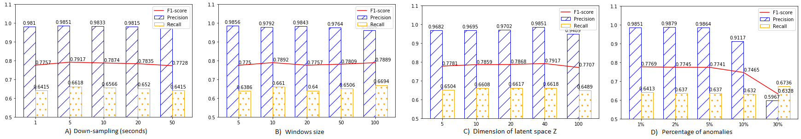
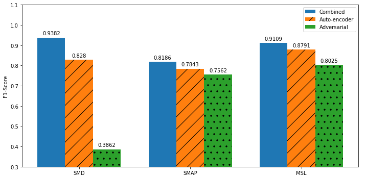
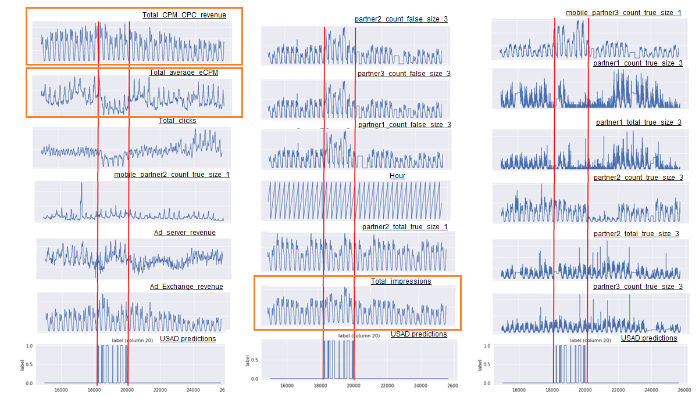

# Data analysis programming.

Kyonggi Univ. 2021. 02. CC545_0351.

### Name

USAD : UnSupervised Anomaly Detection on Multivariate Time Series

### Date

2021.12.09

## Abstract.

**Keywords**: Anomaly detection, Multivariate Time Series, Neural networks, Autoencoders, Adversarial Network, Unsupervised learning, Supervision

## Background

## 1. Introduction

## 2. Related work

## 3. Method

### 3.1 Problem formulation

### 3.2 Unsupervised Anomaly Detection

### 3.3 Implementation

## 4. Experimental setup

### 4.1 Public Datasets

### 4.2 Feasibility study: Orange’s dataset

### 4.3 Evaluation Metrics

## 5. Experiments and results

### 5.1 Overall performance

### 5.2 Effect of parameters

### 5.3 Training time

### 5.4 Ablation Study

### 5.5 Feasibility study

## 6. Conclusions

## Ref

