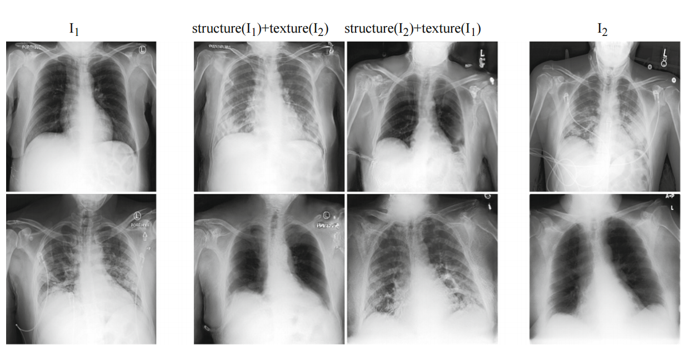
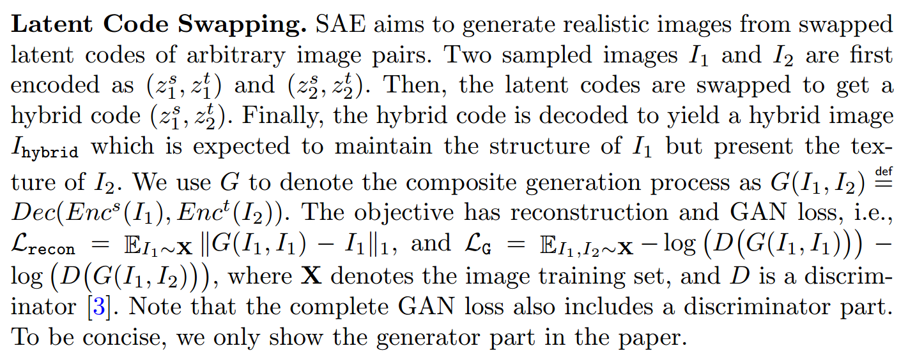
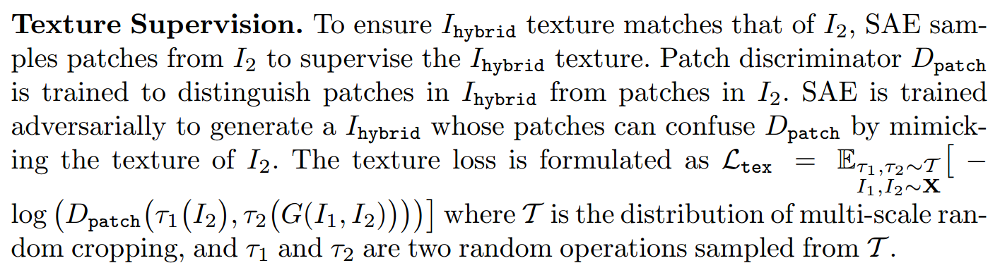
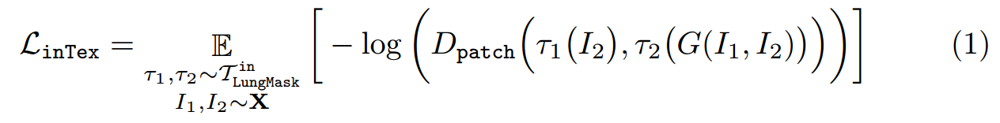
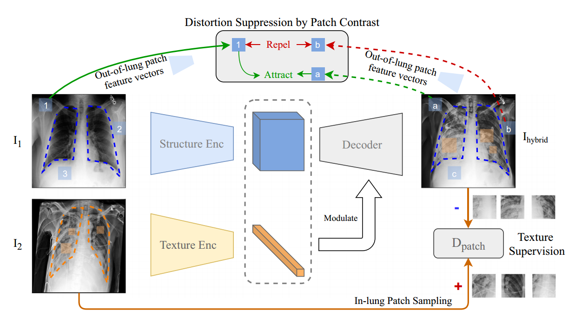
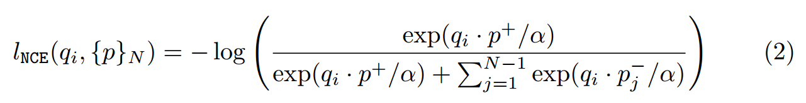
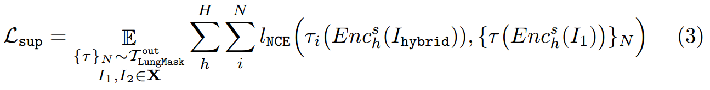
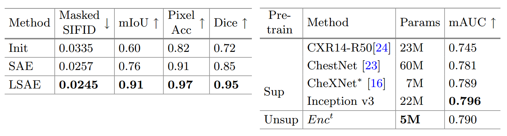
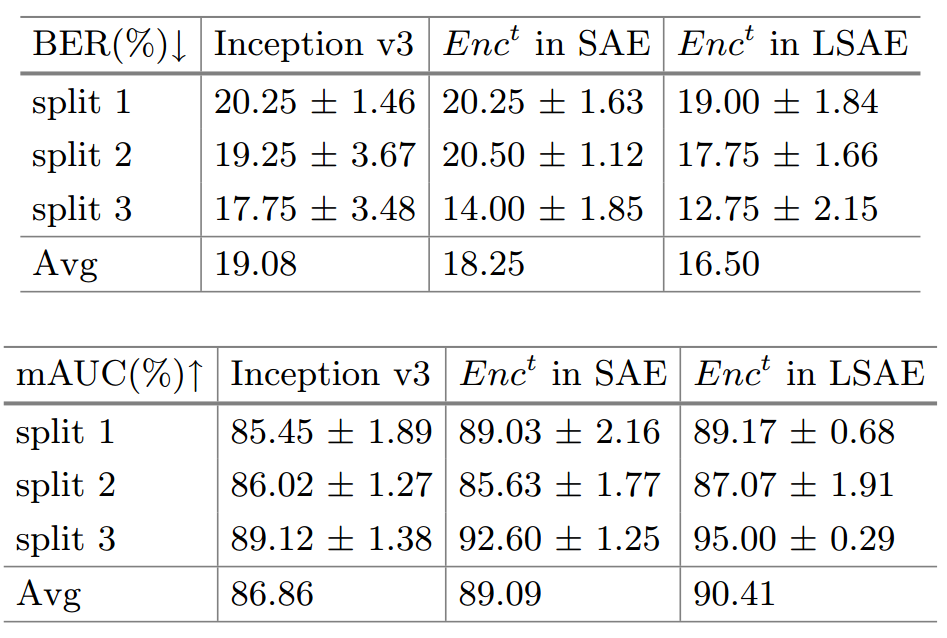

# Medical-Deep-Learning

Kyonggi Univ. 2021. 02. BE530_0058.

### P_16

Chest Radiograph Disentanglement for COVID-19 Outcome Prediction

> COVID-19 결과 예측을 위한 흉부 방사선 사진 분리

### Date

2021.11.24

## Abstract.

Chest radiographs (CXRs) are often the primary front-line diagnostic imaging modality.

> 흉부 방사선 사진(CXR)은 종종 일차적인 진단 영상 기법입니다.

Pulmonary diseases manifest as characteristic changes in lung tissue texture rather than anatomical structure.

> 폐 질환은 해부학적 구조보다는 폐 조직 조직의 특징적인 변화로 나타납니다.

Hence, we expect that studying changes in only lung tissue texture without the influence of possible structure variations would be advantageous for downstream prognostic and predictive modeling tasks.

> 따라서 가능한 구조 변화의 영향 없이 폐 조직 질감의 변화만 연구하는 것이 다운스트림 예후 및 예측 모델링 작업에 유리할 것으로 기대합니다.

In this paper, we propose a generative framework, Lung Swapping Auto Encoder, that learns a factorized representation of a Chest radiograph to disentangle the tissue texture representation from the anatomic structure representation.

> 이 논문에서 우리는 해부학적 구조 표현에서 조직 질감 표현을 풀기 위해 흉부 방사선 사진의 인수분해 표현을 학습하는 생성 프레임워크인 Lung Swapping Auto Encoder를 제안합니다.

Upon learning the disentanglement, we leverage Lung Swapping Auto Encoder in two applications.

> 얽힘을 학습하면 두 가지 응용 프로그램에서 Lung Swapping Auto Encoder를 활용합니다.

1. After adapting the texture encoder in Lung Swapping Auto Encoder to a thoracic disease classification task on the large-scale ChestX-ray14 database (N = 112,120), we achieve a competitive result (mAUC: 79.0%) with unsupervised pre-training. Moreover, when compared with Inception v3 on our multi-institutional COVID-19 dataset, COVOC (N = 340), for a COVID-19 outcome prediction task (estimating need for ventilation), the texture encoder achieves 13% less error with a 77% smaller model size, further demonstrating the efficacy of texture representation for lung diseases

   > Lung Swapping Auto Encoder의 텍스처 인코더를 대규모 ChestX-ray14 데이터베이스(N = 112,120)의 흉부 질환 분류 작업에 적용한 후 감독되지 않은 사전 훈련으로 경쟁력 있는 결과(mAUC: 79.0%)를 달성했습니다. 또한, COVID-19 결과 예측 작업(환기 필요성 추정)에 대해 다중 기관 COVID-19 데이터세트인 COVOC(N = 340)의 Inception v3와 비교할 때 텍스처 인코더는 77%로 13% 더 적은 오류를 달성합니다. 더 작은 모델 크기, 폐 질환에 대한 질감 표현의 효능 추가 입증
2. We leverage the Lung Swapping Auto Encoder for data augmentation by generating hybrid lung images with textures and labels from the COVOC training data and lung structures from ChestX-ray14.

   > 우리는 COVOC 훈련 데이터와 ChestX-ray14의 폐 구조에서 텍스처와 레이블이 있는 하이브리드 폐 이미지를 생성하여 데이터 증대를 위해 Lung Swapping Auto Encoder를 활용합니다.

This further improves ventilation outcome prediction on COVOC.

> 이는 COVOC에 대한 환기 결과 예측을 더욱 향상시킵니다.

The code is available here: https://github.com/cvlab-stonybrook/LSAE.

**Keywords**: Chest radiographs, Disentanglement, Lung swapping, auto-encoder, Unsupervised learning

> **키워드**: 흉부 방사선 사진, 분리, 폐 교환, 자동 인코더, 비지도 학습

## 1. Introduction

**Fig. 1.** **Lung Swapping Result.** Two examples of lung swapping between images in column I1 and images in column I2.

> Fig 1. 폐 교체 결과.
> I1열의 이미지와 I2열의 이미지 간의 폐 교환의 두 가지 예.

The Lung Swapping Auto encoder is able to successfully transfer target lung textures without affecting the lung shape.

> Lung Swapping Auto 인코더는 폐 모양에 영향을 주지 않고 대상 폐 텍스처를 성공적으로 전송할 수 있습니다.

The swapping results are shown in the second and the third columns.

> 스와핑 결과는 두 번째 및 세 번째 열에 표시됩니다.

------

Chest radiographs are the primary diagnostic tool for COVID-19 pneumonia because they are widely available, and have lower risk of cross infection compared to Computed Tomography (CT) scans.

> 흉부 방사선 사진은 널리 사용 가능하고 컴퓨터 단층 촬영(CT) 스캔에 비해 교차 감염 위험이 낮기 때문에 COVID-19 폐렴의 주요 진단 도구입니다.

Despite these advantages, Chest radiographs are less sensitive to subtle disease changes compared to CT scans [12].

> 이러한 장점에도 불구하고 흉부 방사선 사진은 CT 스캔에 비해 미묘한 질병 변화에 덜 민감합니다[12].

In COVID-19 Chest radiographs, we observe that lung tissue texture may change drastically during hospitalization due to varying infiltrate levels.

> COVID-19 흉부 방사선 사진에서 우리는 다양한 침윤 수준으로 인해 입원 중에 폐 조직 질감이 급격히 변할 수 있음을 관찰했습니다.

However, chest anatomy remains mostly unchanged.

> 그러나 흉부 해부학은 대부분 변함이 없습니다.

Therefore, we hypothesize that disease information is more related to lung tissue texture rather than the anatomical structure of the lung.

> 따라서 우리는 질병 정보가 폐의 해부학적 구조보다 폐 조직 질감과 더 관련이 있다고 가정합니다.

To be concise, we use the terms texture and structure in the rest of the article.

> 간결하게 하기 위해 기사의 나머지 부분에서 텍스처와 구조라는 용어를 사용합니다.

Our hypothesis is also supported by recent findings that COVID-19 on Chest radiograph is observed as opacities within lung regions, and their extent and location is associated with disease severity and progression [22,25].

> 우리의 가설은 흉부 방사선 사진에서 코로나19가 폐 영역 내의 혼탁으로 관찰되고 그 범위와 위치가 질병의 중증도 및 진행과 관련이 있다는 최근 발견에 의해 뒷받침됩니다[22,25].

Previous medical image analysis in COVID-19 has mostly focused on diagnosis[7,13].

> 기존의 코로나19 의료 영상 분석은 대부분 진단에 치중해 왔다[7,13].

CT-based models are better at predicting COVID-19 outcomes, compared to Chest radiograph-based models [1,11,13].

> CT 기반 모델은 흉부 방사선 사진 기반 모델에 비해 COVID-19 결과를 더 잘 예측합니다[1,11,13].

This is largely due to the lack of COVID-19 Chest radiograph datasets with relevant endpoints and the limited information that Chest radiographs contain relative to CT scans.

> 이는 주로 관련 종료점이 포함된 COVID-19 흉부 방사선 사진 데이터 세트가 부족하고 흉부 방사선 사진에 포함된 정보가 CT 스캔과 관련하여 제한되어 있기 때문입니다.

Several data augmentation techniques have been proposed for CT scans in the COVID-19 setting [11], but Chest radiograph approaches have continued to rely on publicly sourced datasets [2,13].

> COVID-19 환경에서 CT 스캔에 대해 여러 데이터 증강 기술이 제안되었지만[11] 흉부 방사선 사진 접근 방식은 계속해서 공개 소스 데이터 세트에 의존해 왔습니다[2,13].

These datasets tend to be homogeneous, and often lack disease outcome labels (hospitalization, mechanical ventilation requirement, etc.) [2,13].

> 이러한 데이터 세트는 균질한 경향이 있으며 종종 질병 결과 레이블(입원, 기계 환기 요구 사항 등)이 부족합니다[2,13].

Generative Adversarial Networks [3] and Auto encoders [10] have been widely used for data augmentation, including in medical image applications [6,19,20]. 

> Generative Adversarial Networks[3] 및 자동 인코더[10]는 의료 이미지 애플리케이션[6,19,20]을 포함하여 데이터 증강에 널리 사용되었습니다.

However, standard GAN-based methods [8,26] are not suitable for Chest radiograph generation due to the lack of explicit structure supervision, which can lead to generating distorted shapes.

> 그러나 표준 GAN 기반 방법[8,26]은 명확한 구조 감독이 부족하여 왜곡된 모양을 생성할 수 있기 때문에 흉부 방사선 사진 생성에 적합하지 않습니다.

In this paper, we propose the Lung Swapping Auto Encoder, which learns a factorized representation of a Chest radiograph to disentangle the texture factor from the structure factor.

> 본 논문에서는 조직 인자와 구조 인자를 분리하기 위해 흉부 방사선 사진의 분해된 표현을 학습하는 Lung Swapping Auto Encoder를 제안합니다.

Lung Swapping Auto Encoder shares the same core idea as the recently-proposed Swapping Auto Encoder (SAE) [15], namely that a successful disentanglement model should be able to generate a realistic hybrid image that merges the structure of one image and the texture of another.

> Lung Swapping Auto Encoder는 최근에 제안된 SAE(Swapping Auto Encoder)[15]와 동일한 핵심 아이디어를 공유합니다.
> 즉, 성공적인 분리 모델은 한 이미지의 구조와 다른 이미지의 질감을 병합하는 사실적인 하이브리드 이미지를 생성할 수 있어야 합니다.

To achieve this, images are encoded as a combination of two latent codes representing structure and texture respectively.

> 이를 달성하기 위해 이미지는 각각 구조와 질감을 나타내는 두 개의 잠재 코드의 조합으로 인코딩됩니다.

The Swapping Auto Encoder is trained to generate realistic images from the swapped codes of arbitrary image pairs.

> Swapping Auto Encoder는 임의의 이미지 쌍의 스왑된 코드에서 사실적인 이미지를 생성하도록 훈련되었습니다.

Moreover, the Swapping Auto Encoder is also forced to synthesize the target texture supervised by patches sampled from the target image.

> 또한 Swapping Auto Encoder는 대상 이미지에서 샘플링된 패치에 의해 감독되는 대상 텍스처를 합성해야 합니다.

However, this vanilla Swapping Auto Encoder does not work well for Chest radiograph disentanglement.

> 그러나 이 기본 Swapping Auto Encoder는 흉부 방사선 사진의 얽힘을 잘 작동하지 않습니다.

First, by sampling texture patches from the whole target image, irrelevant out-of-lung textures diminish the effect of the in-lung texture transfer.

> 첫째, 전체 대상 이미지에서 텍스처 패치를 샘플링하여 관련 없는 폐 외 텍스처가 폐 내 텍스처 전송의 효과를 감소시킵니다.

More importantly, because texture supervision is derived from image patches, irrelevant structure clues may leak into the hybrid image, resulting in undesired lung shape distortion and interference with successful disentanglement.

> 더 중요한 것은 텍스처 감독이 이미지 패치에서 파생되기 때문에 관련 없는 구조 단서가 하이브리드 이미지로 누출되어 원치 않는 폐 모양 왜곡과 성공적인 분리를 방해할 수 있다는 점입니다.

We address these problems by: 

> 우리는 다음을 통해 이러한 문제를 해결합니다.

1. Sampling patches from the lung area instead of the whole image for texture supervision (as the infiltrates of interest are located within lung zones), and 

   > 텍스처 감독을 위해 전체 이미지 대신 폐 영역에서 패치 샘플링(관심 있는 침윤물이 폐 영역 내에 위치하기 때문에),

2) Adding a patch contrastive loss to explicitly force outof-lung local patches in the hybrid image to mimic the corresponding patch in the structure image (to prevent structure information in texture patches from leaking into the hybrid image). 
   
   > (텍스처 패치의 구조 정보가 하이브리드 이미지로 누출되는 것을 방지하기 위해) 구조 이미지의 해당 패치를 모방하기 위해 하이브리드 이미지의 폐 밖 로컬 패치를 명시적으로 강제하기 위해 패치 대비 손실을 추가합니다.
   
   Lung Swapping Auto Encoder, trained on a large public Chest radiograph dataset, ChestXray14, can generate realistic and plausible hybrid Chest radiographs with one patient’s lung structure and another patient’s disease texture (see Fig. 1). 
   
   > 대규모 공개 흉부 방사선 사진 데이터세트인 ChestXray14에서 훈련된 Lung Swapping Auto Encoder는 한 환자의 폐 구조와 다른 환자의 질병 질감을 사용하여 현실적이고 그럴듯한 하이브리드 흉부 방사선 사진을 생성할 수 있습니다(그림 1 참조).
   
   We further provide quantitative results for disentanglement in the experiment section.
   
   > 실험 섹션에서 풀림에 대한 정량적 결과를 추가로 제공합니다.

The trained disentanglement model is used in two applications: 

> 훈련된 풀림 모델은 두 가지 응용 프로그램에서 사용됩니다.

1) If textures represent disease infiltrates, the texture encoder in Lung Swapping Auto Encoder, Enc^t, should be discriminative in downstream Chest radiograph semantic tasks.
   
   > 텍스처가 질병 침투를 나타내는 경우 Lung Swapping Auto Encoder, Enct의 텍스처 인코더는 다운스트림 흉부 방사선 사진 의미 작업에서 구별해야 합니다.
   
   To prove this, we finetune Enc^t in Lung Swapping Auto Encoder on both the large ChestX-ray14 database (N = 112,120) and our multi-institutional COVID-19 outcome prediction dataset, COVID-19 Outcome (N = 340). 
   
   > 이를 증명하기 위해 우리는 대규모 ChestX-ray14 데이터베이스(N = 112,120)와 다기관 COVID-19 결과 예측 데이터 세트인 COVID-19 Outcome (N = 340) 모두에서 폐 스와핑 자동 인코더의 Enct를 미세 조정합니다.
   
   For thoracic disease classification on ChestX-ray14, Enc^t achieves competitive results without supervised pre-training. 
   
   > ChestX-ray14의 흉부 질환 분류를 위해 Enct는 감독된 사전 교육 없이도 경쟁력 있는 결과를 달성합니다.
   
   On COVOC, compared with a strong baseline Inception v3 [21], Enc^t reduces error by 13% with a much smaller model size. 
   
   > COVOC에서 강력한 기준 Inception v3[21]와 비교하여 Enct는 훨씬 더 작은 모델 크기로 오류를 13%까지 줄입니다.
   
   Results show that Enc^t learns effective and transferable representations of lung diseases.
   
   > 결과는 Enct가 폐 질환에 대한 효과적이고 전이 가능한 표현을 학습한다는 것을 보여줍니다.
2) To exploit the generative potential of Lung Swapping Auto Encoder, we generate hybrid images with textures and labels from COVID-19 Outcome training data and lung structures from ChestX-ray14. 
   
   > Lung Swapping Auto Encoder의 생성 가능성을 활용하기 위해 우리는 ChestX-ray14의 COVID-19 Outcome 훈련 데이터와 폐 구조에서 텍스처와 레이블을 사용하여 하이브리드 이미지를 생성합니다.
   
   Augmenting with these hybrid images further improves ventilation prediction on COVID-19 Outcome.
   
   > 이러한 하이브리드 이미지로 확대하면 COVID-19 Outcome 의 환기 예측이 더욱 향상됩니다.

In summary: 

1) Lung Swapping Auto Encoder is the first approach to disentangle chest radiographs into structure and texture representations. 
   
   > Lung Swapping Auto Encoder는 흉부 방사선 사진을 구조 및 질감 표현으로 분리하는 첫 번째 접근 방식입니다.
   
   Lung Swapping Auto Encoder succeeds by explicit in-lung texture supervision and out-of-lung distortion suppression, 
   
   > Lung Swapping Auto Encoder는 명시적인 폐 내 조직 감시 및 폐 외 왜곡 억제로 성공,
2. We achieve superior performance for COVID-19 outcome prediction with an efficient model, and

   > 우리는 효율적인 모델로 COVID-19 결과 예측을 위한 우수한 성능을 달성하고,

3. We propose a hybrid image augmentation technique, to further improve ventilation prediction.

   > 우리는 환기 예측을 더욱 향상시키기 위해 하이브리드 이미지 증강 기법을 제안합니다.

## 2. Methodology (방법론)

### 2.1 Swapping Auto Encoder (자동 인코더 교체)

The recent Swapping Auto Encoder[15] consists of an encoder Enc, and a decoder Dec, where Enc is composed of a structure branch Encs and a texture branch Enct to encode the input into structure and texture codes zs and zt.

> 최근 Swapping Auto Encoder[15]는 인코더 Enc와 디코더 Dec로 구성되며, 여기서 Enc는 입력을 구조 및 텍스처 코드 zs 및 zt로 인코딩하기 위해 구조 분기 Encs와 텍스처 분기 Enct로 구성됩니다.

**Latent Code Swapping. ( 잠재 코드 스와핑. )**

### 2.2 Lung Swapping Auto Encoder

**In-lung Texture Supervision.(폐내 조직 감독.)**

**Fig. 2. Lung Swapping AutoEncoder**

**Out-of-Lung Structural Distortion Suppression.(폐 외 구조 왜곡 억제)**

where α is the temperature, and {p}N = {p+}∪{p−}N−1.

> 여기서 α는 온도이고 {p}N = {p+}∪{p−}N−1입니다.

To prevent lNCE from affecting the in-lung texture transfer, we only apply it outside the lung region.

> lNCE가 폐 내 질감 전달에 영향을 미치는 것을 방지하기 위해 폐 영역 외부에만 적용합니다.

Thus, the structural distortion suppression loss is expressed as

> 따라서 구조적 왜곡 억제 손실은 다음과 같이 표현됩니다.

**Overall Objective.(전반적인 목표.)**

Combining the above, we term the final loss as L = L(recon)+ λ1L(G) + λ2L(inTex) + λ3L(sup), where λ1, λ2 and λ3 are tunnable hyper-parameters.

> 위의 사항을 결합하여 최종 손실을 L = L(recon)+ λ1L(G) + λ2L(inTex) + λ3L(sup)이라고 합니다. 여기서 λ1, λ2 및 λ3은 조정 가능한 하이퍼 매개변수입니다.

### 2.3 Hybrid Image Augmentation

If the texture in I2 can be transferred to I(hybrid), we assume the label (e.g., ventilation) of I2 is also attached to I(hybrid). 

> I2의 텍스처를 I(hybrid)로 전송할 수 있다면 I2의 레이블(예: 환기)도 I(hybrid)에 부착된 것으로 가정합니다.

Based on this hypothesis, we design a new data augmentation method: Given an image I(dst) in the target domain, e.g., COVID-19 Outcome, we sample K images {I(src)} from a source domain, e.g., ChestXray14.

> 이 가설을 기반으로 우리는 새로운 데이터 증강 방법을 설계합니다. 대상 도메인(예: COVID-19 결과)의 이미지 I(dst)가 주어지면 소스 도메인(예: ChestXray14)에서 K개의 이미지 {I(src)}를 샘플링합니다. .

Then, we use Lung Swapping Auto Encoder to take Idst as the texture template and images from {I(src)} as structure templates to generate K hybrid images {I(hybrid)}.

> 그런 다음 Lung Swapping Auto Encoder를 사용하여 Idst를 텍스처 템플릿으로 사용하고 {I(src)}의 이미지를 구조 템플릿으로 사용하여 K개의 하이브리드 이미지{I(hybrid)}를 생성합니다.

We label {I(hybrid)} with the label of Idst.

> Idst라는 레이블로 {I(hybrid)}에 레이블을 지정합니다.

Following this protocol, we can enlarge the training set in target domain K times.

> 이 프로토콜에 따라 대상 도메인의 훈련 세트를 K배로 확장할 수 있습니다.

Experimental results show the augmentation method can improve performance further on the COVID-19 ventilation prediction task.

> 실험 결과는 증강 방법이 COVID-19 환기 예측 작업에서 성능을 더욱 향상시킬 수 있음을 보여줍니다.

## 3. Experimental Design and Results (실험 설계 및 결과)

### 3.1 Dataset Description (데이터 세트 설명)

**ChestX-ray14**  is a large-scale Chest radiograph database consisting of 112,120 frontalview Chest radiographs from 32,717 patients. 

> ChestX-ray14는 32,717명의 환자로부터 112,120개의 정면 흉부 방사선 사진으로 구성된 대규모 흉부 방사선 사진 데이터베이스입니다.

We report all the results based on the official split which consists of training (∼70%), validation (∼10%), and testing (∼20%) sets. 

> 우리는 훈련(~70%), 검증(~10%) 및 테스트(~20%) 세트로 구성된 공식 분할을 기반으로 모든 결과를 보고합니다.

Images from the same patient will only appear in one of the sets.

> 동일한 환자의 이미지는 세트 중 하나에만 나타납니다.

------

**COVID-19 Outcome (COVOC)** is a COVID-19 Chest radiograph dataset curated from two institutions.

>  COVID-19 결과(COVOC)는 두 기관에서 선별한 COVID-19 흉부 방사선 사진 데이터세트입니다.

It consists of 340 Chest radiographs from 327 COVID-19 patients acquired upon disease presentation [9]. 

> 질병 발현 시 획득한 코로나19 환자 327명의 흉부 방사선 사진 340장으로 구성됐다[9].

Each Chest radiograph in COVID-19 Outcome is labeled based upon whether the patient required mechanical ventilation (henceforth ventilation) or not.

> COVID-19 결과의 각 흉부 방사선 사진은 환자가 기계 환기(이하 환기)가 필요한지 여부에 따라 레이블이 지정됩니다.

We separate COVID-19 Outcome randomly into 3 splits. 

> COVID-19 결과를 무작위로 3개로 나눕니다.

Each split has 250 samples for training, 30 for validation, and 60 for testing.

> 각 분할에는 훈련용 샘플 250개, 검증용 샘플 30개, 테스트용 샘플 60개가 있습니다.

### 3.2 Implementaion (구현)

For Lung Swapping Auto Encoder, both decoder and discriminator architectures follow StyleGAN2.

> Lung Swapping Auto Encoder의 경우 디코더 및 판별기 아키텍처 모두 StyleGAN2를 따릅니다.

Encoders are built with residual blocks [5].

> 인코더는 잔여 블록으로 구축됩니다[5].

The texture encoder outputs a flattened vector while the structure encoder’s output preserves spatial dimension.

> 텍스처 인코더는 평평한 벡터를 출력하지만 구조 인코더의 출력은 공간 차원을 보존합니다.

The input image size is of 256 × 256. 

> 입력 이미지 크기는 256 × 256입니다.

Patch sizes sampled for texture supervision vary from 16 × 16 to 64 × 64.

> 텍스처 감독을 위해 샘플링된 패치 크기는 16 × 16에서 64 × 64까지 다양합니다.

We set λ1 = 0.5, λ2 = 1, and λ3 = 1. 

> λ1 = 0.5, λ2 = 1, λ3 = 1로 설정했습니다.

The temperature α is set to 0.07. 

> 온도 α는 0.07로 설정됩니다.

Lung Swapping Auto Encoder is optimized by Adam with learning rate 1e-3.

> Lung Swapping Auto Encoder는 Adam이 학습률 1e-3으로 최적화했습니다.

Our code is based on PyTorch 1.7.

> 우리의 코드는 PyTorch 1.7을 기반으로 합니다.

We preprocess all Chest radiographs with histogram equalization.

> 우리는 히스토그램 균등화를 사용하여 모든 흉부 방사선 사진을 사전 처리합니다.

### 3.3 Hybrid Chest radiograph Generation

We start with a larger dataset, i.e., ChestX-ray14, to pre-train Lung Swapping Auto Encoder by learning to generate hybrid Chest radiographs from swapped latent code.

> 더 큰 데이터 세트(예: ChestX-ray14)로 시작하여 교환된 잠재 코드에서 하이브리드 흉부 방사선 사진을 생성하는 방법을 학습하여 Lung Swapping Auto Encoder를 사전 훈련시킵니다.

------

**Experimental Settings. (실험 설정.)**

We train Lung Swapping Auto Encoder on the training set of ChestX-ray14 with a batch of 16 images for 150K iterations. 

> 150K 반복을 위해 16개의 이미지 배치로 ChestX-ray14의 훈련 세트에서 Lung Swapping Auto Encoder를 훈련합니다.

To evaluate performance, we define a lung swapping task by creating two sets of 9,000 images, {I+} and {I−}, from the test set of ChestX-ray14. 

> 성능을 평가하기 위해 ChestX-ray14의 테스트 세트에서 {I+} 및 {I−}라는 9,000개의 이미지로 구성된 두 세트를 생성하여 폐 교체 작업을 정의합니다.

{I+} are sampled from the images diagnosed with at least one of the diseases: infiltration, pneumonia, and fibrosis, which are tightly related with COVID-19 [18]. In contrast, {I−} are sampled from healthy lungs.

> {I+}는 코로나19와 밀접한 관련이 있는 침윤, 폐렴, 섬유증 중 하나 이상의 질병으로 진단된 이미지에서 샘플링됩니다[18]. 대조적으로, {I−}는 건강한 폐에서 샘플링됩니다.

We generate hybrid image sets by mixing texture and structure from {I+} and {I−} in both directions.

> 우리는 양방향으로 {I+}와 {I−}의 텍스처와 구조를 혼합하여 하이브리드 이미지 세트를 생성합니다.

We measure the distance of hybrid image set between both the target texture image set and the structure image set.

> 대상 텍스처 이미지 세트와 구조 이미지 세트 사이의 하이브리드 이미지 세트의 거리를 측정합니다.

------

**Evaluation Protocol.(평가 프로토콜.)**

First, we propose a new metric, Masked SIFID, to measure the disease level distance between Ihybrid and I2.

> 먼저 Ihybrid와 I2 사이의 질병 수준 거리를 측정하기 위해 새로운 메트릭인 Masked SIFID를 제안합니다.

Masked SIFID is based on the SIFID [17] which calculates the FID distance between two images in the Inception v3 feature space.

> Masked SIFID는 Inception v3 기능 공간에서 두 이미지 사이의 FID 거리를 계산하는 SIFID[17]를 기반으로 합니다.

To customize it to disease level distance, we only consider features within the lung region.

> 질병 수준 거리에 맞게 사용자 정의하기 위해 폐 영역 내의 특징만 고려합니다.

Additionally, we use the ChestX-ray14 pre-trained Inception v3 (mAUC: 79.56%) to infer features.

> 또한 ChestX-ray14 사전 훈련된 Inception v3(mAUC: 79.56%)를 사용하여 기능을 추론합니다.

Second, to quantify structural distortion, we use lung segmentation metrics as surrogates.

> 둘째, 구조적 왜곡을 정량화하기 위해 폐 세분화 메트릭을 대리로 사용합니다.

Given a lung segmentation model Seg, we can compute segmentation metrics by treating Seg(G(I1, I2)) as the query and Seg(I1) as the ground truth. 

Third, we solicit feedback from 5 radiologists through a 4-question survey. 

Please refer to the supplementary material for details. 

In the first two questions regarding image quality, radiologists misconstrue 56% of the generated images as real, and 74% of the hybrid image patches as real. 

The third question is to verify the correlation between Masked SIFID and disease level distance. 

When picking which of two query images is closer to the reference, 78.67% of the radiologists’ answers match with Masked SIFID. 

The fourth question is to ascertain whether our method can transfer disease correctly. 

When the radiologists were shown the original and the hybrid image with the same texture, 60% of the images passed the test.

------

**Results**

To get reference values, we first report initial results by directly comparing {I−} with {I+}. 

In Table 1 (left), Lung Swapping Auto Encoder achieves lower Masked SIFID when compared with Swapping Auto Encoder, which demonstrates that our design of in-lung texture supervision works as expected. 

Lung Swapping Auto Encoder also outperforms Swapping Auto Encoder by a large margin in the segmentation metrics, and achieves over 90% in all segmentation metrics, which proves out-of-lung patch contrastive loss can effectively suppress structural distortion. 

Please refer to the supplementary material for details

### 3.4 Semantic Prediction in Chest radiographs by Texture Encoder

Based on hypothesis that pulmonary diseases are tightly related to Chest radiograph texture, the texture encoder in a well-trained Lung Swapping Auto Encoder should be discriminative on Chest radiograph semantic tasks. 

To verify this hypothesis, we evaluate texture encoder, Enct, on both lung disease classification and COVID-19 outcome prediction tasks.

**Table 1. Left** On the hybrid image generation task, Lung Swapping Auto Encoder surpasses Swapping Auto Encoder in both texture synthesis and structure maintenance. 

We report the average of two directions’ texture transfer. 

**Right**. For the 14 pulmonary diseases classification task on ChestXray14, the texture encoder in Lung Swapping Auto Encoder achieves competitive results with a smaller model size. 

∗Note that the data split in [16] is not released. 

We reimplemented CheXNet on the official split. 

The Inception v3 model is also self-implemented.

------

**Table 2.** COVID-19 Outcome Outcome Prediction. We evaluate models with Balanced Error Rate (BER) and average AUC (mAUC). 

The texture encoder surpasses Inception v3 by a large margin. 

It also outperforms the texture encoder in a baseline model Swapping Auto Encoder, which demonstrates that better disentanglement does lead to better discrimination. 

We report mean and std of 5 random runs.

------

**Disease Classification on ChestX-ray14.**

We finetune Enct on the training set of ChestX-ray14 with 14 disease labels, and report mean AUC in Table 1(right). 

We achieve competitive results, despite having a smaller model size.

**Outcome Prediction on COVOC.**

Considering the possible domain discrepancy between ChestX-ray14 and COVID-19 Outcome, we first adapt Lung Swapping Auto Encoder to the new domain by training to generate hybrid images on COVID-19 Outcome for 10K iterations.

Then, we evaluate the texture encoder Enct on the outcome prediction task by further finetuning. 

As COVID-19 Outcome is imbalanced, we report the ventilation prediction Balanced Error Rate (BER) together with mAUC in Table 2. 

Compared with Inception v3, Enct reduces BER by 13.5%, and improves mAUC by 4.1%.

When comparing with the texture encoder in baseline model Swapping Auto Encoder, Lung Swapping Auto Encoder also performs better. 

It demonstrates that better disentanglement leads to better discrimination. 

We also report the prediction of mortality in Table 2 in SM.

### 3.5 Data Argmentation with Hybrid Images

As described in Sect. 2.3, we generate hybrid images to augment the training data in COVID-19 Outcome. 

To control the training budget, we set K = 2, i.e., the training data of COVID-19 Outcome is augmented 2 times. 

To avoid introducing irrelevant diseases, we only sample structure images from the healthy lungs in ChestX-ray14. 

With the same experimental setup with Table 2, the augmentation method can reduce error rate further from 16.50% to 15.67%, and improve mAUC from 90.41% to 92.04% on the ventilation prediction task. 

Moreover, we implement Mixup independently for training on COVID-19 Outcome which achieves 16.41% BER/90.82% mAUC.

Our method still shows superior performance.

## 4. Conclusion

We propose Lung Swapping Auto Encoder to disentangle texture from structure in Chest radiograph images, enabling analysis of disease-associated textural changes in COVID-19 and other pulmonary diseases. 

We also create a data augmentation technique which synthesizes images with structural and textural information from two Chest radiographs. 

This technique can be used to augment data for machine learning applications. 

Our resulting predictive model for mechanical ventilation in COVID-19 patients outperforms conventional methods and may have clinical significance in enabling improved decision making. 

We will apply our texture disentanglement and data augmentation methods to study other pulmonary diseases in the future.
