# Medical-Deep-Learning
Kyonggi Univ. 2021. 02. BE530_0058.

## Paper name

Accounting for Dependencies in Deep Learning Based Multiple Instance Learning for Whole Slide Imaging

> 전체 슬라이드 이미징에 대한 딥러닝 기반 다중 인스턴스 학습의 종속성 설명

## Presentation Date

**2021. 11. 24**

## Abstract

**Multiple instance learning** is a key algorithm for classification of **whole slide images**.

> **다중 인스턴스 학습**은 전체 슬라이드 이미지 분류를 위한 핵심 알고리즘이다.

Histology whole slide images can have billions of pixels, which create enormous computational and annotation challenges.

> **조직학 전체 슬라이드 이미지**는 수십억 개의 픽셀을 가질 수 있으며, 이는 엄청난 계산 및 주석 문제를 일으킨다.

Typically, such images are divided into a set of patches (a bag of instances), where only bag-level class labels are provided.

> 일반적으로 이러한 이미지는 패치 세트(인스턴스 가방)로 나뉘며, 여기서 백 레벨 클래스 레이블만 제공됩니다.

Deep learning based Multiple instance learning methods calculate instance features using convolutional neural network.

> 딥 러닝 기반 다중 인스턴스 학습 방법은 합성곱 신경망을 사용하여 인스턴스 특징을 계산한다.

Our proposed approach is also deep learning based, with the following two contributions: 

> 우리가 제안한 접근 방식도 딥 러닝 기반이며, 다음과 같은 두 가지 기여가 있다.

Firstly, we propose to explicitly account for dependencies between instances during training by embedding self-attention Transformer blocks to capture dependencies between instances.

> 첫째, 인스턴스 간의 의존성을 포착하기 위해 자기 주의 트랜스포머 블록을 내장하여 훈련 중에 인스턴스 간의 의존성을 명시적으로 설명할 것을 제안한다.

For example, a tumor grade may depend on the presence of several particular patterns at different locations in whole slide images, which requires to account for dependencies between patches.

> 예를 들어, 종양 등급은 전체 슬라이드 이미지의 다른 위치에 있는 몇 가지 특정 패턴의 존재에 따라 달라질 수 있으며, 패치 간의 의존성을 고려해야 한다.

Secondly, we propose an instance-wise loss function based on instance pseudo-labels.

> 둘째, 인스턴스 유사 레이블을 기반으로 인스턴스별 손실 함수를 제안한다.

We compare the proposed algorithm to multiple baseline methods, evaluate it on the PANDA challenge dataset, the largest publicly available whole slide images dataset with over 11K images, and demonstrate state-of-the-art results.

> 제안된 알고리즘을 여러 기준 방법과 비교하고, 11K 이상의 이미지가 있는 공개적으로 사용 가능한 가장 큰 전체 슬라이드 이미지 데이터 세트인 PANDA 챌린지 데이터 세트에서 평가하고, 최첨단 결과를 시연한다.

**Keywords**: Multiple instance learning, Histopathology, Transformer, Whole slide imaging, Self-attention

> 키워드: 다중 인스턴스 학습, 조직병리학, 트랜스포머, 전체 슬라이드 이미징, 자기 주의

## 1. Introduction

Whole slide images are digitizing histology slides often analysed for diagnosis of cancer [3].

> 전체 슬라이드 이미지는 암 진단을 위해 종종 분석되는 조직학 슬라이드를 디지털화하고 있다[3].

Whole slide images can contain several billions pixels, and are commonly tiled into smaller patches for processing to reduce the computational burden (Fig. 1).

> 전체 슬라이드 이미지에는 수십억 픽셀이 포함될 수 있으며, 계산 부담을 줄이기 위해 처리하기 위해 일반적으로 더 작은 패치로 타일링된다(그림 1).

Another reason to use patches is because the area of interest (tumor cells) occupies only a tiny fraction of the image, which impedes the performance of conventional classifiers, most of which assume that the class object occupies a large central part of the image.

> 패치를 사용하는 또 다른 이유는 관심 영역(종양 세포)이 이미지의 아주 작은 부분만을 차지하기 때문에 기존의 분류기의 성능을 방해하기 때문이며, 대부분 클래스 개체가 이미지의 중앙 부분을 차지한다고 가정한다.

Unfortunately, patch-wise labels are usually not available, since the detailed annotations are too costly and time-consuming.

> 안타깝게도 상세 주석이 너무 비싸고 시간이 많이 걸리기 때문에 패치별 레이블은 일반적으로 사용할 수 없다.

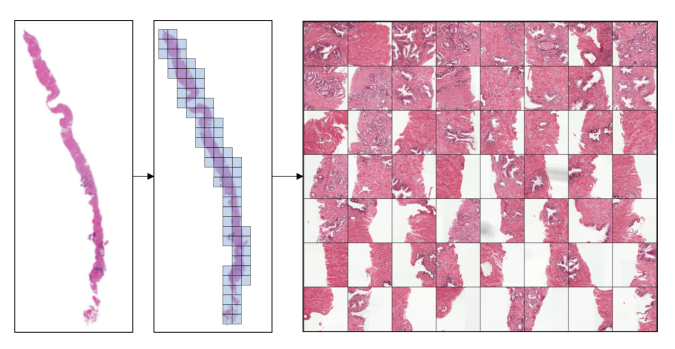

Fig. 1. An example of patch extraction from Whole slide images from the PANDA challenge dataset [2]. 
We tile the image and retain only the foreground patches, out of which we take a random subset to form a bag.

> 그림 1. PANDA 과제 데이터 세트에서 전체 슬라이드 이미지에서 패치 추출의 예[2]. 
> 우리는 이미지를 타일링하고 포그라운드 패치만 유지하며, 그 중 무작위로 부분 집합을 취하여 백을 형성합니다.

An alternative to supervised learning is weakly-supervised learning, where only a single label per Whole slide images is available.

> 지도 학습의 대안으로는 전체 슬라이드 이미지당 하나의 레이블만 사용할 수 있는 약한 지도 학습이 있습니다.

Multiple Instance Learning is a weakly supervised learning algorithms, which aims to train a model using a set of weakly labeled data [5,13].

> 다중 인스턴스 학습은 약하게 감독되는 학습 알고리즘으로, 레이블이 약한 데이터 세트를 사용하여 모델을 훈련하는 것을 목표로 한다[5,13].

Usually a single class label is provided for a bag of many unlabeled instances, indicating that at least one instance has the provided class label.

> 일반적으로 레이블이 지정되지 않은 많은 인스턴스 백에 대해 단일 클래스 레이블이 제공되므로 적어도 하나의 인스턴스가 제공된 클래스 레이블을 가지고 있음을 나타냅니다.

It has many applications in computer vision and language processing [4], however learning from bags raises important challenges that are unique to Multiple Instance Learning.

> 컴퓨터 비전 및 언어 처리[4]에 많은 응용 프로그램이 있지만 가방에서 학습하는 것은 다중 인스턴스 학습에 고유한 중요한 과제를 제기한다.

In context of histopathology, a Whole slide images  represents a bag, and the extracted patches (or their features) represent instances (we often use these notations interchangeably).

> 조직 병리학에서 전체 슬라이드 이미지는 가방을 나타내고 추출된 패치(또는 해당 기능)는 인스턴스를 나타낸다(이러한 표기법을 서로 교환하여 사용하는 경우가 많다).

With the advent of convolutional neural networks (convolutional neural network), deep learning based Multiple Instance Learning has become the mainstream methodological choice for Whole slide images  [10].

> 컨볼루션 신경망(컨볼루션 신경망)의 등장으로 딥 러닝 기반 다중 인스턴스 학습은 전체 슬라이드 이미지에 대한 주요 방법론 선택이 되었다[10].

Campanella et al. [3] was one of the first works to conduct a large study on over 44K Whole slide images, laying the foundation for Multiple Instance Learning applications in clinical practise.

> 캄파넬라 외 연구진. [3]은 44K 이상의 전체 슬라이드 이미지에 대한 대규모 연구를 수행한 최초의 연구 중 하나로, 임상 실습에서 다중 인스턴스 학습 애플리케이션의 기초를 마련했다.

Since the instance labels are not known, classical Multiple Instance Learning algorithm usually selects only one (or a few) instances based on the maximum of the prediction probability at the current iteration.

> 인스턴스 레이블을 알 수 없기 때문에, 고전적인 다중 인스턴스 학습 알고리즘은 일반적으로 현재 반복에서 예측 확률의 최대값에 기초하여 한 개 또는 몇 개의 인스턴스만 선택한다.

Such approach is very time consuming, as all patches need to be inferenced, but only a single patch contributes to the training of convolutional neural networks at each iteration.

> 이러한 접근 방식은 모든 패치를 참조해야 하므로 시간이 매우 많이 걸리지만, 각 반복에서 단일 패치만 컨볼루션 신경망의 훈련에 기여한다.

Ilse et al. [14] proposed to use an attention mechanism (a learnable weights per instance) to utilize all image patches, which we also adopt.

> Ilse 등[14]은 모든 이미지 패치를 활용하기 위해 주의 메커니즘(사례당 학습 가능한 가중치)을 사용할 것을 제안했으며, 이 또한 채택했다.

More recent Multiple Instance Learning methods include works by Zhao et al. [18], who proposed to pre-train a feature extractor based on the variational auto-encoder, and use a graph convolutional network for final classification.

> 보다 최근의 다중 인스턴스 학습 방법에는 Zhao 등의 연구가 포함된다. [18]은 가변 자동 추출기를 기반으로 형상 추출기를 사전 교육하고 최종 분류를 위해 그래프 컨볼루션 네트워크를 사용할 것을 제안했다.

Hashimoto et al. [7] proposed to combine Multiple Instance Learning with domain adversarial normalization and multiple scale learning.

> 하시모토 외. [7]은 다중 인스턴스 학습을 도메인 적대적 정규화 및 다중 스케일 학습과 결합할 것을 제안했다.

Lu et al. [11] precomputed patch-level features (using pretrained convolutional neural network) offline to speed up training, and proposed an additional clustering-based loss to improve generalization during Multiple Instance Learning training.

> 루 외 연구진. [11] 훈련 속도를 높이기 위해 오프라인에서 사전 계산된 패치 수준 기능(사전 훈련된 컨볼루션 신경망 사용)과 다중 인스턴스 학습 훈련 중 일반화를 개선하기 위한 추가 클러스터링 기반 손실을 제안했다.

Maksoud et al. [12] proposed to use a hierarchical approach to process the down-scaled Whole slide images  first, followed by high resolution processing when necessary.

> 막수드 외 연구진. [12]는 계층적 접근 방식을 사용하여 축소된 전체 슬라이드 이미지를 먼저 처리하고 필요할 때 고해상도 처리를 수행할 것을 제안했다.

Such approach demonstrated significant reduction in processing time, while maintaining the baseline accuracy.

> 그러한 접근법은 기준 정확도를 유지하면서 처리 시간을 크게 단축시켰다.

We observed that most Multiple Instance Learning methods assume no dependencies among instances, which is seldom true especially in histopathology [10].

> 우리는 대부분의 다중 인스턴스 학습 방법이 인스턴스 간의 의존성을 가정하지 않는다는 것을 관찰했는데, 이는 특히 조직병리학에서 거의 그렇지 않다[10].

Furthermore, a lack of instance-level loss supervision creates more opportunities for convolutional neural networks to overfit.

> 또한 인스턴스 수준의 손실 감독이 부족하면 컨볼루션 신경망이 오버핏될 기회가 많아진다.

In this work, we propose a deep learning based Multiple Instance Learning algorithm for Whole slide images  classification with the following contributions:

> 본 연구에서는 다음과 같은 기여를 하는 전체 슬라이드 이미지 분류를 위한 딥 러닝 기반 다중 인스턴스 학습 알고리즘을 제안한다.

we propose to explicitly account for dependencies between instances during training. 
We embed transformer encoder [15] blocks into the classification convolutional neural network to capture the dependencies between instances.

> 우리는 훈련 중에 인스턴스 간의 의존성을 명시적으로 설명할 것을 제안한다. 
> 인스턴스 간의 의존성을 포착하기 위해 변압기 인코더[15] 블록을 분류 컨볼루션 신경망에 내장한다.

we propose an instance-wise loss supervision based on instance pseudo-labels.

> 우리는 인스턴스 의사 지도를 기반으로 인스턴스별 손실 감독을 제안한다.

The pseudo-labels are computed based on the ensemble of several models, by aggregating the attention weights and instance-level predictions.

> 의사 레이블은 주의 가중치와 인스턴스 수준 예측을 집계하여 여러 모델의 앙상블을 기반으로 계산된다.

We evaluate the proposed method on PANDA challenge [2] dataset, which is currently the largest publicly available Whole slide images  dataset with over 11000 images, against the baseline methods as well as against the Kaggle challenge leaderboard with over 1000 competing teams, and demonstrate state-of-the-art (SOTA) classification results.

> 현재 11000개 이상의 이미지를 가진 가장 큰 공개 전체 슬라이드 이미지 데이터 세트인 PANDA 챌린지[2] 데이터 세트에 대해 제안된 방법을 기준 방법 및 1000개 이상의 경쟁 팀이 있는 Kaggle 챌린지 리더보드와 비교하여 평가하고 최신 SOTA(Solution) 분류 결과를 시연한다.

## 2. Method

Multiple Instance Learning aims to classify a bag of instances H = {h 1 , . . . , h K } as positive if at least one of the instances h k is positive.

> 다중 인스턴스 학습은 인스턴스 h k 중 하나 이상이 양수이면 인스턴스 H = {h 1 , . . , h K }의 가방을 양수로 분류하는 것을 목표로 한다.

The number of instances K could vary between the bags.

> 케이스 K의 수는 가방마다 다를 수 있습니다.

Individual instance labels are unknown, and only the bag level label Y = [0, 1] is provided:

> 개별 인스턴스 라벨은 알 수 없으며 가방 레벨 라벨 Y = [0, 1]만 제공됩니다.

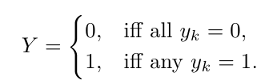

which is equivalent to Y = max k {y k } definition using a Max operator. 

> 이는 최대 연산자를 사용한 Y = 최대 k {y k } 정의와 같습니다.

Training a model whose loss is based on the maximum over instance labels is problematic due to vanishing gradients [14], and the training process becomes slow since only a single patch contributes to the optimization.

> 손실이 인스턴스 레이블의 최대치를 기반으로 하는 모델을 훈련하는 것은 그레이디언트가 사라지기 때문에 문제가 있으며[14] 단일 패치만 최적화에 기여하기 때문에 훈련 과정이 느려진다.

Ilse et al. [14] proposed to use all image patches as linear combination weighted by attention weights.

> Ilse 등[14]은 모든 이미지 패치를 주의 가중치에 의해 가중된 선형 조합으로 사용할 것을 제안했다. 

Consider H ∈ R M ×K to be instance embeddings, e.g. features of a convolutional neural network final layer after average pooling.

> 예를 들어 평균 풀링 후 컨볼루션 신경망 최종 계층의 특징과 같은 인스턴스 임베딩으로 H pooling R M ×K를 고려한다.

Then a linear combination of patch embeddings is

>  그러면 패치 임베딩의 선형 조합은

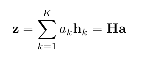

where the attention weights of patch embeddings are a = softmax(tanh(HV)w) where w ∈ R L×1 and V ∈ R M ×L are parameters.

> 여기서 패치 임베딩의 주의 가중치는 = 소프트맥스(tanh(HV)w)이며, 여기서 w Δ R L×1 및 V Δ R M ×L은 매개변수이다.

The attention weights are computed using a multilayer perceptron network with a single hidden layer.

> 주의 가중치는 단일 은닉 레이어가 있는 다층 퍼셉트론 네트워크를 사용하여 계산된다.

### 2.1 Dependency Between Instances

The assumption of no dependency between the bag instances often does not hold.

> 가방 인스턴스 사이에 의존성이 없다는 가정은 종종 받아들여지지 않는다.

For example, for grading the severity of prostate cancer, pathologists need to find two distinct tumor growth patterns in the image and assign Gleason scores to each [1]. 

> 예를 들어, 전립선암의 심각도를 평가하기 위해, 병리학자는 이미지에서 두 개의 뚜렷한 종양 성장 패턴을 찾고 [1]에 글리슨 점수를 할당해야 한다.

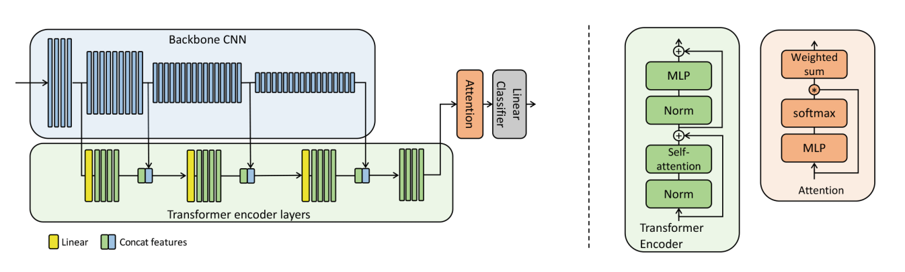

Fig. 2. Model architecture overview.

> 그림 2. 모델 아키텍처 개요

The backbone convolutional neural network (blue) extracts features at different scales, which are spatially averaged-pooled before feeding into the transformer encoder layers (green), to account for dependencies between instances.

> 백본 컨볼루션 신경망(파란색)은 인스턴스 간의 의존성을 설명하기 위해 변압기 인코더 계층(녹색)에 공급하기 전에 공간적으로 평균 풀링된 여러 척도로 특징을 추출한다.

The input to the network is B × N × 3 × W × H. Where B is the batch size, N is the number of instances (patches extracted from a single whole slide image), and 3 × W × H is the spatial patch size. (Color figure online)

> 네트워크에 대한 입력은 B × N × 3 × W × H입니다. 여기서 B는 배치 크기이고, N은 인스턴스 수(단일 슬라이드 이미지에서 추출한 패치)이며, 3 × W × H는 공간 패치 크기입니다. (온라인 컬러 그림)

Then the International Society of Urological Pathology grade is calculated, based on the combination of major and minor Gleason patterns.

> 그런 다음 국제 비뇨기과병리학회 등급은 글리슨 전공과 부전공 패턴의 조합에 기초하여 계산된다.

International Society of Urological Pathology grade indicates a severity of the tumor and plays a crucial role in treatment planning.

> 국제비뇨기과병리학회 등급은 종양의 심각성을 나타내며 치료 계획에 중요한 역할을 한다.

Here, we propose to use the self-attention to account for dependencies between instances.

> 여기서는 인스턴스 간의 종속성을 설명하기 위해 자체 주의를 사용할 것을 제안한다.

In particular, we adopt the transformer, which was initially introduced to capture long range dependencies between words in sentences [15] and later applied to vision [6].

> 특히, 우리는 처음에 문장[15]의 단어 사이의 장거리 의존성을 포착하기 위해 도입되었고 나중에 비전 [6]에 적용된 변압기를 채택한다.

Whereas traditional convolutions are local operation, the self-attention block of Transformers computes attention between all combinations of tokens at a larger range directly.

> 전통적인 컨볼루션이 로컬 작동인 반면, 트랜스포머의 자체 주의 블록은 더 큰 범위에서 토큰의 모든 조합 사이의 주의를 직접 계산한다.

출처 : https://hoya012.github.io/blog/Vision-Transformer-1/

A key component of transformer blocks is a scaled dot product self-attention which is defined as sof tmax(QK^T / √d)V , where queries Q, keys K, and values V matrices are all derived as linear transformations of the input (in our case the instance features space H).

> 변압기 블록의 핵심 구성 요소는 sof tmax(QK T / γ d)V 로 정의되는 스케일링된 도트 곱 자체 주의이며, 여기서 쿼리 Q, 키 K 및 값 V 행렬은 모두 입력의 선형 변환으로 파생된다(이 경우 인스턴스에는 공간 H가 특징임).

The self-attention is performed several times with different, learned linear projections in parallel (multi-head attention).

> 자기 주의는 서로 다른 학습된 선형 투영을 병렬로 여러 번 수행한다(다중 헤드 주의).

In addition to self-attention, each of the transformer encoder layers also contains a fully connected feed-forward network and layer normalization (see Fig. 2) [6,15].

> 자체 주의 외에도, 각각의 변압기 인코더 계층은 완전히 연결된 피드 포워드 네트워크와 레이어 정규화를 포함합니다 [6,15].

We propose two variants of utilizing transformers.

> 우리는 변압기를 활용하는 두 가지 변형을 제안한다.

In the simplest case we attach a transformer encoder block only to the end of the backbone classification convolutional neural network after avg pooling. 

> 가장 간단한 경우, 우리는 평균 풀링 후 백본 분류 컨볼루션 신경망의 끝에만 변압기 인코더 블록을 부착한다.

The idea is similar to the approach proposed in Visual transformers, but before avg pooling [6].

> 이 아이디어는 시각적 변압기에서 제안된 접근방식과 유사하지만, 평균 풀링 [6] 이전이다.

The difference here is that in Visual transformers, the goal was to account for dependencies between the spatial regions (16px × 16px) of the same patch.

> 여기서 차이점은 시각 변압기에서 목표는 동일한 패치의 공간 영역(16px × 16px) 사이의 의존성을 설명하는 것이었다.

Whereas we want to account for the dependencies among the patches.

> 반면에 패치 간의 종속성을 설명하고자 합니다.

Another relevant work was proposed by Wang et al. [16] to utilize self-attention within Multiple Instance Learning, but for text-based disease symptoms classification.

> 또 다른 관련 작업은 Wang 등에 의해 제안되었다. [16] 다중 사례 학습 내에서 자기 주의를 활용하지만 텍스트 기반 질병 증상 분류에 활용한다.

We maintain the dimensionality of encoded data, so that the input, output and hidden dimensionality of the transformer encoder are the same. 

> 우리는 변압기 인코더의 입력, 출력 및 숨겨진 차원이 동일하도록 인코딩된 데이터의 차원성을 유지한다.

We call it Transformer Multiple Instance Learning.

> 우리는 그것을 트랜스포머 다중 인스턴스 학습이라고 부른다.

We also consider a variant of a deeper integration of the transformer with the backbone convolutional neural network.

> 우리는 또한 변압기와 백본 컨볼루션 신경망의 더 깊은 통합의 변형을 고려한다.

We attach separate transformer encoder blocks after each of the main ResNet blocks [8] to capture the patch encodings at different levels of its feature pyramid.

> 우리는 각각의 주요 ResNet 블록[8] 뒤에 별도의 변압기 인코더 블록을 부착하여 기능 피라미드의 다양한 수준에서 패치 인코딩을 캡처한다.

The output of the first transformer encoder is concatenated with next feature scale space of ResNet (after average pooling), and is fed into the next level transformer encoder, up until the final encoder layer, followed by the attention layer.

> 첫 번째 변압기 인코더의 출력은 ResNet의 다음 기능 스케일 공간(평균 풀링 후)과 연결되며, 최종 인코더 레이어까지 다음 레벨 변압기 인코더로 공급되며, 그 뒤에 주의 레이어가 이어진다.

We want to capture dependencies between patches at multiple scales, since different level of convolutional neural network output features include different semantic information.

> 서로 다른 수준의 컨볼루션 신경망 출력 특징에는 서로 다른 의미 정보가 포함되기 때문에 우리는 여러 척도의 패치 간의 의존성을 포착하고자 한다.

Such a Pyramid Transformer Multiple Instance Learning network is shown in Fig. 2 (Fig. 3).

> 그러한 피라미드 변압기 다중 인스턴스 학습 네트워크는 그림 2에 나와 있다(그림 3).

### 2.2 Instance Level Semi-supervision and Pseudo-labeling

> 인스턴스 수준 준감독 및 유사 레이블링

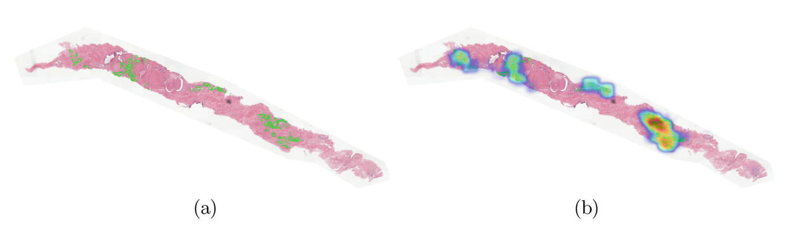

Fig. 3. An example International Society of Urological Pathology grade 5 prostate cancer Whole slide images . 

> 그림 3. 국제비뇨기과병리학회 5급 전립선암 전체 슬라이드 이미지.

(a) Green mask overlay shows ground truth location of cancer regions (provided in the PANDA dataset [2]).

> (a) 녹색 마스크 오버레이는 암 영역의 지상 진실 위치를 보여준다(PANDA 데이터 세트 [2]에 제공).

(b) an additional heat map overlay visualizes our pseudo-labels of International Society of Urological Pathology 5 (weighted by attention), achieved from training on weak (bag-level) labels only.

> (b) 추가적인 열 지도 오버레이는 약한(백 레벨) 라벨에 대한 교육에서만 달성된 국제 비뇨기과병리학회 5의 유사 라벨을 시각화한다.

Notice the close agreement between the dense pseudo-labels and the ground truth.

> 밀집된 의사 라벨과 실측 자료 사이의 밀접한 일치를 주목하세요.

In practice, pseudolabels are computed per patch; here we used a sliding-window approach for dense visualization. (Color figure online)

> 실제로 슈도라벨은 패치별로 계산된다. 여기서는 고밀도 시각화를 위해 슬라이딩 윈도우 접근법을 사용했다. (온라인 컬러 그림)

One of the challenges of Multiple Instance Learning training is the lack of instance labels to guide the optimization process.

> 다중 인스턴스 학습 교육의 문제점 중 하나는 최적화 프로세스를 안내할 인스턴스 레이블이 부족하다는 것이다.

A somewhat similar issue is encountered in semi-supervised learning [17], where pseudo-labels are used either offline or on the fly based on some intermediate estimates or another network’s predictions.

> 준지도 학습[17]에서 유사 레이블이 일부 중간 추정치 또는 다른 네트워크의 예측에 기초하여 오프라인 또는 즉석에서 사용된다.

Here, we propose to generate pseudo-labels for each image patch and use the additional patch-wise loss to assist the optimization process.

> 여기서는 각 이미지 패치에 대해 유사 레이블을 생성하고 추가 패치별 손실을 사용하여 최적화 프로세스를 지원할 것을 제안한다.

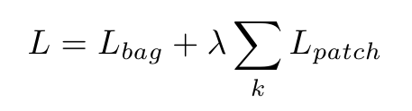

where the total loss L includes a bag-level loss L bag (based on the ground truth labels) and a patch level loss L patch (based on the pseudo-labels). We use crossentropy loss function for both bag-level and patch-level losses.

> 여기서 총 손실 L에는 가방 수준 손실 L 가방(접지 진실 레이블 기반)과 패치 수준 손실 L 패치(의사 레이블 기반)가 포함됩니다. 우리는 가방 수준 손실과 패치 수준 손실 모두에 대해 교차 엔트로피 손실 함수를 사용한다.

We opt for a simple approach to generate pseudo-labels based on ensembling of several identical models trained from random initialization.

> 우리는 무작위 초기화로부터 훈련된 여러 동일한 모델의 앙상블을 기반으로 의사 레이블을 생성하는 간단한 접근 방식을 선택한다.

The final ensembled labels are hard label (rounded to the nearest classes).

> 최종 앙상블 라벨은 하드 라벨(가장 가까운 클래스로 반올림)입니다.

Consider a trained network, its bag-level prediction output is based on the final output vector z (see Eq. 2), followed by a linear projection onto the number of output classes:

> 훈련된 네트워크를 고려했을 때, 그것의 백 레벨 예측 출력은 최종 출력 벡터 z (Eq. 2 참조)를 기반으로 하고, 그 다음에 출력 클래스 수에 대한 선형 투영:

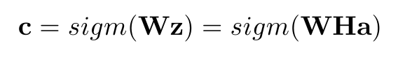

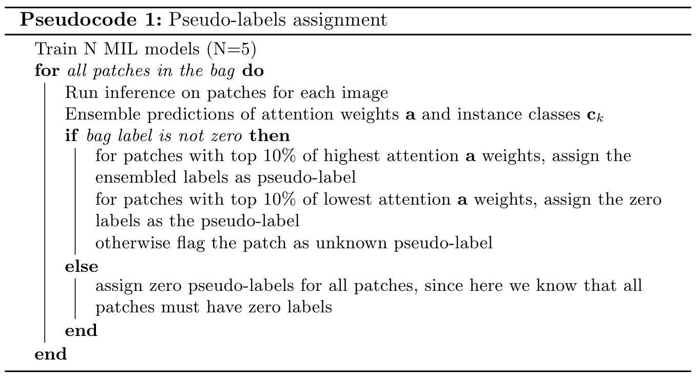

here we assumed a final sigmoid function (but the same holds with softmax).
We approximate the individual instance level prediction as

> 여기서 우리는 최종 시그모이드 함수를 가정했다(그러나 소프트맥스도 동일하다).
> 우리는 개별 인스턴스 수준 예측을 다음과 같이 근사화한다.

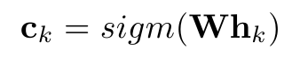

**Pseudocode1.** shows the algorithm to compute the pseudo-labels.

> **의사 코드1.**는 의사 계산을 위한 알고리즘을 보여줍니다.

For some patches, whose ensembled attention weights are neither small nor large (defined by 10% threshold), we do not assign any pseudo-labels, and mark then and unknown to exclude from the L patch loss.

> 앙상블 주의 가중치가 작지도 크지도 않은 일부 패치의 경우(10% 임계값에 의해 정의됨) 유사 레이블을 할당하지 않으며 L 패치 손실에서 제외하도록 표시하고 알 수 없음으로 표시한다.

Given the pseudo-labels we re-optimize the model using the additional patch-wise loss.

> 의사 레이블이 주어지면 추가 패치별 손실을 사용하여 모델을 다시 최적화한다.

The 10% heuristic was chosen to retain only most confident patches, that contribute the most to the final bag level classification.

> 10% 휴리스틱은 최종 가방 수준 분류에 가장 많이 기여하는 가장 신뢰할 수 있는 패치만 유지하도록 선택되었다.

A relevant approach was recently proposed by Lerousseau et al. [9].

> 관련 접근방식은 최근 Lerouseau 등에 의해 제안되었다[9].

However the goal of their work is a dense segmentation map, and not the improvements to the global classification accuracy, and the pseudo-labels are calculated differently, through thresholding of current prediction probability estimates on the fly.

> 그러나 연구의 목표는 글로벌 분류 정확도의 개선이 아닌 고밀도 분할 맵이며, 의사 레이블은 현재 예측 확률 추정치의 임계값을 즉시 통해 다르게 계산된다.

## 3. Experiments

We implemented our method in PyTorch 1 and trained it on 4 NVIDIA Tesla V100
16 GB GPUs, batch size of 16. For the classification backbone, we use ResNet50
pretrained on ImageNet [8].

> 우리는 PyTorch 1에 우리의 방법을 구현했고 4 NVIDIA Tesla V100에서 훈련했다.
> 16GB GPU, 배치 크기 16. 분류 백본은 ResNet50을 사용합니다.
> ImageNet [8]에서 사전 교육됩니다.

For the transformer layers, we keep a similar configuration as in [15], with 4 stacked transformer encoder blocks.

> 변압기 레이어의 경우 [15]와 유사한 구성을 유지하며 4개의 변압기 인코더 블록을 쌓습니다.

The lower pyramid level transformer has dimensionality of 256 for both input and hidden.

> 하부 피라미드 레벨 변압기는 입력과 은닉 모두에 대해 256의 치수성을 가진다.

The final transformer encoder has input dimension of 2308 (a concatenation of ResNet50
output features and the previous transformer outputs). 

> 최종 변압기 인코더의 입력 치수는 2308(ResNet50 연결)입니다.
> 출력 기능 및 이전 변압기 출력).

We use Adam optimizer with initial learning rate of α 0 = 3e−4 for convolutional neural network parameters, and 3e−5 for transformer parameters, then gradually decrease it using cosine learning rate scheduler for 50 epochs.

> 콘볼루션 신경망 매개 변수에는 초기 학습 속도가 α 0 = 3e-4, 변압기 매개 변수에는 3e-5인 Adam optimizer를 사용한 다음 50 Epoch 동안 코사인 학습 속도 스케줄러를 사용하여 점진적으로 감소시킨다.

We use 5-fold cross validations to tune the parameters.

> 우리는 매개 변수를 조정하기 위해 5배 교차 검증을 사용한다.

For transformer layers only, we use weight decay of 0.1 and no dropout.

> 변압기 층에만 0.1의 중량 붕괴를 사용하고 탈락은 하지 않습니다.

**PANDA Dataset.** Prostate cANcer graDe Assessment (PANDA) challenge dataset consists of 11K whole-slide images from two centers [2].

> **팬더 데이터 세트.** 전립선 cANCER graDe Assessment(PANDA) 챌린지 데이터 세트는 두 센터의 11K 전체 슬라이드 이미지로 구성된다[2].

Currently, this is the largest public Whole slide images  dataset available.

> 현재, 이것은 이용 가능한 가장 큰 공개 전체 슬라이드 이미지 데이터 세트이다.

The grading process consisted of finding and classifying cancer tissue into Gleason patterns based on the architectural growth patterns of the tumor [1].

> 채점 과정은 종양의 구조적 성장 패턴에 기초하여 암 조직을 찾아 글리슨 패턴으로 분류하는 것으로 구성되었다[1].

Consequently, it is converted into an International Society of Urological Pathology grade on a 1–5 scale, based on the presence of two distinct Gleason patterns.

> 그 결과, 글리슨 패턴의 존재에 기초하여 국제 비뇨기병학회 등급으로 전환된다.

The dataset was provided as part of the Panda kaggle challenge, which attracted more than 1000 teams, with the goal to predict the most accurate International Society of Urological Pathology grades.

> 이 데이터 세트는 가장 정확한 국제 비뇨기병학회 등급을 예측하는 것을 목표로 1000개 이상의 팀이 참여한 판다 카글 챌린지의 일부로 제공되었다.

Each individual image on average is about 25,000px × 25,000px RGB.

> 각각의 이미지는 평균적으로 약 25,000px × 25,000px RGB이다.

The challenge also includes a hidden dataset, whose images were graded by multiple pathologists.

> 과제는 또한 여러 병리학자에 의해 등급이 매겨진 숨겨진 데이터 세트를 포함한다.

The private dataset labels are not publicly available, but can be used to asses your model blindly via Kaggle website (invisible to the public as the challenge is closed now).

> 개인 데이터 세트 레이블은 공개적으로 사용할 수 없지만, Kaggle 웹 사이트를 통해 모델을 맹목적으로 평가하는 데 사용할 수 있다(지금 과제가 종료되었으므로 대중에게 보이지 않음).

In our experiments, we use a medium resolution input images (4× smaller than the highest resolution).

> 실험에서 우리는 중간 해상도 입력 이미지(최고 해상도보다 4배 작음)를 사용한다.

**Patch Selection.** To extract patches from Whole slide images , we tile the image into a grid of 224px x 224px patches. 

> **패치 선택.** 전체 슬라이드 이미지에서 패치를 추출하기 위해 이미지를 224px x 224px 패치로 바둑판식으로 배열합니다.

At each iteration, the grid has a random offset from the top left corner, to ensure randomness of the patches. We then retain only the foreground patches. From the remaining patches, we maintain only a random subset (K = 56), which is a trade-off between covering the tissue content and GPU memory limits (see Fig. 1).

> 각 반복 시 그리드는 패치의 임의성을 보장하기 위해 왼쪽 상단 모서리에서 임의 간격띄우기를 가집니다. 그런 다음 전경 패치만 보관합니다. 나머지 패치에서 조직 함량과 GPU 메모리 한계 사이의 트레이드오프인 임의의 하위 집합(K = 56)만 유지한다(그림 1 참조).

We use batch size 16, which makes the data input size 16 × K × 3 × 224 × 224 at each iteration. During testing, inference is done using all foreground patches.

> 우리는 각 반복에서 데이터 입력 크기를 16 × K × 3 × 224 × 224로 만드는 배치 크기 16을 사용합니다. 테스트하는 동안 모든 전경 패치를 사용하여 추론을 수행한다.

### 3.1 Results

**Transformer Multiple Instance Learning.**

> **트랜스포머 다중 인스턴스 학습.**

We evaluate and compare our method to the Attention Multiple Instance Learning and its Gated Attention Multiple Instance Learning [14], as well as to a classical Multiple Instance Learning with Max operator [3].

> 우리는 우리의 방법을 어텐션 다중 인스턴스 학습 및 게이트 어텐션 다중 인스턴스 학습[14]과 Max 연산자를 사용한 고전적인 다중 인스턴스 학습[3]과 평가하고 비교한다.

For evaluation metrics we use Accuracy, Area Under Curve and Quadratic Weighted Kappa of International Society of Urological Pathology grade prediction (see Table 1).

> 평가 지표에 대해서는 국제 비뇨기과병리학회 등급 예측의 정확성, 곡선 아래 면적 및 2차 가중 카파를 사용한다(표 1 참조).

Quadratic Weighted Kappa metric measures the similarity between the predictions and targets, with a maximum value of 1.

> 2차 가중 카파 메트릭은 최대값 1로 예측과 목표값 사이의 유사성을 측정합니다.

Quadratic Weighted Kappa was chosen as the main metric during the PANDA challenge [2], since it is more appropriate for the tasks with predicted classes being severity grades/levels

> 2차 가중 카파는 예측 클래스가 심각도 등급/수준인 작업에 더 적합하기 때문에 PANDA 과제[2] 동안 주요 메트릭으로 선택되었다.

All metrics are computed using our 5-fold (80%/20% training/validation) splits, except for the Leaderboard column results, which come from the evaluation on kaggle challenge hidden private test-set.

> 숨겨진 사설 테스트 세트에 대한 평가에서 나온 리더보드 열 결과를 제외하고 모든 메트릭은 5배(80%/20% 교육/유효성 검사) 분할을 사용하여 계산된다.

Even though the challenge is closed now, it allows for blind submission of the code snippet, which runs on the PANDA hidden set and outputs the final Quadratic Weighted Kappa number.

> 과제는 현재 종료되었지만 PANDA 숨겨진 세트에서 실행되고 최종 2차 가중 카파 숫자를 출력하는 코드 조각을 블라인드 제출할 수 있다.

These results are not added to the kaggle leaderboard, and are allowed only for post-challenge evaluations. 

> 이러한 결과는 카글 리더보드에 추가되지 않으며, 도전 후 평가에만 허용된다.

Table 1 shows that the proposed two transforms based approaches outperform other methods both in our validation sets, and on the challenge hidden set.

> 표 1은 제안된 두 가지 변환 기반 접근법이 검증 세트와 숨겨진 도전 세트 모두에서 다른 방법을 능가한다는 것을 보여준다.

We have also inspected the self-attention matrices and found that for many cases, they have distinct off-diagonal high value elements.

> 또한 자체 주의 매트릭스를 검사한 결과 많은 경우 뚜렷한 비대각 고부가 요소를 가지고 있는 것으로 나타났다.

In particular, instances with Whole slide images tumor cells of different Gleason scores have higher off-diagonal values, indicating that such a combination is valuable for the final classification, which was captured by the transformer self-attention.

> 특히 글리슨 점수가 다른 전체 슬라이드 이미지를 가진 인스턴스의 경우 비대각 값이 더 높기 때문에 이러한 조합이 변압기 자체 주의에 의해 포착된 최종 분류에 가치가 있음을 나타낸다.

**Patch-Wise Pseudo-labels.** We train 5 models and ensemble their patch-level predictions. 

> **패치-Wise 유사 레이블.** 5개 모델을 교육하고 패치 수준 예측을 종합합니다.

We use λ = 100. We show the performance of adding the pseudolabels supervision in Table 2.

> 우리는 θ = 100을 사용한다. 표 2에서 유사 라벨 감독을 추가한 성능을 보여준다.

In all cases the performance has improved compared to the baselines shown in Table 1 by ∼1%. Table 2 also shows the QWK results of the winners (top 3 places) of the PANDA kaggle challenge.

> 모든 경우에 성능은 표 1에 표시된 기준선에 비해 ~1% 향상되었습니다. 표 2는 PANDA 카글 챌린지 우승자(상위 3위)의 QWK 결과도 보여준다.

Notice that our single model results are on par with the winners of the challenge (who all use ensembling of several models). 

> 우리의 단일 모델 결과는 도전의 승자(모두 여러 모델의 앙상블을 사용함)와 동등하다.

We also experimented with ensembling, and the ensemble of our 10 models, achieves the leaderboard QWK of 0.94136, which would have been the first place in the leaderboard.

> 또한 앙상블을 실험하여 10개 모델의 앙상블이 리더보드 QWK 0.94136을 달성했으며, 이는 리더보드에서 1위를 차지했을 것이다.

We have also tried but found no benefit of repeating pseudo-labeling several rounds, because the pseudo-label values almost do not change after the 1st round.

> 의사 레이블 값은 1차 이후에도 거의 변하지 않기 때문에 우리는 또한 여러 라운드에 의사 레이블을 반복하는 것의 이점을 발견하지 못했다.

Table 1. Evaluations results on PANDA dataset. 

> 표 1. PANDA 데이터 세트에 대한 평가 결과.

The Leaderboard column shows the QWK results of the private leaderboard of Kaggle’s challenge, which allows direct comparison to more then 1000 participants.

> 리더보드 열은 Kaggle의 챌린지 개인 리더보드의 QWK 결과를 보여주며, 이를 통해 1000명 이상의 참가자와 직접 비교할 수 있습니다.

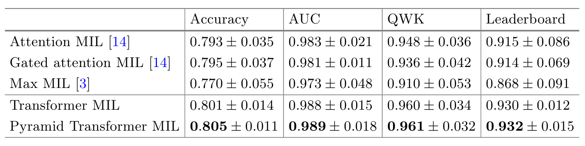

Table 2. Evaluation results of adding pseudo-labels to our baseline transformer Multiple Instance Learning approaches.

> 2번 테이블. 기준 변압기 다중 인스턴스 학습 접근법에 의사 레이블을 추가하는 평가 결과.

We also include the results of the top three places of this challenge a (who all use ensembling of several models).

> 또한 이 과제의 상위 세 위치 a(모두 여러 모델의 앙상블을 사용함)의 결과도 포함한다.

Our results indicate that pseudo-labeling further improves the performance, with our single model providing results on par with the top winning teams.

> 우리의 결과는 의사 라벨링이 성능을 더욱 향상시켜 단일 모델이 상위 우승 팀과 동등한 결과를 제공한다는 것을 보여준다.

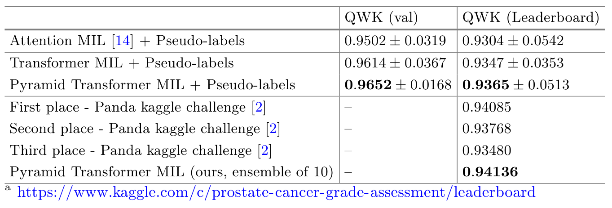

## 4. Discussion and Conclusion

We proposed a new deep learning based Multiple Instance Learning approach for Whole slide images  classification with the following two main contributions: the addition of the transformer module to account for dependencies among instances and the instance-level supervision loss using pseudo-labels.

> 인스턴스 간 의존성을 설명하기 위한 변압기 모듈의 추가와 의사 레이블을 사용한 인스턴스 수준 감독 손실의 두 가지 주요 기여와 함께 전체 슬라이드 이미지 분류를 위한 새로운 딥 러닝 기반 다중 인스턴스 학습 접근 방식을 제안했다.

We evaluated the method on PANDA challenge prostate Whole slide images dataset, which includes over 11000 images.

> 우리는 11000개 이상의 이미지를 포함하는 PANDA 챌린지 전립선 전체 슬라이드 이미지 데이터 세트에 대한 방법을 평가했다.

To put in perspective, most recently published SOTA methods evaluated their performance on datasets with the order of only several hundred images [7,11,12,18].

> 쉽게 말하면, 가장 최근에 발표된 SOTA 방법은 수백 개의 이미지만으로 데이터 세트에 대한 성능을 평가했다[7,11,12,18].

Furthermore, we compared our results directly to the leaderboard of the PANDA kaggle challenge with over 1000 participating teams, and demonstrated that our single model performance is on par with the top three winning teams, as evaluated blindly on the same hidden private test-set.

> 또한 1,000개 이상의 참가 팀이 있는 PANDA 카글 챌린지의 리더보드와 결과를 직접 비교하고, 동일한 숨겨진 비공개 테스트 세트에서 맹목적으로 평가한 결과 우리의 단일 모델 성능이 상위 3개 팀과 동등하다는 것을 입증했다.

Finally, recently proposed visual transformers [6] have shown a capability to replace the classification convolutional neural network completely, allowing for the possibility to create deep learning based Multiple Instance Learning model solely based on the transformer blocks; we leave these investigations for future research.

> 마지막으로, 최근에 제안된 시각적 변압기[6]는 분류 컨볼루션 신경망을 완전히 대체할 수 있는 기능을 보여줌으로써, 변압기 블록만을 기반으로 딥 러닝 기반 다중 인스턴스 학습 모델을 만들 수 있는 가능성을 보여주었다. 이러한 조사는 향후 연구를 위해 남겨두었다.

## Ref

https://wikidocs.net/22893

http://www.aitimes.kr/news/articleView.html?idxno=17314

https://wikidocs.net/31379

