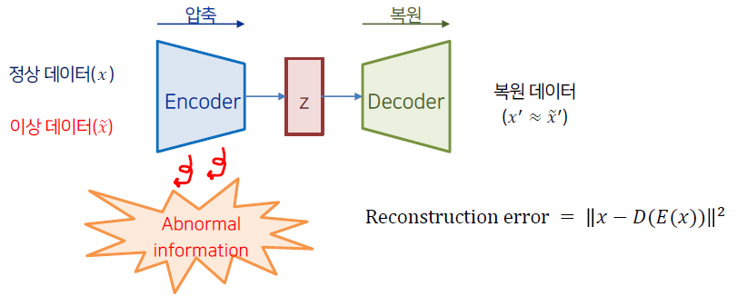
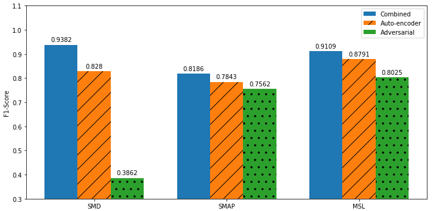
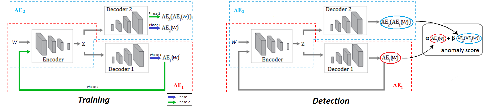
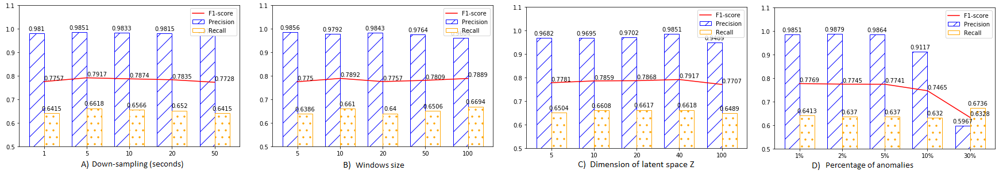

# USAD: UnSupervised Anomaly Detection on Multivariate Time Series

# Data analysis programming.

Kyonggi Univ. 2021. 02. CC545_0351.

### Name

USAD : UnSupervised Anomaly Detection on Multivariate Time Series

### Date

2021.12.09

**Background**

주어진 학습 데이터 셋에서 기존 관측과는 상이하여 다른 메커티즘에 의해 생성되었다고 판단할만한 관측값을 anomaly sample이라고 부르며, 이상치를 탐지하는 task를 anomaly detection (AD)이라고 부른다. 

Anomaly detection task는 abnormal에 대한 label의 유무에 따라 supervised setting과 unsupervised setting으로 나뉜다. 

대부분의 real world에서는 label이 존재하지 않아 unsupervised setting에서의 높은 성능을 기록하는 알고리즘들이 각광을 받고 있다.

Unsupervised anomaly detection on multivariate time series (USAD)는 이름에서 알 수 있듯이 다변량 시계열에서 unsupervised setting으로 anomaly detection task를 진행하는 모델이다. 

각 용어들의 의미를 살펴보자. 

앞서 정의한 anomaly 말고 눈에 띄는 단어는 multivariate time series이다. 

Multivariate time series란 각 시간 단위마다 여러 개의 값을 가지는 시계열을 뜻한다. 

그림으로 표현하면 Figure 02와 같다 [1].

Figure 02 : Multivariate time series example

다음으로 unsupervised anomaly detection은 크게 autoencoder (AE) 기반 알고리즘, variational autoenc-oder (VAE) 기반 알고리즘, generative adversarial networks (GANs) 기반 알고리즘이 존재한다. 

Unsuperv-ised anomaly detection 알고리즘은 AE -> VAE 혹은 AE -> GANs로 변하는 추세인데 그 이유에 대해서는 추후에 posting 하도록 하겠다. 

USAD의 작동 과정을 설명하기 전에 본 논문의 contribution을 이해하기 위해서 AE 기반 AD와 GANs 기반 AD의 장단점을 알아보자.

**Autoencoder based anomaly detection**

먼저 anomaly detection은 학습 단계(training phase)와 탐지 단계(detection phase)로 구분할 수 있다. 

AE 기반 모델의 학습 단계에서는 정상 데이터를 압축&복원 과정을 거치는데, 

이 때 복원된 시계열과 원본 시계열 간의 차이인 reconstruction error를 minimize 하여 정상 데이터를 잘 복원하는 모델을 구축한다.

이처럼 정상 데이터만을 학습한 AE 모델은 비정상 데이터를 입력하였을 경우 큰 값의 reconstruction error를 갖는다. 

학습에서 보지 못한 data기에 제대로 복원하지 못하는 것인데, 탐지 단계에서는 위 성질을 활용하여 정상과 이상 데이터가 혼재해 있는 데이터를 AE의 input으로 넣은 후 이를 복원하였을 때 발생한 reconstruction error를 사용하여 threshold를 넘기면 이상, 넘기지 않으면 정상으로 판단한다. 

이 때 이상 탐지의 기준이 되는 reconstruction error를 anomaly score라고 부른다.

AE 기반의 anomaly detection 알고리즘의 경우 학습이 용이하다는 장점이 있지만 정상 데이터의 분포와 유사한 비정상 데이터가 들어올 경우 이를 잘 구별하지 못한다는 단점이 존재한다. 

이는 AE의 압축 과정에서 복원에 불필요한 정보를 제거하기 때문인데 학습 단계에서 정상 데이터만을 사용한다는 특성과 맞물려 비정상을 탐지할 수 있는 abnormal information이 소거되는 특징이 있다. 

다시 말하면 정상 데이터만을 학습한 AE의 경우 비정상 데이터가 들어오더라도 최대한 정상처럼 복원하는 성질이 존재하기에 **미세한 차이의 anomaly sample을 검출하지 못한다**는 단점이 존재한다.

fig 3. Autoencoder based anomaly detection architecture

**Generative adversarial networks based anomaly detection**

GANs는 가상 데이터(fake data)를 생성하는 generator와 실제(real)와 fake data를 구분하는 discriminator로 구성된다. 

GANs 기반 anomaly detection은 real data를 normal로, fake data를 abnormal로 판단하여 학습을 진행하며 전반적인 구조는 Figure 04와 같다 [2].

Figure 04 : GANs based anomaly detection architecture (GANomaly)

GANs 기반 방법의 경우 input sequence의 압축 및 복원을 generator가 담당한다. 이 때 generator의 목적은 discriminator를 속이는 것이기에 generator의 encoder, decoder가 real 정보 뿐 아니라 fake에 대한 정보를 포함하도록 강제된다. 

즉 discriminator의 도입으로 압축과 복원을 담당하는 encoder, decoder가 보다 자세하게 비정상 데이터를 구분할 수 있게 되어 기존 AE기반 모델의 단점을 보완하는 특징이 있다. 

다만 com-puter vision 등에서 발생하는 GANs의 일반적인 문제점과 마찬가지로 안정적인 학습이 어렵다는 단점이 존재한다.

USAD는 두 가지 방법의 장점을 모두 취하는 모델이다. 학습이 쉽고 안정적인 결과를 낼 수 있는 AE의 장점과 discriminator의 도입으로 abnormal information을 포함할 수 있는 GANs의 장점을 결합하였다. 

AE를 사용하되 adversarial training을 적용하여 보다 상세한 anomaly detection을 추구하였다.

Figure 05 : USAD architecture

USAD의 architecture는 Figure 05와 같다. 

Adversarial training을 적용하기 위해 2개의 decoder를 사용하였다는 점 외에는 기존의 AE 기반의 anomaly detection과 동일한 구조를 갖는다. 

Notation을 잠시 정리하면 두 개의 decoder는 각각 $D_1, D_2$로 표기되며 이들은 동일한 encoder network $E$ 를 사용한다. 

W를 training data 안에 있는 sequence의 window라고 하였을 때 두 개의 Decoder에 따라 AE는 각각 $AE_1=D_1(E(W)),AE_2=D_2(E(W))$와 같이 표기된다. 

이제 USAD의 학습 단계와 탐지 단계에 대해서 알아보자.

**Training process**

USAD는 두 단계를 거쳐서 학습이 진행된다. 

첫 번째 단계는 AE training 단계로 기존의 AE를 학습하는 것과 동일한 과정을 거친다. 

이를 수식으로 표현하면 다음과 같다.

학습의 첫 번째 단계인 AE training 과정에서는 각각의 AE가 training data에 속해있는 input W (real, normal)를 잘 복원하도록 학습을 진행한다. 

다음으로 두 번째 단계인 adversarial training 과정을 알아보자.

Adversarial training 과정에서 각각의 $autoencoder (AE_1, AE_2)$는 다음과 같은 목적을 지닌다.

Train $AE_2$ to distinguish the real data from the data coming from $AE_1$, and train $AE_1$ to fool $AE_2$

$*AE_2*$는 real data인 $W$와 $AE_1$로 부터 복원된 fake data인 $AE_1(W)$를 구분하도록 학습한다.

반면 $AE_1$은 $AE_2$의 real과 fake에 대한 판별 성능을 저하시키는 것을 목적으로 학습이 진행된다.

즉 $AE_1$은 GANs에서 generator의 역할을, $AE_2$는 discriminator의 역할을 수행한다. 

Adversarial training 단계에서의 목적함수는 다음과 같이 표기할 수 있다.

각각의 수식이 갖는 의미를 살펴보자. 먼저 generator 역할을 수행하는 첫 번째 autoencoder는 real data $W$와 fake에 대한 $AE_2$의 output인

$AE_2(AE_1(W))$간의 차이를 최소화 시켜야 discriminator를 속일 수 있다. 

반대로 discriminator 역할을 수행하는 두 번째 autoencoder는 fake data가 input으로 들어 왔을 때 real data와의 차이를 최대화 시켜야(=large reconstruction error) real과 fake를 잘 구별하고 있다고 볼 수 있다. 

따라서 $AE_1$**은 fake에 대한** $AE_2$**의 reconstruction error를 줄이도록 학습**하고, 반대로 $AE_2$**는 fake에 대한 reconstruction error를 키우도록 학습**

한다.

위의 두 가지 training phase를 하나의 loss function으로 표기하면 다음과 같다.

먼저 위 수식의 세부 term에 대해서 설명하면 다음과 같다. 

각각의 loss에서 앞의 term은 real data에 대한 reconstruction error로써 원본 데이터를 잘 복원하는 AE training의 loss에 해당한다. 

AE training term을 통해서 원래의 input을 잘 복원하도록 학습이 진행된다. 

다음으로 두 번째 term의 경우 adversarial training의 loss로 구성되어 있다. 

앞에서 살펴본 minimize, maximize term이 부호로써 각각 +,-로 표기가 된 것을 확인할 수 있다. 

마지막으로 두 term을 합할 때 곱해지는 분모의 $n$은 학습 중인 epoch을 뜻하여 학습 초반에는 real data에 대한 reconstruction error에 가중치를 주고 학습 후반에는 adversarial training에 가중치를 주는 역할을 한다. 

이제 각각의 AE 관점에서 loss를 이해해보자. 

$AE_1$에 적용되는 loss를 살펴보면 real data에 대한 reconstruction error와 fake data에 대한 $AE_2$의 reconstruction error가 모두 최소일 때 최소값을 갖는다. 

이를 통해 $AE_2$가 fake data에 대한 판별력이 떨어지는 것을 목표로 하는 것을 확인할 수 있다.  

반대로 $AE_2$에 적용되는 loss를 살펴보면 real data에 대한 reconstruction error가 최소이고, fake data에 대한 $AE_2$의 reconstruction error가 최대일 때 최소값을 갖는다. 

즉 fake data가 들어왔을 때 anomaly가 들어왔다는 신호인 reconstruction error를 크게 내뱉도록 학습이 진행된다. 

GANs 기반 anomaly detection에서 real은 normal, fake은 abnormal로 사용하는 것을 감안하면 $AE_2$는 결국 **normal과 abnormal의 미세한 차이를 극대화**시키는 역할을 하게 된다. 

기존의 AE 기반 anomaly detection model과 비교하여 높은 성능을 보일 수 있는 이유가 여기에 있다.

**Detection process**

학습이 완료된 USAD를 사용하여 실제 anomaly detection을 수행하는 과정을 알아보겠다. 먼저 USAD의 anomaly score 산출 공식은 다음과 같다.

$*\hat W*$은 unseen data, 즉 train data에 존재하지 않은 새로운 sequence의 window를 뜻하며 normal과 abnor-mal이 혼재되어있다. 

USAD의 anomaly score는 input과 $AE_1$의 reconstruction error와 더불어 input과 fake에 대한 $AE_2$의 reconstruction error의 가중합으로 산출할 수 있다. 

USAD의 anomaly score는 뒷 term에 해당하는 fake에 대한 $AE_2$의 reconstruction error를 사용하여 정상과 매우 유사한 분포를 지닌 비정상 데이터가 들어오더라도 이를 탐지할 수 있게된다. 

두 가지 term을 결합할 때 사용되는 hyper-parameter인 $\alpha$와 $\beta$ 합은 1로 설정이 되며 parameter setting에 따라 다음과 같은 결과를 얻을 수 있다.

$\beta$가 커진다는 것은 정상 분포와 약간만 달라지더라도 큰 anomaly score를 발생시키기 때문에 detection의 횟수는 증가하고, 이에 따라 detection sensitivity가 높아지게 된다. 

반대로 real data에 대한 reconstruction error를 더욱 크게 반영할 경우 미세한 anomaly detection은 불가하여 detection 수는 감소하고 detection sensitivity는 낮아지게 된다.

**Experiments**

USAD는 총 5가지 public datasets와 1가지 private dataset을 활용하여 성능을 검증하였다. 5가지 public datasets은 다음과 같다.

- Secure water treatment (SWatT)
- Water distribution (WADI)
- Server machine dataset (SMD)
- Soil moisture active passive (SMAP)
- Mars science laboratory (MSL)

각각의 datasets에 대한 평가 지표는 precision, recall, F1 score, F1 star로 구성되며 F1 star의 경우 precision과 recall의 평균을 사용하여 도출된 값이다.

다음은 5가지 datasets에 대한 비교 모델과의 성능 비교표이다. 

첫 번째 표의 without/with는 point-adjust 적용 여부를 뜻하며 point-adjust란 각각의 observation/time-point에 대해서 독립적으로 anomaly를 detecting 한것으로 이해하였다.

> Point-adjust : detect each observation/time-point independently and assigns a label to single time-point
> 

Figure 06 : Performance table 01

다음은 5가지 datasets에 대한 알고리즘별 average performance (standard deviation)을 기록한 표이다.

Figure 07 : Performance table 02

성능 비교 표를 정리하면 대부분의 경우에서 USAD가 좋은 성능을 보여주는 것을 확인할 수 있다. 특히 AE를 활용한 anomaly detection과 비교하면 월등한 성능을 보여준다. 다만 MAD-GAN, TadGAN을 비롯한 GANs 기반의 알고리즘과 비교시 좋은 성능을 보여줄 수 있을지는 미지수다. Adversarial training이 적용된 모델인 만큼 GANs 기반 anomaly detection과의 성능 비교도 있었으면 좋았을 것 같다.

다음은 SWaT data에 대한 hyper-parameter별 성능을 기록한 표이다. 앞서 말한대로 $\beta$값이 커짐에 따라 detection의 수가 많아짐을 확인할 수 있다. 

신기하게도 $\beta$를 1로 두어 adversarial term만을 반영했을 때가 F1 score 기준으로 가장 좋았던 것을 알 수 있다. 

이는 SWaT data의 anomaly sample이 normal sample과의 차이가 크게 나지 않기 때문이 아닌가 추측해본다.

Figure 08 : Performance table 03

마지막으로 USAD에서 adversarial training의 효과를 확인하기 위한 ablation study 결과는 다음과 같다.

3가지 datasets에 대해서 순수 adversarial의 성능은 가장 낮으나 AE와 결합했을 때 가장 좋은 성능을 보인 것을 확인할 수 있었다. 

앞에서 hyper-parameter별 모델 성능과는 다른 결과가 나온점이 의아하기 했다.

USAD는 기존의 AE 기반의 anomaly detection 알고리즘의 장점과 GANs 기반의 anomaly detection 알고리즘의 장점을 결합한 방법이다. 

해당 방법의 성능 향상 효과는 실험을 통해서 AE 기반의 방법보다는 효율적임을 보였으나 GANs 기반의 방법과의 비교는 존재하지 않았다. 

또한 도출된 anomaly score로부터 abno-rmal을 판단하는 thresholding에 대한 자세한 설명이 존재하지 않았다.

## Abstract.

The automatic supervision of IT systems is a current challenge at Orange. 

Given the size and complexity reached by its IT operations, the number of sensors needed to obtain measurements overtime, used to infer normal and abnormal behaviors, has increased dramatically making traditional expert-based supervision methods slow or prone to errors. 

In this paper, we propose a fast and stable method called UnSupervised Anomaly Detection for multivariate time series (USAD) based on adversely trained autoencoders. 

Its autoencoder architecture makes it capable of learning in an unsupervised way. 

The use of adversarial training and its architecture allows it to isolate anomalies while providing fast training. 

We study the properties of our methods through experiments on five public datasets, thus demonstrating its robustness, training speed and high anomaly detection performance. 

Through a feasibility study using Orange’s proprietary data we have been able to validate Orange’s requirements on scalability, stability, robustness,
training speed and high performance.

**Keywords**: Anomaly detection, Multivariate Time Series, Neural networks, Autoencoders, Adversarial Network, Unsupervised learning, Supervision

## 1. Introduction

IT system monitoring is a supervision process on measurable events and outputs of a system, which is used as a reference specifying the system’s proper functioning. 

Deviations from the reference are analyzed to determine if there exists a fault. 

Historically, this analysis has been done by system monitoring experts who establish normal behavior thresholds for every measured event/output. 

If a measurement exceeds its associated expert-defined threshold, it is considered that the system is not behaving as expected. 

Because of the size and complexity of today’s IT operations at Orange, the number of sensors needed to obtain measurements over time has increased dramatically making traditional expert-defined thresholdbased methods no longer usable as they are not scalable. 

Under this scenario, the automation of our IT system monitoring has become a necessity. 

Automated IT system monitoring required the development of methods that observe the different measurements acquired by the sensors and, from these, infer normal and abnormal behaviors.

---

Detecting unexpected behavior on a set of measurements correlated with each other over time is an active research discipline called
anomaly detection in multivariate time series [2]. 

In the past years, many approaches have been developed to address this issue. 

The most commonly used techniques include distance-based techniques such as k-nearest neighbors [3],clustering such as K-means[9], classification
with One-Class SVM [11]. 

However, today’s IT systems have reached a complexity that no longer allows the use of these methods. 

Indeed, as the number of dimensions increases, these techniques generally suffer from sub-optimal performance due to the curse of dimensionality. 

Most recently, the ability of unsupervised anomaly detection methods based on deep learning to infer correlations between time series which allow identifying anomalous behaviors has received a lot of attention [12][20][17][18].

---

Among deep learning methods for detecting anomalies on temporal data, methods based on recurrent neural networks [7] (RNNs) are very popular. 

However, RNNs results are well-known for being computationally hungry and requiring a significant amount of time to be train. 

Thus, RNNs incur in high costs associated to time, energy consumption and CO2 emissions. 

For Orange, the use of highly scalable, but also low energy consuming methods is a key issue. 

Indeed, Orange is constantly pursuing its efforts to improve energy efficiency through its“Green IT&Networks” program. 

These constraints of high scalability and movement towards GreenAI [16], oblige us to rethink the important characteristics of the deep learning methods to be put in place. 

Therefore, it is desirable to develop implement methods with high algorithmic efficiency.

---

Other deep learning-based methods that have been of great interest recently are those based on generating adversary networks [5].

However, GAN training is not always easy, due to problems such as mode collapse and non-convergence [1]. 

The lack of stability is a major obstacle when considering to implement and deploy these methods into production at Orange. 

A production environment requires the development of robust methods that can be re-trained routinely.

---

In this paper, we propose a new method called UnSupervised Anomaly Detection for multivariate time series (USAD) based on an autoencoder architecture [15] whose learning is inspired by GANs.

The intuition behind USAD is that the adversarial training of its encoder-decoder architecture allows it to learn how to amplify the reconstruction error of inputs containing anomalies, while gaining stability compared to methods based on GANs architectures.

Its architecture makes it fast to trained meeting Orange’s expectations in terms of scalability and algorithm efficiency. 

The main contributions of this paper are:

- We propose an encoder-decoder architecture within an adversarial training framework that allows to combine the advantages of autoencoders and adversarial training, while compensating for the limitations of each technique
- We perform an empirical study on publicly available datasets to analyze robustness, training speed and performance of the proposed method.
- We perform a feasibility study with Orange’s proprietary data to analyze if the proposed method meets the company’s requirements on scalability, stability, robustness, training speed and high performance.

The rest of this document is organized as follows. Section 2 discusses methods for detecting unsupervised anomalies in multivariate time series. 

Section 3 discusses the details of our method. 

Sections 4 and 5 describe the experiments and demonstrate the state-of-the-art performance of our method.

## 2. Related work

Anomaly detection for time series is a complex task that has been largely studied [6]. 

Among the different taxonomies which have been proposed, methods can be identified as clustering [9], densitybased[11], distance-based [3] and isolation-based methods [10].

---

In addition to traditional methods, the ability of unsupervised anomaly detection methods based on deep learning to infer correlations between time series has recently received much attention[12, 18, 20]. 

The Deep Autoencoding Gaussian Mixture Model(DAGMM) [21] jointly considers a Deep Autoencoder and a Gaussian Mixture Model to model the density distribution of multidimensional data. 

The Multi-Scale Convolutional Recursive EncoderDecoder(MSCRED) [20] jointly considers time dependence, noise robustness and interpretation of anomaly severity. 

The LSTMVAE[14] combines the LSTM with a variational autoencoder (VAE) by replacing the feed-forward network in a VAE with a LSTM. 

The Adversarially Learned Anomaly Detection (ALAD) [19] is based on bi-directional GANs, that derives adversarially learned features for the anomaly detection task. 

The LSTM-VAE models the time dependence of time series through LSTM networks and obtains a better generalization capability than traditional methods. 

Most recently, Su et al proposed a stochastic recurrent neural network for multivariate time series anomaly detection, the OmniAnomaly, that learns robust multivariate time series’ representations with a stochastic variable connection and a planar normalizing flow, and use the reconstruction probabilities to determine anomalies [17].

However, these methods obtain good results at the expense of their training speed. Indeed, none of these methods take into account the training time (i.e. energy consumption) in their performance criteria. 

This is why it is necessary today for Orange to develop methods with performances equivalent to the state of the art in terms of anomaly detection, while favoring architectures that allow fast and energy-efficient training.

## 3. Method

We first formalize the problem we are addressing in section 3.1.

In 3.2 we present the formulation of our method. Finally, in section 3.3 we describe the method’s implementation.

### 3.1 Problem formulation

A univariate time series is a sequence of data points

$$T = ( x_1, . . . , x_T )$$

each one being an observation of a process measured at a specific time $t$. 

Univariate time series contain a single variable at each time instant, while multivariate time series record more than one variable at a time; we denote multivariate time series as $T = x_1, . . . , x_T, x ∈ R^m$. 

In this work we focus on the more general setting of multivariate time series, as the univariate setting is a particular case of the multivariate one with $m = 1$.

---

Now consider an unsupervised learning problem where $T$ is given as training input. Anomaly detection refers to the task of identifying an unseen observation $\hat x_t$$, t > T$ , based on the fact that it differs significantly from $T$, thus assuming that $T$ contains only normal points. 

The amount by which the unseen sample $\hat x_t$ and the normal set $T$ differ is measured by an anomaly score, which is then compared to a threshold to obtain an anomaly label.

---

To model the dependence between a current time point and previous ones, let us now define $W_t$, a time window of length $K$ at given time $t$:

$$W_t = x_{t−K+1}, . . . , x_{t−1}, x_t$$

It is possible to transform the original time series $T$ into a sequence of windows $W = {W_1, . . . ,W_T }$ to be used as training input. 

Given a binary variable $y ∈ {0, 1}$, the goal of our anomaly detection problem is to assign to an unseen window $\hat W_t, t > T$ , a label $y_t$ to indicate a detected anomaly at time $t$, i.e. $y_t$ = 1, or not ($y_t$ = 0) based on the window’s anomaly score. 

For the sake of simplicity and without loss of generality we will use $W$ to denote a training input window and $\hat W$ to denote an unseen input one.

### 3.2 Unsupervised Anomaly Detection

An autoencoder (AE) [15] is an unsupervised artificial neural network combining an encoder $E$ and a decoder $D$. 

The encoder part takes the input $X$ and maps it into a set of latent variables $Z$, whereas the decoder maps the latent variables $Z$ back into the input space as a reconstruction $R$. 

The difference between the original input vector $X$ and the reconstruction $R$ is called the reconstruction error.

Thus, the training objective aims to minimize this error. 

It is defined as:

$$L_{AE} = ∥X − AE(X)∥_2$$

where

$$AE(X) = D(Z), Z = E(X)$$

and $∥ · ∥_2$ denotes the L2-norm.

---

Autoencoder-based anomaly detection uses the reconstruction error as the anomaly score. 

Points with a high score are considered to be anomalies. 

Only samples from normal data are used at training. 

At inference, the AE will reconstruct normal data very well, while failing to do so with anomaly data which the AE has not encountered. 

However, if the anomaly is too small, i.e. it is relatively close to normal data, the reconstruction error will be small and thus the anomaly will not be detected. 

This occurs because the AE aims to reconstruct input data as well (as close to normality) as possible.

To overcome this problem, the AE should be able to identify if the input data contains no anomaly before doing a good reconstruction.

---

The possibility for a method to know whether an input sample is normal or not is what characterizes Generative Adversarial Networks (GANs) [5]. 

A GAN is an unsupervised artificial neural network based on a two-player minimax adversarial game between two networks, which are trained simultaneously. 

One network, the generator (G), aims to generate realistic data, whereas the second one acts as a discriminator (D) trying to discriminate real data from
that one generated by G. 

The training objective of G is to maximize the probability of D making a mistake, whereas the training objective D is to minimize its classification error.

---

Similarly to AE-based, GAN-based anomaly detection uses normal data for training. 

After training the discriminator is used as an anomaly detector. 

If the input data is different from the learned data distribution, the discriminator considers it as coming from the generator and classifies it as fake, i.e. as an anomaly. 

However, GAN training is not always easy, due to problems such as mode collapse and non-convergence [1], often attributed to the imbalance
between the generator and the discriminator

---

The UnSupervised Anomaly Detection (USAD) method we propose, is formulated as an AE architecture within a two-phase adversarial training framework. 

On one hand, this allows to overcome the intrinsic limitations of AEs by training a model capable of identifying when the input data does not contain an anomaly and thus perform a good reconstruction. 

On the other hand, the AE architecture allows to gain stability during adversarial training, therefore addressing the problem of collapse and non-convergence mode encountered in GANs.

---

USAD is composed of three elements: an encoder network $E$ and two decoder networks $D_1$ and $D_2$. 

As depicted in Figure 1, the three elements are connected into an architecture composed of two autoencoders $AE_1$ and $AE_2$ sharing the same encoder network:

$$AE_1(W) = D_1(E(W)), AE_2(W)= D_2(E(W ))$$

---

The architecture from Eq. 3 is trained in two phases. 

First, the two AEs are trained to learn to reconstruct the normal input windows $W$ . 

Secondly, the two AEs are trained in an adversarial way, where $AE_1$ will seek to fool $AE_2$ and $AE_2$ aims to learn when the data is real (coming directly from $W$ ) or reconstructed (coming from $AE_1$). 

Further details are provided in the following.

---

**Phase 1: Autoencoder training.** 

At a first stage, the objective is to train each AE to reproduce the input. 

Input data $W$ is compressed by encoder $E$ to the latent space $Z$ and then reconstructed by each decoder. 

According to Eq. 2, the training objectives are :

$$L_{AE_1} = ∥W − AE_1(W)∥_2$$

$$L_{AE_2} = ∥W − AE_2(W)∥2$$

Phase 2: Adversarial training. In the second phase, the objective is to train $AE_2$ to distinguish the real data from the data coming from $AE_1$, and to train $AE_1$ to fool $AE_2$. 

Data coming from $AE_1$ is compressed again by $E$ to $Z$ and then reconstructed by $AE_2$.

Using an adversarial training configuration, the objective of $AE_1$ is to minimize the difference between $W$ and the output of $AE_2$.

The objective of $AE_2$ is to maximize this difference. 

$AE_1$ trains on whether or not it succeeds in fooling $AE_2$, and $AE_2$ distinguishes the candidates reconstructed by $AE_1$ from the real data. 

The training objective is :

$$min_{AE_1}max_{AE_2}∥W − AE_2(AE_1(W ))∥_2$$

which account to the following losses

$$L_{AE_1} = ∥W − AE_1(W)∥_2$$

$$L_{AE_2} = ∥W − AE_2(W)∥2$$

Two-phase training. In our architecture, autoencoders have a dual purpose. 

$AE1$ minimizes the reconstruction error of $W$ (phase 1) and minimizes the difference between $W$ an the reconstructed output of $AE_2$ (phase 2). 

As $AE_1, AE_2$ minimizes the reconstruction error of $W$ (phase 1) but, it then maximizes the reconstruction error of the input data reconstructed by $AE_1$ (phase 2). 

The dual purpose training objective of each AE is expressed as the combination of Equations 4, 6 in an evolutionary scheme, where the proportion of
each part evolves with time:

$$L_{AE_1} = {1\over n}∥W − AE_1(W )∥_2 + (1 −{1\over n})∥W − AE_2(AE_1(W))∥_2$$

$$L_{AE_2} = {1\over n}∥W − AE_2(W )∥_2 + (1 −{1\over n})∥W − AE_2(AE_1(W))∥_2$$

and $n$ denotes a training epoch. The two-phase training process is summarized in Algorithm 1.

---

It is important to remark that $AE_2$ does not act as a discriminator in the strict sense of GANs, because if its input is the original data, it is the loss from Eq 4 that intervenes. 

When its input is a reconstruction, the objective from Eq. 5-6 intervenes instead.

---

**Inference**. During the detection phase (Algorithm 2), the anomaly score is defined as:

$$A(\hat W) = \alpha∥\hat W − AE_1(\hat W)∥_2 + \beta ∥\hat W − AE_2(AE_1(\hat W))∥_2$$

where $\alpha + \beta$ = 1 and are used to parameterize the trade-off between false positives and true positives. 

If we $\alpha$ is greater than $\beta$, we reduce the number of true positives and reduce the number of false positives. 

Conversely, if we take an $\alpha$ less than $\beta$, we increase the number of true positives at the cost of also increasing the number of false positives. 

We denote $\alpha < \beta$ a high detection sensitivity scenario and $α > β$ a low detection sensitivity one. 

This parametrization scheme is of great industrial interest. 

It allows, using a single trained model, to obtain during the inference a set of different sensitivity anomaly scores. 

This is further illustrated in Section 5.2.

Figure 1: Proposed architecture illustrating the information flow at training (left) and detection stage (right)

### 3.3 Implementation

Our method of anomaly detection is divided into three stages. 

There is a first data pre-processing stage common to training and detection where data is normalized and split into time windows of length K. 

The second stage is used for training the method. 

The training is offline and aims to capture the normal behaviors of predefined portions (a few weeks/months) of multivariate time series and
to produce an anomaly score for each time window. 

This offline training procedure can be performed automatically at regular time intervals, taking care to select a training period that does not include
too many periods considered abnormal. 

The last stage is anomaly detection. 

It is performed online using the model trained at the second stage. 

As a new time window arrives, the model is used to obtain an anomaly score. If the anomaly score of a window is higher than a defined anomaly threshold, the new time window is declared as abnormal.

Table 1: Benchmarked Datasets. (%) is the percentage of anomalous data points in the data set.

## 4. Experimental setup

This section describes the datasets and the performance metrics used in the experiments and the feasibility study.

### 4.1 Public Datasets

Five publicly available datasets were used in our experiments. 

Table 1 summarizes the datasets characteristics and they are briefly described in the following.

---

$Secure Water Treatment (SWaT)$ Dataset. The SWaT $dataset^1$ is a scaled down version of a real-world industrial water treatment plant
producing filtered water [4]. 

The collected dataset [13] consists of 11 days of continuous operation: 7 days collected under normal operations and 4 days collected with attack scenarios.

---

$Water Distribution (WADI)$ Dataset. 

This $dataset^2$ is collected from the WADI testbed, an extension of the SWaT tesbed [13]. 

It consists of 16 days of continuous operation, of which 14 days were collected under normal operation and 2 days with attack scenarios.

---

$Server Machine Dataset.$ 

SMD is a new 5-week-long dataset from a large Internet company collected and made publicly $available^3$ [17]. 

It contains data from 28 server machines each one monitored by $m$ = 33 metrics. 

SMD is divided into two subsets of equal size: the first half is the training set and the second half is the testing set.

---

$Soil Moisture Active Passive (SMAP)$ satellite and Mars Science Laboratory (MSL) $rover Datasets.$

SMAP and MSL are two realworld public datasets, expert-labeled datasets from NASA [8]. 

They contain respectively the data of 55/27 entities each monitored by $m$ = 25/55 metrics.

### 4.2 Feasibility study: Orange’s dataset

Our feasibility study was performed on an internal dataset, collected specifically for this purpose. 

The collected data come from technical and business indicators from Orange’s advertising network in its website. 

The data represent a total of $m = 33$ continuous variables including 27 technical and 6 business measurements. 

The dataset is divided into two subsets: a train set corresponding to about 32 days and a test set corresponding to about 60 days of activity. 

We have selected 60 days of testing corresponding to a critical period for Orange. To obtain our training set, we selected the previous consecutive days without any major incidents for the company. 

We were able to obtain a training set of 32 mainly normal days. 

Anomalies in the test set were labeled by domain experts based on incident reports. Its main characteristics are reported in Table 1.

### 4.3 Evaluation Metrics

Precision (P), Recall (R), and F1 score (F1) were used to evaluate anomaly detection performance:

$$P= {{TP} \over {TP+FP}}, R= {{TP} \over {TP+FN}}, F1= 2*{{P*R} \over {P+R}}$$

with TP the True Positives, FP the False Positives, and FN the False negatives. 

We consider a window is labeled as an anomaly as soon as one of the points it contains is detected as anomalous.

---

In [17], the authors compute the F1 score using the average precision and average recall. 

For the sake of completeness, we report this measure when comparing our method to their benchmark. 

We denote this measure the F1* score:

$${F1}^*= 2*{{\bar P* \bar R} \over {\bar P+ \bar R}}$$

where $\bar P, \bar R$ denote the average precision and recall, respectively.

---

Performance is assessed by comparing the results of each evaluated method with the annotated ground truth. 

To allow a direct comparison with the benchmark proposed by [17] we use their approach. 

Anomalous observations usually occur in the form of contiguous anomaly segments. 

In this approach, if at least one observation of an anomalous segment is correctly detected, all the other observation of the segment are also considered as correctly detected, even if they were not. 

The observations outside the ground truth anomaly segment are treated as usual. 

We denote this approach point-adjust. 

We also assess performance without point-adjust on the two datasets (SWaT and WADI) not belonging to the benchmark [17].

## 5. Experiments and results

We study the key properties of USAD by assessing its performance and comparing it to other state of the art methods (5.1), analyzing how different parameters affect the performance of the method (5.2), estimating its computational performance (5.3) and through an ablation study where, at each time, we suppress one of the training phases (5.4). 

Finally, in Section 5.5 we report a feasibility study using Orange’s internal data to demonstrate that USAD meets the requirements needed to be deployed in production.

### 5.1 Overall performance

To demonstrate the overall performance of USAD we compare it with five unsupervised methods for the detection of multivariate time series anomalies. 

These are: Isolation Forests (IF) [10], autoencoders(AE), LSTM-VAE [14], DAGMM [21], OmniAnomaly [17].

As not all of the anomaly detection methods used for comparison provide a mechanism to select anomaly thresholds, we tested possible anomaly thresholds for every model and report the results linked to the highest F1 score. 

Table 2 details the obtained performance results for all methods on the public datasets. 

On top, the results obtained with SWaT and WADI datasets are presented, whereas the bottom part of the table reports obtained results from
the benchmark proposed by [17], using three remaining datasets.

USAD outperforms all methods on SWaT, MSL, SMAP and WADI without point-adjust datasets, and its F1 is the second best on the SMD dataset. 

On average over all datasets (Table 3) is the best performing method exceeding by 0.096 the current state-of-theart[17].

---

Overall, IF and DAGMM present the lowest performance. 

These are two unsupervised anomaly detection methods that do not exploit temporal information between observations. 

For time series, temporal information is important and necessary because observations are dependent and historical data are useful for reconstructing
current observations. 

In USAD, for both training and detection, the input is a sequence of observations that contains the temporal relationship to retain this information.

---

Despite the relative poor results in most datasets, IF achieves the highest F1 score with point-adjust on WADI. 

This is explained by the natures of the point-adjust method and the WADI dataset.

IF considers each observation/time-point independently and assigns a label to a single time-point and not to a window. 

WADI’s anomalies lasting in time, the point-adjust validates the entirety of an anomaly as being well detected. 

Thus IF is little impacted by its bad predictions (FPs) affecting only one observation at a time, compared to the advantage obtained with the point-adjust
which validates whole segments of good prediction despite having potentially missed several abnormalities.

---

Differently, AE, LSTM-VAE, use sequential observations as input allowing the two methods to retain temporal information. 

These methods perform the best possible reconstruction regardless of the existence of an anomaly in the input window. 

This does not allow them to detect anomalies close to the normal data. 

USAD compensates for this drawback of AE-based methods through its adversarial training. 

A similar situation occurs with OmniAnomaly, as it does not have a mechanism that allows to amplify “mild” anomalies.

![Table 2: Performance comparison. Top: precision (P), recall (R) and F1 score with and without point-adjust (Without) in SWaT and WADI datasets. Bottom: Using the benchmark proposed by [17] with point ajust. P, R F1, and F1* are reported.](USAD/Untitled%2015.png)

Table 2: Performance comparison. Top: precision (P), recall (R) and F1 score with and without point-adjust (Without) in SWaT and WADI datasets. Bottom: Using the benchmark proposed by [17] with point ajust. P, R F1, and F1* are reported.

Table 3: Average performance (± standard deviation) over all datasets using point-adjust.

### 5.2 Effect of parameters

In this section, we study the effects that different parameters and factors that can have impact on the performance of USAD. 

All experiments were done using the SWaT dataset.

---

The first factor we study is how USAD responds to different down-sampling rates of the training data. 

Down-sampling speeds up learning by reducing the size of the data and also has a denoising effect. 

However, it can have a negative effect if too much information is lost. 

Figure 2(A) summarizes the obtained results using 5 different rates [1, 5, 10, 20, 50]. 

Results show that USAD’s performance is relatively insensitive to down-sampling, with a relatively constant performance across sampling rates. 

This indicates that the choice of the down-sampling rate is not critical to the method. 

For our experiments, we selected a rate of 5. 

This is the best trade-off between denoising the training data and limiting the loss of information.

Moreover, it allows to reduce by 5 the training time needed for USAD.

---

The second factor we investigate is how USAD responds to different window sizes in the data. 

The window size has an impact on the type of abnormal behaviors that can be detected a direct impact on the speed of anomaly detection since the speed of detection is defined by the duration of a window. 

Figure 2(B) presents the obtained results for five different window sizes K ∈ [5, 10, 20, 50, 100].

The best result was achieved for window size K = 10. 

USAD can detect behavior changes faster when the window is smaller since each observation has a greater impact on the anomaly score. 

A window that is too large will have to wait for more observations to detect an anomaly. 

However, a larger window will detect longer anomalies. 

If an anomaly is however too short, it may be hidden in the number of points that a too-large window has. 

For Orange, a small window is better since it allows both faster training and faster detection.

---

The latent variables Z sit in a m−dimensional space, which is assumed to be smaller than one of the original data. 

We study the role of m in the performance of USAD. 

Figure 2(C) presents the results for m ∈ [5, 10, 20, 40, 100]. 

Results show that a very small dimension for Z causes a large loss of information at the encoding stage that the decoder is not then able to recover, thus leading to a poor performance. 

On the other extreme, using a large value for m results in memorization of the training data causing and a drop in performance. 

Instead, mid-range values of m do not seem to have a strong effect in the performance, showing both relatively high and stable F1 scores.

---

USAD is trained under the assumption that the training set is formed using only normal samples. 

But in practice the training set do not only consist of normal data. 

Therefore, we investigate to which level the performance of the method is affected when this assumption is broken by injecting noise in the training dataset.

We inject Gaussian noise (µ = 0, σ = 0.3) in a random selection of time-points representing a percentage of the training dataset size. 

We vary this percentage from 1% to 30%. 

The noise is injected after down-sampling (rate= 5) to avoid noise attenuation by the down-sampling.

---

Figure 2(D) shows the performance of our method, in terms of P, R and F1, as the level of noise increases. 

USAD demonstrates its robustness with a relatively constant, high performance for noise levels of up to 5%. 

When the training set noise is of 10% a slight drop in the performance starts to be observed. 

However, the overall performance, measured by the F1 score, remains good.

Interestingly, this performance drop is caused by a lower precision.

As the recall remains relatively constant, this implies that with higher noise in the training set the method begins to be more prone to detect false positives. 

This behavior suggests that as the noise starts to increase, USAD is no longer able to properly learn the most complex behaviors existing within the training set. 

As a result, the number of false positives increases in the test set, since USAD detects complex normal behaviors as anomalies. 

Finally, a significant drop in performance can be observed for high noise levels (30%). 

However, such a high anomaly rate during training in a production environment is not realistic. 

This means that for a given period of time, 30% of the samples are unnoticed anomalies.

As there are so many anomalies in production, it is not realistic that such a large number of incidents are missed by Orange’s incident supervision. 

Thus, it is unlikely that USAD will be confronted with such a high rate of anomalies during its training in a production environment at Orange.

---

Finally, we study the role of the sensitivity threshold (equation 9).

A large α corresponds to giving more importance to the reconstruction of the AE1 autoencoder in the anomaly score, while a large β corresponds to giving more importance to the reconstruction of the AE2 autoencoder (see Figure 1). 

The possibility to tune the detection sensitivity without having to re-train the model is of great importance for Orange. 

Table 4 reports the effect of varying α, β in the number of detected FPs, TPs and the F1 score.

---

We observe that by increasing α and reducing β it is possible to reduce the number of FPs (by a maximum of 50% when passing from 0.0 to 0.9) while limiting the drop in the number of TPs (3% from 0.0 to 0.9). 

Thus, the regulation of α and β allows parameterizing the sensitivity of USAD to meet the requirements of a production environment. 

With a model, it is possible to achieve different levels of sensitivity so that detection meets the needs of the different levels of hierarchy within Orange’s supervision teams. 

Managers prefer a lower sensitivity levels, limiting the number of false positives but warning them in case of important incidents, while technicians will  prefer a high level of sensitivity, allowing them to miss a minimum of incidents.

### 5.3 Training time

In this section we study the computational performance of USAD and we compare it to OmniAnomaly, the method offering the closest performance in anomaly detection (see Table 3). 

To do this, we measured the average time taken per epoch on the 5 public data sets. 

The reference time for SMD, SMAP and MSL is the average time for one epoch over all entities (i.e. 28 machines of the SMD, 55 of the SMAP and 27 of he MSL). 

Both methods were trained using a NVIDIA GeForce GTX 1080 Ti.

---

Table 5 presents the obtained results. USAD provides good performance in unsupervised anomaly detection over multivariate time series while reducing training time by an average of 547 times.

### 5.4 Ablation Study

Using SMD, SMAP and MSL datasets, we investigate the effects of the two-phase training of USAD. 

Figure 3 presents a performance comparison in terms of the F1-score using USAD (Combined), USAD with only phase one training (Autoencoders) and with only phase 2 training (Adversarial). 

Training USAD without adversarial learning accounts to using the objective presented in equation 4, whereas suppressing the autoencoder accounts to use the objective from Equations 5-6.

---

GAN-inspired adversarial training represents an increase in performance of 5.88% (F1 score) with respect to the second best option which is USAD without adversarial training and 24.09% with respect to using only adversarial training. 

This can be explained by the amplified reconstruction error effect introduced by USAD regardless of the presence or not of an anomaly in the input window. 

Thus, USAD without its adversarial training cannot detect the anomalies closest to the normal data. USAD’s poor performance with only adversarial training is explained by the fact that the method does not have the autoencoder training to orientate the weights in a favorable place before starting phase 2 of adversarial training. 

In conclusion, ablation of any of the training phases leads to poorer performance. 

For instance, both ablated versions of USAD have a lower F1 score than that of several of the bench-marked methods (Table 2, bottom).

Figure 2: Effect of parameters. Precision, Recall and F1-score as a function of A) the training set’s down-sampling rate, B) the window size K, C) the dimension of the latent space Z and D) the percentage of anomalies in the training set

Figure 3: Impact with and without adversarial training on USAD

### 5.5 Feasibility study

The automation of the supervision of complex IT systems is a challenge for Orange. 

After studying the properties of USAD and assessing its performance in using public datasets, the company must ensure that the method is as effective on its data.

---

Table 6 reports the results obtained in the internal dataset. 

USAD was able to detect all significant incidents in less than 30 minutes over the two months length of test data. 

For example, USAD was able to detect in less than 30 minutes an incident that took 24 hours to be detected by the operators in charge of supervision at Orange (Figure 4). 

This incident was caused by an error introduced in the configuration files allowing to assign advertising displays to unexpected partners. 

This caused the number of advertising displays (total impressions) to increase, while reducing the average display prices (total average ecpm). 

As a result, important business indicators such as the revenue (total cpm cpc revenue) remained stable and so, the operators were unable to detect the incident quickly. 

Faced with the large amount of indicators to survey, people in charge of supervision concentrated their efforts on supervising indicators with high business impact, therefore, explaining, the 24 hours needed to detect this configuration incident.

## 6. Conclusions

In this paper, we propose USAD, an UnSupervised Anomaly Detection for multivariate time series method based on autoencoders and
trained within an adversarial training inspired by the Generative Adversarial Networks. Its autoencoder architecture makes it an unsupervised
method and allows it to show great stability during the adversarial training. 

We used a set of five public reference datasets to study the desired properties of USAD. The method demonstrated superior performance over state-of-the-art techniques on public reference datasets in terms of standard F1-score. 

In addition, its demonstrated fast training, robustness to the choice of parameters and stability allows for high scalability of the model within an industrial setting. 

USAD also provides the possibility to parameterize its sensitivity and to produce, from a single model, a set of detection levels. 

This possibility offers Orange’s supervision teams essential functionalities enabling the use of the method in production on large-scale infrastructure.

Since the teams need to be able to lower the sensitivity of the detection to prevent only major incidents when their workload becomes too high, the ability to multiply detection sensitivities during inference makes the model extremely scalable within the company and brings major advantages. 

First of all, it allows us to limit the time needed to train the supervision models by limiting their number to just one. 

Secondly, a deep learning model put into production must be monitored and supervised by teams. Limiting the number of models allows us to reduce the time spent supervising models in production and therefore free up time from supervisors to be devoted to different tasks.

---

The feasibility study performed using Orange’s internal data provided conclusive results which confirm that USAD suggests a promising direction for the automation of IT systems supervision at Orange. 

It also signaled some of the difficulties that might be encountered on the way to deployment and execution. 

For example, during the data collection process (Section 4.2) we were faced with the unexpected difficulty of gathering a continuous training period
not containing too many anomalies. 

This is an interesting aspect that makes us think on the infrastructure that will need to be put in place to have USAD succesfully deployed.

Figure 4: Example of a time series from the feasibility study where a configuration incident was detected by USAD. Twentyfour out of the 33 time variables are shown. The orange boxes highlight the variables referred to. In orange, the series referred to in section 5.5.

## Ref