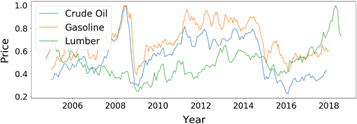

# USAD: UnSupervised Anomaly Detection on Multivariate Time Series

# Data analysis programming.

Kyonggi Univ. 2021. 02. CC545_0351.

### Name

USAD : UnSupervised Anomaly Detection on Multivariate Time Series

### Date

2021.12.09

**Background**

주어진 학습 데이터 셋에서 기존 관측과는 상이하여 다른 메커티즘에 의해 생성되었다고 판단할만한 관측값을 anomaly sample이라고 부르며, 이상치를 탐지하는 task를 anomaly detection (AD)이라고 부른다. 

Anomaly detection task는 abnormal에 대한 label의 유무에 따라 supervised setting과 unsupervised setting으로 나뉜다. 

대부분의 real world에서는 label이 존재하지 않아 unsupervised setting에서의 높은 성능을 기록하는 알고리즘들이 각광을 받고 있다.

Unsupervised anomaly detection on multivariate time series (USAD)는 이름에서 알 수 있듯이 다변량 시계열에서 unsupervised setting으로 anomaly detection task를 진행하는 모델이다. 

각 용어들의 의미를 살펴보자. 

앞서 정의한 anomaly 말고 눈에 띄는 단어는 multivariate time series이다. 

Multivariate time series란 각 시간 단위마다 여러 개의 값을 가지는 시계열을 뜻한다. 

그림으로 표현하면 Figure 02와 같다 [1].

Figure 02 : Multivariate time series example

다음으로 unsupervised anomaly detection은 크게 autoencoder (AE) 기반 알고리즘, variational autoenc-oder (VAE) 기반 알고리즘, generative adversarial networks (GANs) 기반 알고리즘이 존재한다. 

Unsuperv-ised anomaly detection 알고리즘은 AE -> VAE 혹은 AE -> GANs로 변하는 추세인데 그 이유에 대해서는 추후에 posting 하도록 하겠다. 

USAD의 작동 과정을 설명하기 전에 본 논문의 contribution을 이해하기 위해서 AE 기반 AD와 GANs 기반 AD의 장단점을 알아보자.

**Autoencoder based anomaly detection**

먼저 anomaly detection은 학습 단계(training phase)와 탐지 단계(detection phase)로 구분할 수 있다. 

AE 기반 모델의 학습 단계에서는 정상 데이터를 압축&복원 과정을 거치는데, 

이 때 복원된 시계열과 원본 시계열 간의 차이인 reconstruction error를 minimize 하여 정상 데이터를 잘 복원하는 모델을 구축한다.

이처럼 정상 데이터만을 학습한 AE 모델은 비정상 데이터를 입력하였을 경우 큰 값의 reconstruction error를 갖는다. 

학습에서 보지 못한 data기에 제대로 복원하지 못하는 것인데, 탐지 단계에서는 위 성질을 활용하여 정상과 이상 데이터가 혼재해 있는 데이터를 AE의 input으로 넣은 후 이를 복원하였을 때 발생한 reconstruction error를 사용하여 threshold를 넘기면 이상, 넘기지 않으면 정상으로 판단한다. 

이 때 이상 탐지의 기준이 되는 reconstruction error를 anomaly score라고 부른다.

AE 기반의 anomaly detection 알고리즘의 경우 학습이 용이하다는 장점이 있지만 정상 데이터의 분포와 유사한 비정상 데이터가 들어올 경우 이를 잘 구별하지 못한다는 단점이 존재한다. 

이는 AE의 압축 과정에서 복원에 불필요한 정보를 제거하기 때문인데 학습 단계에서 정상 데이터만을 사용한다는 특성과 맞물려 비정상을 탐지할 수 있는 abnormal information이 소거되는 특징이 있다. 

다시 말하면 정상 데이터만을 학습한 AE의 경우 비정상 데이터가 들어오더라도 최대한 정상처럼 복원하는 성질이 존재하기에 **미세한 차이의 anomaly sample을 검출하지 못한다**는 단점이 존재한다.

fig 3. Autoencoder based anomaly detection architecture

**Generative adversarial networks based anomaly detection**

GANs는 가상 데이터(fake data)를 생성하는 generator와 실제(real)와 fake data를 구분하는 discriminator로 구성된다. 

GANs 기반 anomaly detection은 real data를 normal로, fake data를 abnormal로 판단하여 학습을 진행하며 전반적인 구조는 Figure 04와 같다 [2].

Figure 04 : GANs based anomaly detection architecture (GANomaly)

GANs 기반 방법의 경우 input sequence의 압축 및 복원을 generator가 담당한다. 이 때 generator의 목적은 discriminator를 속이는 것이기에 generator의 encoder, decoder가 real 정보 뿐 아니라 fake에 대한 정보를 포함하도록 강제된다. 

즉 discriminator의 도입으로 압축과 복원을 담당하는 encoder, decoder가 보다 자세하게 비정상 데이터를 구분할 수 있게 되어 기존 AE기반 모델의 단점을 보완하는 특징이 있다. 

다만 com-puter vision 등에서 발생하는 GANs의 일반적인 문제점과 마찬가지로 안정적인 학습이 어렵다는 단점이 존재한다.

USAD는 두 가지 방법의 장점을 모두 취하는 모델이다. 학습이 쉽고 안정적인 결과를 낼 수 있는 AE의 장점과 discriminator의 도입으로 abnormal information을 포함할 수 있는 GANs의 장점을 결합하였다. 

AE를 사용하되 adversarial training을 적용하여 보다 상세한 anomaly detection을 추구하였다.

Figure 05 : USAD architecture

USAD의 architecture는 Figure 05와 같다. 

Adversarial training을 적용하기 위해 2개의 decoder를 사용하였다는 점 외에는 기존의 AE 기반의 anomaly detection과 동일한 구조를 갖는다. 

Notation을 잠시 정리하면 두 개의 decoder는 각각 $D_1, D_2$로 표기되며 이들은 동일한 encoder network $E$ 를 사용한다. 

W를 training data 안에 있는 sequence의 window라고 하였을 때 두 개의 Decoder에 따라 AE는 각각 $AE_1=D_1(E(W)),AE_2=D_2(E(W))$와 같이 표기된다. 

이제 USAD의 학습 단계와 탐지 단계에 대해서 알아보자.

**Training process**

USAD는 두 단계를 거쳐서 학습이 진행된다. 

첫 번째 단계는 AE training 단계로 기존의 AE를 학습하는 것과 동일한 과정을 거친다. 

이를 수식으로 표현하면 다음과 같다.

학습의 첫 번째 단계인 AE training 과정에서는 각각의 AE가 training data에 속해있는 input W (real, normal)를 잘 복원하도록 학습을 진행한다. 

다음으로 두 번째 단계인 adversarial training 과정을 알아보자.

Adversarial training 과정에서 각각의 $autoencoder (AE_1, AE_2)$는 다음과 같은 목적을 지닌다.

Train $AE_2$ to distinguish the real data from the data coming from $AE_1$, and train $AE_1$ to fool $AE_2$

$*AE_2*$는 real data인 $W$와 $AE_1$로 부터 복원된 fake data인 $AE_1(W)$를 구분하도록 학습한다.

반면 $AE_1$은 $AE_2$의 real과 fake에 대한 판별 성능을 저하시키는 것을 목적으로 학습이 진행된다.

즉 $AE_1$은 GANs에서 generator의 역할을, $AE_2$는 discriminator의 역할을 수행한다. 

Adversarial training 단계에서의 목적함수는 다음과 같이 표기할 수 있다.

각각의 수식이 갖는 의미를 살펴보자. 먼저 generator 역할을 수행하는 첫 번째 autoencoder는 real data $W$와 fake에 대한 $AE_2$의 output인

$AE_2(AE_1(W))$간의 차이를 최소화 시켜야 discriminator를 속일 수 있다. 

반대로 discriminator 역할을 수행하는 두 번째 autoencoder는 fake data가 input으로 들어 왔을 때 real data와의 차이를 최대화 시켜야(=large reconstruction error) real과 fake를 잘 구별하고 있다고 볼 수 있다. 

따라서 $AE_1$**은 fake에 대한** $AE_2$**의 reconstruction error를 줄이도록 학습**하고, 반대로 $AE_2$**는 fake에 대한 reconstruction error를 키우도록 학습**

한다.

위의 두 가지 training phase를 하나의 loss function으로 표기하면 다음과 같다.

먼저 위 수식의 세부 term에 대해서 설명하면 다음과 같다. 

각각의 loss에서 앞의 term은 real data에 대한 reconstruction error로써 원본 데이터를 잘 복원하는 AE training의 loss에 해당한다. 

AE training term을 통해서 원래의 input을 잘 복원하도록 학습이 진행된다. 

다음으로 두 번째 term의 경우 adversarial training의 loss로 구성되어 있다. 

앞에서 살펴본 minimize, maximize term이 부호로써 각각 +,-로 표기가 된 것을 확인할 수 있다. 

마지막으로 두 term을 합할 때 곱해지는 분모의 $n$은 학습 중인 epoch을 뜻하여 학습 초반에는 real data에 대한 reconstruction error에 가중치를 주고 학습 후반에는 adversarial training에 가중치를 주는 역할을 한다. 

이제 각각의 AE 관점에서 loss를 이해해보자. 

$AE_1$에 적용되는 loss를 살펴보면 real data에 대한 reconstruction error와 fake data에 대한 $AE_2$의 reconstruction error가 모두 최소일 때 최소값을 갖는다. 

이를 통해 $AE_2$가 fake data에 대한 판별력이 떨어지는 것을 목표로 하는 것을 확인할 수 있다.  

반대로 $AE_2$에 적용되는 loss를 살펴보면 real data에 대한 reconstruction error가 최소이고, fake data에 대한 $AE_2$의 reconstruction error가 최대일 때 최소값을 갖는다. 

즉 fake data가 들어왔을 때 anomaly가 들어왔다는 신호인 reconstruction error를 크게 내뱉도록 학습이 진행된다. 

GANs 기반 anomaly detection에서 real은 normal, fake은 abnormal로 사용하는 것을 감안하면 $AE_2$는 결국 **normal과 abnormal의 미세한 차이를 극대화**시키는 역할을 하게 된다. 

기존의 AE 기반 anomaly detection model과 비교하여 높은 성능을 보일 수 있는 이유가 여기에 있다.

**Detection process**

학습이 완료된 USAD를 사용하여 실제 anomaly detection을 수행하는 과정을 알아보겠다. 먼저 USAD의 anomaly score 산출 공식은 다음과 같다.

$*\hat W*$은 unseen data, 즉 train data에 존재하지 않은 새로운 sequence의 window를 뜻하며 normal과 abnor-mal이 혼재되어있다. 

USAD의 anomaly score는 input과 $AE_1$의 reconstruction error와 더불어 input과 fake에 대한 $AE_2$의 reconstruction error의 가중합으로 산출할 수 있다. 

USAD의 anomaly score는 뒷 term에 해당하는 fake에 대한 $AE_2$의 reconstruction error를 사용하여 정상과 매우 유사한 분포를 지닌 비정상 데이터가 들어오더라도 이를 탐지할 수 있게된다. 

두 가지 term을 결합할 때 사용되는 hyper-parameter인 $\alpha$와 $\beta$ 합은 1로 설정이 되며 parameter setting에 따라 다음과 같은 결과를 얻을 수 있다.

$\beta$가 커진다는 것은 정상 분포와 약간만 달라지더라도 큰 anomaly score를 발생시키기 때문에 detection의 횟수는 증가하고, 이에 따라 detection sensitivity가 높아지게 된다. 

반대로 real data에 대한 reconstruction error를 더욱 크게 반영할 경우 미세한 anomaly detection은 불가하여 detection 수는 감소하고 detection sensitivity는 낮아지게 된다.

**Experiments**

USAD는 총 5가지 public datasets와 1가지 private dataset을 활용하여 성능을 검증하였다. 5가지 public datasets은 다음과 같다.

- Secure water treatment (SWatT)
- Water distribution (WADI)
- Server machine dataset (SMD)
- Soil moisture active passive (SMAP)
- Mars science laboratory (MSL)

각각의 datasets에 대한 평가 지표는 precision, recall, F1 score, F1 star로 구성되며 F1 star의 경우 precision과 recall의 평균을 사용하여 도출된 값이다.

다음은 5가지 datasets에 대한 비교 모델과의 성능 비교표이다. 

첫 번째 표의 without/with는 point-adjust 적용 여부를 뜻하며 point-adjust란 각각의 observation/time-point에 대해서 독립적으로 anomaly를 detecting 한것으로 이해하였다.

> Point-adjust : detect each observation/time-point independently and assigns a label to single time-point
> 

Figure 06 : Performance table 01

다음은 5가지 datasets에 대한 알고리즘별 average performance (standard deviation)을 기록한 표이다.

Figure 07 : Performance table 02

성능 비교 표를 정리하면 대부분의 경우에서 USAD가 좋은 성능을 보여주는 것을 확인할 수 있다. 특히 AE를 활용한 anomaly detection과 비교하면 월등한 성능을 보여준다. 다만 MAD-GAN, TadGAN을 비롯한 GANs 기반의 알고리즘과 비교시 좋은 성능을 보여줄 수 있을지는 미지수다. Adversarial training이 적용된 모델인 만큼 GANs 기반 anomaly detection과의 성능 비교도 있었으면 좋았을 것 같다.

다음은 SWaT data에 대한 hyper-parameter별 성능을 기록한 표이다. 앞서 말한대로 $\beta$값이 커짐에 따라 detection의 수가 많아짐을 확인할 수 있다. 

신기하게도 $\beta$를 1로 두어 adversarial term만을 반영했을 때가 F1 score 기준으로 가장 좋았던 것을 알 수 있다. 

이는 SWaT data의 anomaly sample이 normal sample과의 차이가 크게 나지 않기 때문이 아닌가 추측해본다.

Figure 08 : Performance table 03

마지막으로 USAD에서 adversarial training의 효과를 확인하기 위한 ablation study 결과는 다음과 같다.

3가지 datasets에 대해서 순수 adversarial의 성능은 가장 낮으나 AE와 결합했을 때 가장 좋은 성능을 보인 것을 확인할 수 있었다. 

앞에서 hyper-parameter별 모델 성능과는 다른 결과가 나온점이 의아하기 했다.

USAD는 기존의 AE 기반의 anomaly detection 알고리즘의 장점과 GANs 기반의 anomaly detection 알고리즘의 장점을 결합한 방법이다. 

해당 방법의 성능 향상 효과는 실험을 통해서 AE 기반의 방법보다는 효율적임을 보였으나 GANs 기반의 방법과의 비교는 존재하지 않았다. 

또한 도출된 anomaly score로부터 abno-rmal을 판단하는 thresholding에 대한 자세한 설명이 존재하지 않았다.

## Abstract.

The automatic supervision of IT systems is a current challenge at Orange.

> IT 시스템의 자동 감독은 Orange에서 현재 해결해야 할 과제입니다.
> 

Given the size and complexity reached by its IT operations, the number of sensors needed to obtain measurements overtime, used to infer normal and abnormal behaviors, has increased dramatically making traditional expert-based supervision methods slow or prone to errors. 

> IT 운영에서 도달하는 규모와 복잡성을 감안할 때 정상 및 비정상 동작을 추론하는 데 사용되는 초과 시간 측정을 획득하는 데 필요한 센서의 수가 급격히 증가하여 기존의 전문가 기반 감독 방법이 느려지거나 오류가 발생하기 쉽습니다.
> 

In this paper, we propose a fast and stable method called UnSupervised Anomaly Detection for multivariate time series (USAD) based on adversely trained autoencoders. 

> 이 논문에서는 역으로 훈련된 자동 인코더를 기반으로 하는 USAD(다변량 시계열에 대한 UnSupervised Anomaly Detection)라는 빠르고 안정적인 방법을 제안합니다.
> 

Its autoencoder architecture makes it capable of learning in an unsupervised way. 

> 오토인코더 아키텍처는 감독되지 않은 방식으로 학습할 수 있도록 합니다.
> 

The use of adversarial training and its architecture allows it to isolate anomalies while providing fast training. 

> 적대적 훈련과 그 아키텍처를 사용하면 빠른 훈련을 제공하는 동시에 변칙성을 격리할 수 있습니다.
> 

We study the properties of our methods through experiments on five public datasets, thus demonstrating its robustness, training speed and high anomaly detection performance. 

> 우리는 5개의 공개 데이터 세트에 대한 실험을 통해 방법의 속성을 연구하여 견고성, 교육 속도 및 높은 이상 탐지 성능을 보여줍니다.
> 

Through a feasibility study using Orange’s proprietary data we have been able to validate Orange’s requirements on scalability, stability, robustness,
training speed and high performance.

> Orange의 독점 데이터를 사용한 타당성 조사를 통해 우리는 확장성, 안정성, 견고성, 훈련 속도 및 고성능에 대한 Orange의 요구 사항을 검증할 수 있었습니다.
> 

**Keywords**: Anomaly detection, Multivariate Time Series, Neural networks, Autoencoders, Adversarial Network, Unsupervised learning, Supervision

> 키워드: 이상 탐지, 다변수 시계열, 신경망, 자동 인코더, 적대적 네트워크, 비지도 학습, 감독
> 

## 1. Introduction

IT system monitoring is a supervision process on measurable events and outputs of a system, which is used as a reference specifying the system’s proper functioning. 

> IT 시스템 모니터링은 측정 가능한 이벤트 및 시스템의 출력에 대한 감독 프로세스로, 시스템의 적절한 기능을 지정하는 참조로 사용됩니다.
> 

Deviations from the reference are analyzed to determine if there exists a fault. 

> 기준으로부터의 편차는 결함이 있는지 확인하기 위해 분석됩니다.
> 

Historically, this analysis has been done by system monitoring experts who establish normal behavior thresholds for every measured event/output. 

> 역사적으로 이 분석은 측정된 모든 이벤트/출력에 대해 정상적인 동작 임계값을 설정하는 시스템 모니터링 전문가에 의해 수행되었습니다.
> 

If a measurement exceeds its associated expert-defined threshold, it is considered that the system is not behaving as expected. 

> 측정값이 관련 전문가가 정의한 임계값을 초과하면 시스템이 예상대로 작동하지 않는 것으로 간주됩니다.
> 

Because of the size and complexity of today’s IT operations at Orange, the number of sensors needed to obtain measurements over time has increased dramatically making traditional expert-defined thresholdbased methods no longer usable as they are not scalable. 

> Orange의 오늘날 IT 운영의 규모와 복잡성으로 인해 시간이 지남에 따라 측정값을 얻는 데 필요한 센서의 수가 급격히 증가하여 기존의 전문가가 정의한 임계값 기반 방법은 확장할 수 없기 때문에 더 이상 사용할 수 없게 되었습니다.
> 

Under this scenario, the automation of our IT system monitoring has become a necessity. 

> 이러한 시나리오에서 IT 시스템 모니터링의 자동화는 필수가 되었습니다.
> 

Automated IT system monitoring required the development of methods that observe the different measurements acquired by the sensors and, from these, infer normal and abnormal behaviors.

> 자동화된 IT 시스템 모니터링을 위해서는 센서가 수집한 다양한 측정값을 관찰하고 이를 통해 정상 및 비정상 동작을 추론하는 방법의 개발이 필요했습니다.
> 

---

Detecting unexpected behavior on a set of measurements correlated with each other over time is an active research discipline called anomaly detection in multivariate time series [2]. 

> 시간이 지남에 따라 서로 상관 관계가 있는 측정 집합에서 예기치 않은 동작을 감지하는 것은 다변량 시계열에서 이상 감지라고 하는 활성 연구 분야입니다[2].
> 

In the past years, many approaches have been developed to address this issue. 

> 지난 몇 년 동안 이 문제를 해결하기 위해 많은 접근 방식이 개발되었습니다.
> 

The most commonly used techniques include distance-based techniques such as k-nearest neighbors [3],clustering such as K-means[9], classification
with One-Class SVM [11].

> 가장 일반적으로 사용되는 기술에는 k-최근접 이웃[3]과 같은 거리 기반 기술, K-평균과 같은 클러스터링[9], One-Class SVM을 사용한 분류[11]가 포함됩니다.
> 

However, today’s IT systems have reached a complexity that no longer allows the use of these methods. 

> 그러나 오늘날의 IT 시스템은 더 이상 이러한 방법을 사용할 수 없는 복잡성에 도달했습니다.
> 

Indeed, as the number of dimensions increases, these techniques generally suffer from sub-optimal performance due to the curse of dimensionality.

> 실제로, 차원의 수가 증가함에 따라 이러한 기술은 일반적으로 차원의 저주로 인해 최적이 아닌 성능으로 어려움을 겪습니다.
> 

Most recently, the ability of unsupervised anomaly detection methods based on deep learning to infer correlations between time series which allow identifying anomalous behaviors has received a lot of attention [12][20][17][18].

> 가장 최근에는 딥 러닝을 기반으로 하는 감독되지 않은 이상 탐지 방법이 시계열 간의 상관 관계를 추론하여 이상 행동을 식별하는 기능이 많은 주목을 받았습니다[12][20][17][18].
> 

---

Among deep learning methods for detecting anomalies on temporal data, methods based on recurrent neural networks [7] (RNNs) are very popular.

> 시간 데이터의 이상을 탐지하는 딥 러닝 방법 중 RNN(Recurrent Neural Networks)을 기반으로 하는 방법이 널리 사용됩니다.
> 

However, RNNs results are well-known for being computationally hungry and requiring a significant amount of time to be train. 

> 그러나 RNN 결과는 계산량이 많고 학습하는 데 상당한 시간이 필요한 것으로 잘 알려져 있습니다.
> 

Thus, RNNs incur in high costs associated to time, energy consumption and CO2 emissions. 

> 따라서 RNN은 시간, 에너지 소비 및 CO2 배출과 관련하여 높은 비용을 발생시킵니다.
> 

For Orange, the use of highly scalable, but also low energy consuming methods is a key issue. 

> Orange의 경우 확장성이 높으면서도 에너지 소모가 적은 방법을 사용하는 것이 핵심 문제입니다.
> 

Indeed, Orange is constantly pursuing its efforts to improve energy efficiency through its “Green IT&Networks” program.

> 실제로 Orange는 "Green IT&Networks" 프로그램을 통해 에너지 효율성을 개선하기 위한 노력을 지속적으로 추구하고 있습니다.
> 

These constraints of high scalability and movement towards GreenAI [16], oblige us to rethink the important characteristics of the deep learning methods to be put in place. 

> 이러한 높은 확장성과 GreenAI로의 이동에 대한 이러한 제약은 [16] 적용할 딥 러닝 방법의 중요한 특성을 다시 생각하게 합니다.
> 

Therefore, it is desirable to develop implement methods with high algorithmic efficiency.

> 따라서 알고리즘 효율성이 높은 구현 방법을 개발하는 것이 바람직합니다.
> 

---

Other deep learning-based methods that have been of great interest recently are those based on generating adversary networks [5].

> 최근 큰 관심을 받고 있는 다른 딥 러닝 기반 방법은 적대 네트워크 생성을 기반으로 하는 방법입니다[5].
> 

However, GAN training is not always easy, due to problems such as mode collapse and non-convergence [1]. 

> 그러나 GAN 훈련은 모드 붕괴 및 비수렴과 같은 문제로 인해 항상 쉬운 것은 아닙니다[1].
> 

The lack of stability is a major obstacle when considering to implement and deploy these methods into production at Orange. 

> 이러한 방법을 구현하고 Orange에서 생산에 배포할 때 안정성 부족이 주요 장애물입니다.
> 

A production environment requires the development of robust methods that can be re-trained routinely.

> 생산 환경에서는 일상적으로 재교육할 수 있는 강력한 방법을 개발해야 합니다.
> 

---

In this paper, we propose a new method called UnSupervised Anomaly Detection for multivariate time series (USAD) based on an autoencoder architecture [15] whose learning is inspired by GANs.

> 이 논문에서는 GAN에서 영감을 얻은 자동 인코더 아키텍처[15]에 기반한 USAD(UnSupervised Anomaly Detection for multivariate time series)라는 새로운 방법을 제안합니다.
> 

The intuition behind USAD is that the adversarial training of its encoder-decoder architecture allows it to learn how to amplify the reconstruction error of inputs containing anomalies, while gaining stability compared to methods based on GANs architectures.

> USAD 이면의 직관은 인코더-디코더 아키텍처의 적대적 훈련을 통해 GAN 아키텍처를 기반으로 하는 방법에 비해 안정성을 얻으면서 비정상을 포함하는 입력의 재구성 오류를 증폭하는 방법을 배울 수 있다는 것입니다.
> 

Its architecture makes it fast to trained meeting Orange’s expectations in terms of scalability and algorithm efficiency. 

> 그 아키텍처는 확장성과 알고리즘 효율성 측면에서 Orange의 기대치를 충족시키는 훈련을 빠르게 합니다.
> 

The main contributions of this paper are:

> 이 백서의 주요 기여 사항은 다음과 같습니다.
> 
- We propose an encoder-decoder architecture within an adversarial training framework that allows to combine the advantages of autoencoders and adversarial training, while compensating for the limitations of each technique
  
    > 우리는 autoencoder와 adversarial training의 장점을 결합하면서 각 기법의 한계를 보완할 수 있는 adversarial training 프레임워크 내 인코더-디코더 아키텍처를 제안합니다.
    > 
- We perform an empirical study on publicly available datasets to analyze robustness, training speed and performance of the proposed method.
  
    > 우리는 제안된 방법의 견고성, 훈련 속도 및 성능을 분석하기 위해 공개적으로 사용 가능한 데이터 세트에 대한 실증적 연구를 수행합니다.
    > 
- We perform a feasibility study with Orange’s proprietary data to analyze if the proposed method meets the company’s requirements on scalability, stability, robustness, training speed and high performance.
  
    > 우리는 제안된 방법이 확장성, 안정성, 견고성, 교육 속도 및 고성능에 대한 회사의 요구 사항을 충족하는지 분석하기 위해 Orange의 독점 데이터를 사용하여 타당성 조사를 수행합니다.
    > 

The rest of this document is organized as follows. 

> 이 문서의 나머지는 다음과 같이 구성되어 있습니다.
> 

Section 2 discusses methods for detecting unsupervised anomalies in multivariate time series. 

> 섹션 2에서는 다변수 시계열에서 감독되지 않은 이상을 탐지하는 방법을 설명합니다.
> 

Section 3 discusses the details of our method.

> 섹션 3에서는 우리의 방법에 대해 자세히 설명합니다.
> 

Sections 4 and 5 describe the experiments and demonstrate the state-of-the-art performance of our method.

> 섹션 4와 5에서는 실험을 설명하고 우리 방법의 최첨단 성능을 보여줍니다.
> 

## 2. Related work

> 2. 관련 업무
> 

Anomaly detection for time series is a complex task that has been largely studied [6]. 

> 시계열에 대한 이상 감지는 많이 연구되어 온 복잡한 작업입니다[6].
> 

Among the different taxonomies which have been proposed, methods can be identified as clustering [9], densitybased[11], distance-based [3] and isolation-based methods [10].

> 제안된 다양한 분류법 중에서 클러스터링[9], 밀도 기반[11], 거리 기반[3] 및 격리 기반[10] 방법으로 식별할 수 있습니다.
> 

---

In addition to traditional methods, the ability of unsupervised anomaly detection methods based on deep learning to infer correlations between time series has recently received much attention[12, 18, 20]. 

> 기존의 방법 외에도 딥 러닝을 기반으로 시계열 간의 상관 관계를 추론하는 비지도 이상 탐지 방법의 기능이 최근 많은 주목을 받고 있습니다[12, 18, 20].
> 

The Deep Autoencoding Gaussian Mixture Model(DAGMM) [21] jointly considers a Deep Autoencoder and a Gaussian Mixture Model to model the density distribution of multidimensional data. 

> DAGMM(Deep Autoencoding Gaussian Mixture Model)[21]은 다차원 데이터의 밀도 분포를 모델링하기 위해 Deep Autoencoder와 Gaussian Mixture Model을 공동으로 고려합니다.
> 

The Multi-Scale Convolutional Recursive EncoderDecoder(MSCRED) [20] jointly considers time dependence, noise robustness and interpretation of anomaly severity. 

> Multi-Scale Convolutional Recursive EncoderDecoder(MSCRED)[20]는 시간 의존성, 잡음 견고성 및 이상 심각도 해석을 공동으로 고려합니다.
> 

The LSTMVAE[14] combines the LSTM with a variational autoencoder (VAE) by replacing the feed-forward network in a VAE with a LSTM. 

> LSTMVAE[14]는 VAE의 피드포워드 네트워크를 LSTM으로 대체하여 LSTM과 VAE(variational autoencoder)를 결합합니다.
> 

The Adversarially Learned Anomaly Detection (ALAD) [19] is based on bi-directional GANs, that derives adversarially learned features for the anomaly detection task. 

> ALAD(Adversarially Learned Anomaly Detection)[19]는 양방향 GAN을 기반으로 하며, 이는 비정상 탐지 작업을 위해 적대적으로 학습된 기능을 파생시킵니다.
> 

The LSTM-VAE models the time dependence of time series through LSTM networks and obtains a better generalization capability than traditional methods. 

> LSTM-VAE는 LSTM 네트워크를 통해 시계열의 시간 의존성을 모델링하고 기존 방법보다 더 나은 일반화 능력을 얻습니다.
> 

Most recently, Su et al proposed a stochastic recurrent neural network for multivariate time series anomaly detection, the OmniAnomaly, that learns robust multivariate time series’ representations with a stochastic variable connection and a planar normalizing flow, and use the reconstruction probabilities to determine anomalies [17].

> 가장 최근에 Su et al은 확률적 변수 연결과 평면 정규화 흐름을 사용하여 강력한 다변수 시계열 표현을 학습하고 재구성 확률을 사용하여 이상을 결정하는 다변수 시계열 이상 감지를 위한 확률적 순환 신경망인 OmniAnomaly를 제안했습니다. [17].
> 

However, these methods obtain good results at the expense of their training speed. 

> 그러나 이러한 방법은 훈련 속도를 희생시키면서 좋은 결과를 얻을 수 있습니다.
> 

Indeed, none of these methods take into account the training time (i.e. energy consumption) in their performance criteria. 

> 실제로, 이러한 방법 중 어느 것도 성능 기준에 훈련 시간(즉, 에너지 소비)을 고려하지 않습니다.
> 

This is why it is necessary today for Orange to develop methods with performances equivalent to the state of the art in terms of anomaly detection, while favoring architectures that allow fast and energy-efficient training.

> 이것이 오늘날 Orange가 빠르고 에너지 효율적인 교육을 가능하게 하는 아키텍처를 선호하면서 이상 감지 측면에서 최신 기술과 동등한 성능을 가진 방법을 개발하는 것이 필요한 이유입니다.
> 

## 3. Method

We first formalize the problem we are addressing in section 3.1.

> 먼저 섹션 3.1에서 다루고 있는 문제를 공식화합니다.
> 

In 3.2 we present the formulation of our method.

> 3.2에서 우리는 방법의 공식을 제시합니다.
> 

Finally, in section 3.3 we describe the method’s implementation.

> 마지막으로 섹션 3.3에서 메서드의 구현을 설명합니다.
> 

### 3.1 Problem formulation

> 3.1 문제 공식화
> 

A univariate time series is a sequence of data points

> 일변량 시계열은 데이터 포인트의 시퀀스입니다.
> 

$$T = [ x_1, . . . , x_T ]$$

each one being an observation of a process measured at a specific time $t$. 

> 각각은 특정 시간 t에서 측정된 프로세스의 관찰입니다.
> 

Univariate time series contain a single variable at each time instant, while multivariate time series record more than one variable at a time; 

단변량 시계열은 각 시점에 단일 변수를 포함하는 반면, 다변량 시계열은 한 번에 둘 이상의 변수를 기록합니다.

we denote multivariate time series as $T = x_1, . . . , x_T, x ∈ R^m$. 

우리는 다변수 시계열을 $T = x_1, . . . , x_T, x ∈ R^m$로 나타냅니다.

In this work we focus on the more general setting of multivariate time series, as the univariate setting is a particular case of the multivariate one with $m = 1$.

> 이 작업에서는 일변량 설정이 m = 1인 다변량 설정의 특정 경우이기 때문에 다변량 시계열의 보다 일반적인 설정에 중점을 둡니다.
> 

---

Now consider an unsupervised learning problem where $T$ is given as training input. 

> 이제 T가 훈련 입력으로 제공되는 비지도 학습 문제를 고려하십시오.
> 

Anomaly detection refers to the task of identifying an unseen observation $\hat x_t$$, t > T$ , based on the fact that it differs significantly from $T$, thus assuming that $T$ contains only normal points. 

> 이상 탐지는 T와 상당히 다르다는 사실을 기반으로 보이지 않는 관찰 $\hat x_t, t > T$를 식별하는 작업을 말하며, 따라서 T에는 정상 점만 포함된다고 가정합니다.
> 

The amount by which the unseen sample $\hat x_t$ and the normal set $T$ differ is measured by an anomaly score, which is then compared to a threshold to obtain an anomaly label.

> 보이지 않는 샘플 $\hat x_t$와 일반 세트 $T$가 다른 양은 이상 점수로 측정되며, 이를 임계값과 비교하여 이상 징후 레이블을 얻습니다.
> 

---

To model the dependence between a current time point and previous ones, let us now define $W_t$, a time window of length $K$ at given time $t$:

> 현재 시점과 이전 시점 간의 종속성을 모델링하기 위해 이제 주어진 시간 t에서 길이가 $K$인 시간 창인 $W_t$를 정의하겠습니다.
> 

$$W_t = [x_{t−K+1}, . . . , x_{t−1}], x_t$$

It is possible to transform the original time series $T$ into a sequence of windows $W = [{W_1, . . . ,W_T }]$ to be used as training input. 

> 원래 시계열 T를 일련의 창 $W = [{W_1, . . . ,W_T }]$ 훈련 입력으로 사용됩니다.
> 

Given a binary variable $y ∈ {0, 1}$, the goal of our anomaly detection problem is to assign to an unseen window $\hat W_t, t > T$ , a label $y_t$ to indicate a detected anomaly at time $t$, i.e. $y_t$ = 1, or not ($y_t$ = 0) based on the window’s anomaly score. 

> 이진 변수 $y ∈ {0, 1}$이 주어지면 이상 감지 문제의 목표는 시간 $t$에서 감지된 이상을 나타내는 레이블 $y_t$를 보이지 않는 창 $\hat W_t, t > T$에 할당하는 것입니다. 즉, $y_t = 1$ 또는 창의 이상 점수를 기반으로 하지 않습니다 $(y_t = 0)$.
> 

For the sake of simplicity and without loss of generality we will use $W$ to denote a training input window and $\hat W$ to denote an unseen input one.

> 단순함과 일반성을 잃지 않기 위해 $W$를 사용하여 훈련 입력 창을 나타내고 $\hat W$를 사용하여 보이지 않는 입력 창을 나타냅니다.
> 

### 3.2 Unsupervised Anomaly Detection

> 3.2 비지도 변칙 탐지
> 

An autoencoder (AE) [15] is an unsupervised artificial neural network combining an encoder $E$ and a decoder $D$. 

> Autoencoder(AE)[15]는 인코더 $E$와 디코더 $D$를 결합한 비지도 인공 신경망입니다.
> 

The encoder part takes the input $X$ and maps it into a set of latent variables $Z$, whereas the decoder maps the latent variables $Z$ back into the input space as a reconstruction $R$. 

> 인코더 부분은 입력 $X$를 가져와 잠재 변수 $Z$ 세트에 매핑하는 반면 디코더는 잠재 변수  $Z$를 재구성 $R$로 입력 공간에 매핑합니다.
> 

The difference between the original input vector $X$ and the reconstruction $R$ is called the reconstruction error.

> 원래 입력 벡터 $X$와 재구성 $R$ 사이의 차이를 재구성 오차라고 합니다.
> 

Thus, the training objective aims to minimize this error. 

> 따라서 훈련 목표는 이 오류를 최소화하는 것을 목표로 합니다.
> 

It is defined as:

> 다음과 같이 정의됩니다.
> 

$$L_{AE} = ∥X − AE(X)∥_2$$

where

> 어디
> 

$$AE(X) = D(Z), Z = E(X)$$

and $∥ · ∥_2$ denotes the L2-norm.

> $∥ · ∥_2$는 L2-노름을 나타냅니다.
> 

---

Autoencoder-based anomaly detection uses the reconstruction error as the anomaly score. 

> Autoencoder 기반 이상 탐지는 재구성 오류를 이상 점수로 사용합니다.
> 

Points with a high score are considered to be anomalies. 

> 높은 점수를 받은 포인트는 이상으로 간주됩니다.
> 

Only samples from normal data are used at training. 

> 훈련 시에는 정규 데이터의 샘플만 사용합니다.
> 

At inference, the AE will reconstruct normal data very well, while failing to do so with anomaly data which the AE has not encountered. 

> 추론할 때 AE는 정상 데이터를 매우 잘 재구성하지만 AE가 발생하지 않은 비정상 데이터에서는 실패합니다.
> 

However, if the anomaly is too small, i.e. it is relatively close to normal data, the reconstruction error will be small and thus the anomaly will not be detected. 

> 그러나 이상이 너무 작으면, 즉 정상 데이터에 상대적으로 가까우면 재구성 오류가 작아서 이상을 감지하지 못합니다.
> 

This occurs because the AE aims to reconstruct input data as well (as close to normality) as possible.

> This occurs because the AE aims to reconstruct input data as well (as close to normality) as possible.
> 

To overcome this problem, the AE should be able to identify if the input data contains no anomaly before doing a good reconstruction.

> 이 문제를 극복하기 위해 AE는 올바른 재구성을 수행하기 전에 입력 데이터에 이상이 없는지 식별할 수 있어야 합니다.
> 

---

The possibility for a method to know whether an input sample is normal or not is what characterizes Generative Adversarial Networks (GANs) [5].

> 입력 샘플이 정상인지 여부를 알 수 있는 방법의 가능성은 GAN(Generative Adversarial Networks) [5]의 특징입니다.
> 

A GAN is an unsupervised artificial neural network based on a two-player minimax adversarial game between two networks, which are trained simultaneously. 

> GAN은 동시에 훈련되는 두 네트워크 간의 2인 미니맥스 적대 게임을 기반으로 하는 비지도 인공 신경망입니다.
> 

One network, the generator (G), aims to generate realistic data, whereas the second one acts as a discriminator (D) trying to discriminate real data from
that one generated by G. 

> 하나의 네트워크인 Generator(G)는 현실적인 데이터를 생성하는 것을 목표로 하는 반면, 두 번째 네트워크는 G에 의해 생성된 데이터와 실제 데이터를 구별하는 판별자(D)의 역할을 합니다.
> 

The training objective of G is to maximize the probability of D making a mistake, whereas the training objective D is to minimize its classification error.

> G의 훈련 목표는 D가 실수할 확률을 최대화하는 반면 훈련 목표 D는 분류 오류를 최소화하는 것입니다.
> 

---

Similarly to AE-based, GAN-based anomaly detection uses normal data for training. 

> AE 기반과 유사하게 GAN 기반의 이상 탐지는 훈련을 위해 일반 데이터를 사용합니다.
> 

After training the discriminator is used as an anomaly detector. 

> 훈련 후 판별자는 이상 탐지기로 사용됩니다.
> 

If the input data is different from the learned data distribution, the discriminator considers it as coming from the generator and classifies it as fake, i.e. as an anomaly. 

> 입력 데이터가 학습된 데이터 분포와 다른 경우 판별자는 이를 생성기에서 온 것으로 간주하고 가짜, 즉 이상으로 분류합니다.
> 

However, GAN training is not always easy, due to problems such as mode collapse and non-convergence [1], often attributed to the imbalance
between the generator and the discriminator.

> 그러나 GAN 훈련은 종종 생성기와 판별기 간의 불균형에 기인하는 모드 붕괴 및 비수렴[1]과 같은 문제로 인해 쉽지 않습니다.
> 

---

The UnSupervised Anomaly Detection (USAD) method we propose, is formulated as an AE architecture within a two-phase adversarial training framework. 

> 우리가 제안하는 USAD(UnSupervised Anomaly Detection) 방법은 2단계 적대적 훈련 프레임워크 내에서 AE 아키텍처로 공식화됩니다.
> 

On one hand, this allows to overcome the intrinsic limitations of AEs by training a model capable of identifying when the input data does not contain an anomaly and thus perform a good reconstruction. 

> 한편으로 이것은 입력 데이터에 이상이 포함되어 있지 않은 경우를 식별할 수 있는 모델을 훈련하여 우수한 재구성을 수행함으로써 AE의 본질적인 한계를 극복할 수 있습니다.
> 

On the other hand, the AE architecture allows to gain stability during adversarial training, therefore addressing the problem of collapse and non-convergence mode encountered in GANs.

> 반면에 AE 아키텍처는 적대적 훈련 중에 안정성을 얻을 수 있으므로 GAN에서 발생하는 붕괴 및 비수렴 모드 문제를 해결합니다.
> 

---

USAD is composed of three elements: an encoder network $E$ and two decoder networks $D_1$ and $D_2$. 

> USAD는 인코더 네트워크 $E$와 두 개의 디코더 네트워크  $D_1$ 및 $D_2$의 세 가지 요소로 구성됩니다.
> 

As depicted in Figure 1, the three elements are connected into an architecture composed of two autoencoders $AE_1$ and $AE_2$ sharing the same encoder network:

> 그림 1에 표시된 것처럼 세 가지 요소는 동일한 인코더 네트워크를 공유하는 두 개의 자동 인코더 $AE_1$ 및 $AE_2$로 구성된 아키텍처에 연결됩니다.
> 

$$AE_1(W) = D_1(E(W)), AE_2(W)= D_2(E(W ))$$

---

The architecture from Eq. 3 is trained in two phases. 

> Eq.의 아키텍처 3은 2단계로 훈련됩니다.
> 

First, the two AEs are trained to learn to reconstruct the normal input windows $W$ . 

> 먼저, 두 개의 AE는 일반 입력 창 $W$를 재구성하는 방법을 학습하도록 훈련됩니다.
> 

Secondly, the two AEs are trained in an adversarial way, where $AE_1$ will seek to fool $AE_2$ and $AE_2$ aims to learn when the data is real (coming directly from $W$ ) or reconstructed (coming from $AE_1$). 

> 두 번째로, 두 개의 AE는 적대적인 방식으로 훈련됩니다. 여기서 $AE_1$은 $AE_2$를 속이려고 하고 $AE_2$는 데이터가 실제($W$에서 직접 가져옴) 또는 재구성($AE_1$에서 가져옴)할 때 학습하는 것을 목표로 합니다.
> 

Further details are provided in the following.

> 자세한 내용은 다음에서 제공됩니다.
> 

---

**Phase 1: Autoencoder training.** 

> 1단계: Autoencoder 교육.
> 

At a first stage, the objective is to train each AE to reproduce the input. 

> 첫 번째 단계에서 목표는 각 AE가 입력을 재현하도록 훈련하는 것입니다.
> 

Input data $W$ is compressed by encoder $E$ to the latent space $Z$ and then reconstructed by each decoder. 

> 입력 데이터 W는 인코더 E에 의해 잠재 공간 Z로 압축된 다음 각 디코더에 의해 재구성됩니다.
> 

According to Eq. 2, the training objectives are :

> Eq2에 따르면 훈련 목표는 다음과 같습니다.
> 

$$L_{AE_1} = ∥W − AE_1(W)∥_2$$

$$L_{AE_2} = ∥W − AE_2(W)∥2$$

**Phase 2: Adversarial training.** 

> 2단계: 적대적 훈련.
> 

In the second phase, the objective is to train $AE_2$ to distinguish the real data from the data coming from $AE_1$, and to train $AE_1$ to fool $AE_2$. 

> 두 번째 단계에서 목표는 실제 데이터와 $AE_1$에서 오는 데이터를 구별하도록 $AE_2$를 훈련시키고 $AE_2$를 속이도록 $AE_1$을 훈련시키는 것입니다.
> 

Data coming from $AE_1$ is compressed again by $E$ to $Z$ and then reconstructed by $AE_2$.

> $AE_1$에서 오는 데이터는 $E$에서 $Z$로 다시 압축된 다음 $AE_2$에서 재구성됩니다.
> 

Using an adversarial training configuration, the objective of $AE_1$ is to minimize the difference between $W$ and the output of $AE_2$.

> 적대적 훈련 구성을 사용하여 $AE_1$의 목표는 $W$와 $AE_2$의 출력 간의 차이를 최소화하는 것입니다.
> 

The objective of $AE_2$ is to maximize this difference. 

> $AE_2$의 목표는 이 차이를 최대화하는 것입니다.
> 

$AE_1$ trains on whether or not it succeeds in fooling $AE_2$, and $AE_2$ distinguishes the candidates reconstructed by $AE_1$ from the real data. 

> $AE_1$은 $AE_2$를 속이는 데 성공했는지 여부에 대해 학습하고 $AE_2$는 $AE_1$에 의해 재구성된 후보를 실제 데이터와 구별합니다.
> 

The training objective is :

> 교육 목표는 다음과 같습니다.
> 

$$min_{AE_1}max_{AE_2}∥W − AE_2(AE_1(W ))∥_2$$

which account to the following losses

> 다음 손실에 대한 설명
> 

$$L_{AE_1} = ∥W − AE_1(W)∥_2$$

$$L_{AE_2} = ∥W − AE_2(W)∥2$$

Two-phase training. In our architecture, autoencoders have a dual purpose.

> 2단계 교육. 우리 아키텍처에서 autoencoder는 이중 목적을 가지고 있습니다.
> 

$AE_1$ minimizes the reconstruction error of $W$ (phase 1) and minimizes the difference between $W$ an the reconstructed output of $AE_2$ (phase 2). 

> $AE_1$은 $W$의 재구성 오차를 최소화하고(위상 1) $AE_2$(위상 2)의 재구성된 출력 $W$간의 차이를 최소화합니다.
> 

As $AE_1, AE_2$ minimizes the reconstruction error of $W$ (phase 1) but, it then maximizes the reconstruction error of the input data reconstructed by $AE_1$ (phase 2). 

> $AE_1$과 마찬가지로 $AE_2$는 W의 재구성 오차를 최소화하지만(단계 1),  $AE_1$에 의해 재구성된 입력 데이터의 재구성 오차를 최대화한다(단계 2).
> 

The dual purpose training objective of each AE is expressed as the combination of Equations 4, 6 in an evolutionary scheme, where the proportion of
each part evolves with time:

> 각 AE의 이중 목적 훈련 목표는 각 부분의 비율이 시간에 따라 진화하는 진화 계획에서 수학식 4, 6의 조합으로 표현됩니다.
> 

$$L_{AE_1} = {1\over n}∥W − AE_1(W )∥_2 + (1 −{1\over n})∥W − AE_2(AE_1(W))∥_2$$

$$L_{AE_2} = {1\over n}∥W − AE_2(W )∥_2 + (1 −{1\over n})∥W − AE_2(AE_1(W))∥_2$$

and $n$ denotes a training epoch. 

> n은 훈련 에포크를 나타냅니다.
> 

The two-phase training process is summarized in Algorithm 1.

> 2단계 훈련 과정은 알고리즘 1에 요약되어 있습니다.
> 

---

It is important to remark that $AE_2$ does not act as a discriminator in the strict sense of GANs, because if its input is the original data, it is the loss from Eq 4 that intervenes. 

> AE_2의 입력이 원본 데이터인 경우 개입하는 것은 Eq 4의 손실이기 때문에 AE_2가 GAN의 엄격한 의미에서 판별자 역할을 하지 않는다는 점에 주목하는 것이 중요합니다.
> 

When its input is a reconstruction, the objective from Eq. 5-6 intervenes instead.

> 입력이 재구성이면 Eq5-6의 목표가 대신 개입합니다.
> 

---

**Inference**. During the detection phase (Algorithm 2), the anomaly score is defined as: 

> 추론. 탐지 단계(알고리즘 2) 동안 이상 점수는 다음과 같이 정의됩니다.
> 

$$A(\hat W) = \alpha∥\hat W − AE_1(\hat W)∥_2 + \beta ∥\hat W − AE_2(AE_1(\hat W))∥_2$$

where $\alpha + \beta$ = 1 and are used to parameterize the trade-off between false positives and true positives. 

> 여기서 $\alpha + \beta = 1$이고 거짓 긍정과 참 긍정 간의 균형을 매개변수화하는 데 사용됩니다.
> 

If we $\alpha$ is greater than $\beta$, we reduce the number of true positives and reduce the number of false positives. 

> 만약 우리가 $\alpha$가 $\beta$보다 크면, 우리는 참 긍정의 수를 줄이고 거짓 긍정의 수를 줄입니다.
> 

Conversely, if we take an $\alpha$ less than $\beta$, we increase the number of true positives at the cost of also increasing the number of false positives. 

> 반대로, $\alpha$를 $\beta$보다 작게 취하면 거짓 긍정의 수도 증가하는 대가로 참 긍정의 수를 증가시킵니다.
> 

We denote $\alpha < \beta$ a high detection sensitivity scenario and $α > β$ a low detection sensitivity one. 

> 우리는 $\alpha < \beta$ 높은 탐지 감도 시나리오와 α > β 낮은 탐지 감도 시나리오를 나타냅니다.
> 

This parametrization scheme is of great industrial interest. 

> 이 매개변수화 체계는 산업계에서 큰 관심을 받고 있습니다.
> 

It allows, using a single trained model, to obtain during the inference a set of different sensitivity anomaly scores. 

> 단일 훈련된 모델을 사용하여 추론하는 동안 다양한 민감도 이상 점수 세트를 얻을 수 있습니다.
> 

This is further illustrated in Section 5.2.

> 이것은 5.2절에 자세히 설명되어 있습니다.
> 

Figure 1: Proposed architecture illustrating the information flow at training (left) and detection stage (right)

### 3.3 Implementation

> 3.3 구현
> 

Our method of anomaly detection is divided into three stages. 

> 이상 탐지 방법은 3단계로 나뉩니다.
> 

There is a first data pre-processing stage common to training and detection where data is normalized and split into time windows of length K.

> 데이터가 정규화되고 길이가 K인 시간 창으로 분할되는 학습 및 감지에 공통적인 첫 번째 데이터 전처리 단계가 있습니다.
> 

The second stage is used for training the method. 

> 두 번째 단계는 방법을 훈련하는 데 사용됩니다.
> 

The training is offline and aims to capture the normal behaviors of predefined portions (a few weeks/months) of multivariate time series and to produce an anomaly score for each time window. 

> 훈련은 오프라인이며 다변수 시계열의 미리 정의된 부분(몇 주/월)의 정상적인 동작을 캡처하고 각 시간 창에 대한 이상 점수를 생성하는 것을 목표로 합니다.
> 

This offline training procedure can be performed automatically at regular time intervals, taking care to select a training period that does not include too many periods considered abnormal. 

> 이 오프라인 교육 절차는 정기적인 시간 간격으로 자동으로 수행될 수 있으며, 비정상으로 간주되는 너무 많은 기간을 포함하지 않는 교육 기간을 선택하도록 주의합니다.
> 

The last stage is anomaly detection. 

> 마지막 단계는 이상 징후 탐지입니다.
> 

It is performed online using the model trained at the second stage. 

> 2단계에서 훈련된 모델을 사용하여 온라인으로 수행합니다.
> 

As a new time window arrives, the model is used to obtain an anomaly score. 

> 새 시간 창이 도착하면 모델을 사용하여 이상 점수를 얻습니다.
> 

If the anomaly score of a window is higher than a defined anomaly threshold, the new time window is declared as abnormal.

> 창의 이상 점수가 정의된 이상 임계값보다 높으면 새 시간 창은 비정상으로 선언됩니다.
> 

Table 1: Benchmarked Datasets. (%) is the percentage of anomalous data points in the data set.
표 1: 벤치마킹된 데이터 세트 (%)는 데이터 세트에서 비정상적인 데이터 요소의 백분율입니다.

## 4. Experimental setup

> 4. 실험 설정
> 

This section describes the datasets and the performance metrics used in the experiments and the feasibility study.

> 이 섹션에서는 실험과 타당성 조사에 사용된 데이터 세트와 성능 메트릭을 설명합니다.
> 

### 4.1 Public Datasets

> 4.1 공개 데이터 세트
> 

Five publicly available datasets were used in our experiments. 

> 공개적으로 사용 가능한 5개의 데이터 세트가 실험에 사용되었습니다.
> 

Table 1 summarizes the datasets characteristics and they are briefly described in the following.

> Table 1은 데이터셋의 특징을 요약한 것이며 다음과 같이 간략하게 설명된다.
> 

---

$Secure Water Treatment (SWaT)$ Dataset. The SWaT $dataset^1$ is a scaled down version of a real-world industrial water treatment plant
producing filtered water [4]. 

> 보안 수처리(SWaT) 데이터 세트. SWaT $dataset^1$은 여과수를 생산하는 실제 산업용 수처리 공장의 축소 버전입니다[4].
> 

The collected dataset [13] consists of 11 days of continuous operation: 7 days collected under normal operations and 4 days collected with attack scenarios.

> 수집된 데이터 세트[13]는 11일간의 연속 운영으로 구성되어 있습니다. 정상 운영에서 수집한 7일과 공격 시나리오에서 수집한 4일입니다.
> 

---

$Water Distribution (WADI)$ Dataset. 

> 물 분배(WADI) 데이터 세트.
> 

This $dataset^2$ is collected from the WADI testbed, an extension of the SWaT tesbed [13]. 

> 이 $dataset^2$는 SWaT 테스트베드[13]의 확장인 WADI 테스트베드에서 수집됩니다.
> 

It consists of 16 days of continuous operation, of which 14 days were collected under normal operation and 2 days with attack scenarios.

> 연속 운용 16일 중 정상 운용 시 14일, 공격 시나리오 시 2일로 구성된다.
> 

---

$Server Machine Dataset.$ 

> 서버 시스템 데이터 세트.
> 

SMD is a new 5-week-long dataset from a large Internet company collected and made publicly $available^3$ [17]. 

> SMD는 대규모 인터넷 회사에서 수집하고 공개적으로 사용할 수 있는 5주 길이의 새로운 데이터 세트입니다 [17].
> 

It contains data from 28 server machines each one monitored by $m$ = 33 metrics. 

> 여기에는 각각 m = 33 메트릭으로 모니터링되는 28개의 서버 시스템에서 가져온 데이터가 포함됩니다.
> 

SMD is divided into two subsets of equal size: the first half is the training set and the second half is the testing set.

> SMD는 크기가 동일한 두 개의 하위 집합으로 나뉩니다. 첫 번째 절반은 훈련 세트이고 후반부는 테스트 세트입니다.
> 

---

$Soil Moisture Active Passive (SMAP)$ satellite and Mars Science Laboratory (MSL) $rover Datasets.$

> 토양 수분 능동 수동(SMAP) 위성 및 화성 과학 연구소(MSL) 로버 데이터 세트.
> 

SMAP and MSL are two realworld public datasets, expert-labeled datasets from NASA [8].  

> SMAP 및 MSL은 NASA[8]의 전문가 레이블 데이터 세트인 실제 공개 데이터 세트입니다.
> 

They contain respectively the data of 55/27 entities each monitored by $m$ = 25/55 metrics.

> 여기에는 각각 m = 25/55 메트릭으로 모니터링되는 55/27 엔터티의 데이터가 포함되어 있습니다.
> 

### 4.2 Feasibility study: Orange’s dataset

> 4.2 타당성 조사: Orange의 데이터 세트
> 

Our feasibility study was performed on an internal dataset, collected specifically for this purpose. 

> 타당성 조사는 이 목적을 위해 특별히 수집된 내부 데이터 세트에 대해 수행되었습니다.
> 

The collected data come from technical and business indicators from Orange’s advertising network in its website. 

> 수집된 데이터는 웹사이트에 있는 Orange 광고 네트워크의 기술 및 비즈니스 지표에서 가져온 것입니다.
> 

The data represent a total of $m = 33$ continuous variables including 27 technical and 6 business measurements. 

> 데이터는 27개의 기술적 측정 및 6개의 비즈니스 측정을 포함하여 총 m = 33개의 연속 변수를 나타냅니다.
> 

The dataset is divided into two subsets: a train set corresponding to about 32 days and a test set corresponding to about 60 days of activity.

> 데이터 세트는 약 32일에 해당하는 트레인 세트와 약 60일 동안 활동에 해당하는 테스트 세트의 두 가지 하위 집합으로 나뉩니다.
> 

We have selected 60 days of testing corresponding to a critical period for Orange. 

> 우리는 Orange의 중요한 기간에 해당하는 60일의 테스트를 선택했습니다.
> 

To obtain our training set, we selected the previous consecutive days without any major incidents for the company. 

> 훈련 세트를 얻기 위해 회사에 큰 사고가 없는 연속된 날을 선택했습니다.
> 

We were able to obtain a training set of 32 mainly normal days. 

> 우리는 주로 정상적인 32일의 훈련 세트를 얻을 수 있었습니다.
> 

Anomalies in the test set were labeled by domain experts based on incident reports. 

> 테스트 세트의 이상 현상은 사고 보고서를 기반으로 도메인 전문가에 의해 레이블이 지정되었습니다.
> 

Its main characteristics are reported in Table 1.

> 주요 특성은 표 1에 나와 있습니다.
> 

### 4.3 Evaluation Metrics

> 4.3 평가 지표
> 

Precision (P), Recall (R), and F1 score (F1) were used to evaluate anomaly detection performance:

> 정밀도(P), 재현율(R) 및 F1 점수(F1)는 이상 탐지 성능을 평가하는 데 사용되었습니다.
> 

$$P= {{TP} \over {TP+FP}}, R= {{TP} \over {TP+FN}}, F1= 2*{{P*R} \over {P+R}}$$

with TP the True Positives, FP the False Positives, and FN the False negatives. 

> TP는 참 긍정, FP는 거짓 긍정, FN은 거짓 부정입니다.
> 

We consider a window is labeled as an anomaly as soon as one of the points it contains is detected as anomalous.

> 우리는 창에 포함된 포인트 중 하나가 비정상으로 감지되는 즉시 창에 비정상으로 레이블이 지정되었다고 간주합니다.
> 

---

In [17], the authors compute the F1 score using the average precision and average recall. 

> [17]에서 저자는 평균 정밀도와 평균 재현율을 사용하여 F1 점수를 계산합니다.
> 

For the sake of completeness, we report this measure when comparing our method to their benchmark. 

> 완전성을 기하기 위해 우리의 방법을 벤치마크와 비교할 때 이 측정값을 보고합니다.
> 

We denote this measure the F1* score:

> 이 측정값을 F1* 점수로 표시합니다.
> 

$${F1}^*= 2*{{\bar P* \bar R} \over {\bar P+ \bar R}}$$

where $\bar P, \bar R$ denote the average precision and recall, respectively.

> 여기서 $\bar P$, $\bar R$은 각각 평균 정밀도와 재현율을 나타냅니다.
> 

---

Performance is assessed by comparing the results of each evaluated method with the annotated ground truth. 

> 성능은 평가된 각 방법의 결과를 주석이 있는 ground truth와 비교하여 평가됩니다.
> 

To allow a direct comparison with the benchmark proposed by [17] we use their approach. 

> [17]에서 제안한 벤치마크와 직접 비교할 수 있도록 그들의 접근 방식을 사용합니다.
> 

Anomalous observations usually occur in the form of contiguous anomaly segments. 

> 비정상적인 관찰은 일반적으로 연속적인 이상 세그먼트의 형태로 발생합니다.
> 

In this approach, if at least one observation of an anomalous segment is correctly detected, all the other observation of the segment are also considered as correctly detected, even if they were not. 

> 이 접근 방식에서 변칙적 세그먼트에 대한 하나 이상의 관찰이 올바르게 감지되면 세그먼트에 대한 다른 모든 관찰은 그렇지 않더라도 올바르게 감지된 것으로 간주됩니다.
> 

The observations outside the ground truth anomaly segment are treated as usual. 

> Ground Truth 이상 세그먼트 외부의 관찰은 평소와 같이 처리됩니다.
> 

We denote this approach point-adjust. 

> 우리는 이 접근 포인트 조정을 나타냅니다.
> 

We also assess performance without point-adjust on the two datasets (SWaT and WADI) not belonging to the benchmark [17].

> 우리는 또한 벤치마크[17]에 속하지 않는 두 데이터 세트(SWaT 및 WADI)에 대해 포인트 조정 없이 성능을 평가합니다.
> 

## 5. Experiments and results

> 5. 실험과 결과
> 

We study the key properties of USAD by assessing its performance and comparing it to other state of the art methods (5.1), analyzing how different parameters affect the performance of the method (5.2), estimating its computational performance (5.3) and through an ablation study where, at each time, we suppress one of the training phases (5.4). 

> USAD의 성능을 평가하고 다른 최첨단 방법(5.1)과 비교하고, 다른 매개변수가 방법의 성능에 어떻게 영향을 미치는지 분석(5.2)하고, 계산 성능(5.3)을 추정하고, 절제를 통해 USAD의 주요 특성을 연구합니다. 매번 훈련 단계 중 하나를 억제하는 연구(5.4).
> 

Finally, in Section 5.5 we report a feasibility study using Orange’s internal data to demonstrate that USAD meets the requirements needed to be deployed in production.

> 마지막으로 섹션 5.5에서 Orange의 내부 데이터를 사용하여 USAD가 프로덕션에 배포하는 데 필요한 요구 사항을 충족함을 입증하는 타당성 조사를 보고합니다.
> 

### 5.1 Overall performance

> 5.1 전반적인 성능
> 

To demonstrate the overall performance of USAD we compare it with five unsupervised methods for the detection of multivariate time series anomalies.

> USAD의 전반적인 성능을 입증하기 위해 다변수 시계열 이상 탐지를 위한 5가지 비지도 방법과 비교합니다.
> 

These are: Isolation Forests (IF) [10], autoencoders(AE), LSTM-VAE [14], DAGMM [21], OmniAnomaly [17].

> Isolation Forests(IF)[10], autoencoders(AE), LSTM-VAE[14], DAGMM[21], OmniAnomaly[17] 등이 있습니다.
> 

As not all of the anomaly detection methods used for comparison provide a mechanism to select anomaly thresholds, we tested possible anomaly thresholds for every model and report the results linked to the highest F1 score. 

> 비교에 사용된 모든 이상 감지 방법이 이상 임계값을 선택하는 메커니즘을 제공하는 것은 아니므로 모든 모델에 대해 가능한 이상 임계값을 테스트하고 가장 높은 F1 점수와 연결된 결과를 보고합니다.
> 

Table 2 details the obtained performance results for all methods on the public datasets. 

> 표 2는 공개 데이터 세트의 모든 방법에 대해 얻은 성능 결과를 자세히 설명합니다.
> 

On top, the results obtained with SWaT and WADI datasets are presented, whereas the bottom part of the table reports obtained results from the benchmark proposed by [17], using three remaining datasets.

> 상단에는 SWaT 및 WADI 데이터 세트로 얻은 결과가 표시되고, 표 하단에는 [17]에서 제안한 벤치마크에서 나머지 3개 데이터 세트를 사용하여 얻은 결과가 나와 있습니다.
> 

USAD outperforms all methods on SWaT, MSL, SMAP and WADI without point-adjust datasets, and its F1 is the second best on the SMD dataset. 

> USAD는 포인트 조정 데이터 세트가 없는 SWaT, MSL, SMAP 및 WADI에서 모든 방법을 능가하며 F1은 SMD 데이터 세트에서 두 번째로 좋습니다.
> 

On average over all datasets (Table 3) is the best performing method exceeding by 0.096 the current state-of-theart[17].

> 평균적으로 모든 데이터 세트(표 3)는 현재 최신 상태[17]를 0.096 초과하는 최고의 성능을 발휘하는 방법입니다.
> 

---

Overall, IF and DAGMM present the lowest performance. 

> 전체적으로 IF와 DAGMM이 가장 낮은 성능을 보입니다.
> 

These are two unsupervised anomaly detection methods that do not exploit temporal information between observations. 

> 이들은 관찰 사이의 시간 정보를 이용하지 않는 두 가지 비지도 변칙 탐지 방법입니다.
> 

For time series, temporal information is important and necessary because observations are dependent and historical data are useful for reconstructing
current observations. 

> 시계열의 경우 관측값이 종속적이고 과거 데이터가 현재 관측값을 재구성하는 데 유용하기 때문에 시간 정보가 중요하고 필요합니다.
> 

In USAD, for both training and detection, the input is a sequence of observations that contains the temporal relationship to retain this information.

> USAD에서 훈련과 탐지 모두에서 입력은 이 정보를 유지하기 위한 시간적 관계가 포함된 일련의 관찰입니다.
> 

---

Despite the relative poor results in most datasets, IF achieves the highest F1 score with point-adjust on WADI. 

> 대부분의 데이터 세트에서 상대적으로 열악한 결과를 얻었음에도 불구하고 IF는 WADI에서 포인트 조정으로 가장 높은 F1 점수를 달성했습니다.
> 

This is explained by the natures of the point-adjust method and the WADI dataset.

> 이것은 포인트 조정 방식과 WADI 데이터셋의 특성에 의해 설명됩니다.
> 

IF considers each observation/time-point independently and assigns a label to a single time-point and not to a window. 

> IF는 각 관찰/시점을 독립적으로 고려하고 창이 아닌 단일 시점에 레이블을 지정합니다.
> 

WADI’s anomalies lasting in time, the point-adjust validates the entirety of an anomaly as being well detected. 

> 시간이 지남에 따라 지속되는 WADI의 이상 현상, 포인트 조정은 전체 이상 항목이 잘 감지되었는지 확인합니다.
> 

Thus IF is little impacted by its bad predictions (FPs) affecting only one observation at a time, compared to the advantage obtained with the point-adjust
which validates whole segments of good prediction despite having potentially missed several abnormalities.

> 따라서 IF는 잠재적으로 여러 비정상을 놓쳤음에도 불구하고 양호한 예측의 전체 세그먼트를 검증하는 포인트 조정으로 얻은 이점과 비교하여 한 번에 하나의 관찰에만 영향을 미치는 잘못된 예측(FP)의 영향을 거의 받지 않습니다.
> 

---

Differently, AE, LSTM-VAE, use sequential observations as input allowing the two methods to retain temporal information.

> 이와는 달리 AE, LSTM-VAE는 순차적 관찰을 입력으로 사용하여 두 가지 방법이 시간 정보를 유지할 수 있도록 합니다.
> 

These methods perform the best possible reconstruction regardless of the existence of an anomaly in the input window. 

> 이러한 방법은 입력 창에 이상이 있는지 여부에 관계없이 가능한 최상의 재구성을 수행합니다.
> 

This does not allow them to detect anomalies close to the normal data. 

> 이것은 그들이 정상 데이터에 가까운 변칙성을 탐지하는 것을 허용하지 않습니다.
> 

USAD compensates for this drawback of AE-based methods through its adversarial training. 

> USAD는 적대적 훈련을 통해 AE 기반 방법의 이러한 단점을 보완합니다.
> 

A similar situation occurs with OmniAnomaly, as it does not have a mechanism that allows to amplify “mild” anomalies.

> OmniAnomaly에서도 유사한 상황이 발생합니다. OmniAnomaly에는 "가벼운" 이상 징후를 증폭할 수 있는 메커니즘이 없기 때문입니다.
> 

![Table 2: Performance comparison. Top: precision (P), recall (R) and F1 score with and without point-adjust (Without) in SWaT and WADI datasets. Bottom: Using the benchmark proposed by [17] with point ajust. P, R F1, and F1* are reported.
표 2: 성능 비교. 상단: SWaT 및 WADI 데이터 세트에서 정밀도(P), 재현율(R) 및 F1 점수(포인트 조정 포함 여부). 하단: point ajust와 함께 [17]에서 제안한 벤치마크 사용. P, R F1 및 F1*이 보고됩니다.](USAD/Untitled%2015.png)

Table 2: Performance comparison. Top: precision (P), recall (R) and F1 score with and without point-adjust (Without) in SWaT and WADI datasets. Bottom: Using the benchmark proposed by [17] with point ajust. P, R F1, and F1* are reported.
표 2: 성능 비교. 상단: SWaT 및 WADI 데이터 세트에서 정밀도(P), 재현율(R) 및 F1 점수(포인트 조정 포함 여부). 하단: point ajust와 함께 [17]에서 제안한 벤치마크 사용. P, R F1 및 F1*이 보고됩니다.

Table 3: Average performance (± standard deviation) over all datasets using point-adjust.
표 3: 포인트 조정을 사용하는 모든 데이터 세트에 대한 평균 성능(± 표준 편차).

### 5.2 Effect of parameters

> 5.2 매개변수의 영향
> 

In this section, we study the effects that different parameters and factors that can have impact on the performance of USAD. 

> 이 섹션에서는 USAD의 성능에 영향을 줄 수 있는 다양한 매개변수와 요인의 영향을 연구합니다.
> 

All experiments were done using the SWaT dataset.

> 모든 실험은 SWaT 데이터셋을 사용하여 수행되었습니다.
> 

---

The first factor we study is how USAD responds to different down-sampling rates of the training data. 

> 우리가 연구하는 첫 번째 요소는 USAD가 훈련 데이터의 다양한 다운샘플링 비율에 어떻게 반응하는지입니다.
> 

Down-sampling speeds up learning by reducing the size of the data and also has a denoising effect. 

> 다운샘플링은 데이터의 크기를 줄여 학습 속도를 높이고 노이즈 제거 효과도 있습니다.
> 

However, it can have a negative effect if too much information is lost. 

> 그러나 너무 많은 정보가 손실되는 부정적인 영향을 미칠 수 있습니다.
> 

Figure 2(A) summarizes the obtained results using 5 different rates [1, 5, 10, 20, 50]. 

> 그림 2(A)는 5가지 다른 속도[1, 5, 10, 20, 50]를 사용하여 얻은 결과를 요약한 것입니다.
> 

Results show that USAD’s performance is relatively insensitive to down-sampling, with a relatively constant performance across sampling rates. 

> 결과는 USAD의 성능이 샘플링 속도 전반에 걸쳐 상대적으로 일정한 성능으로 다운 샘플링에 상대적으로 둔감하다는 것을 보여줍니다.
> 

This indicates that the choice of the down-sampling rate is not critical to the method. 

> 이것은 다운 샘플링 속도의 선택이 방법에 중요하지 않다는 것을 나타냅니다.
> 

For our experiments, we selected a rate of 5. 

> 실험을 위해 5의 비율을 선택했습니다.
> 

This is the best trade-off between denoising the training data and limiting the loss of information.

> 이것은 훈련 데이터의 노이즈 제거와 정보 손실 제한 사이의 최상의 절충안입니다.
> 

Moreover, it allows to reduce by 5 the training time needed for USAD.

> 또한 USAD에 필요한 훈련 시간을 5분의 1로 줄일 수 있습니다.
> 

---

The second factor we investigate is how USAD responds to different window sizes in the data. 

> 우리가 조사하는 두 번째 요소는 USAD가 데이터의 다양한 창 크기에 응답하는 방식입니다.
> 

The window size has an impact on the type of abnormal behaviors that can be detected a direct impact on the speed of anomaly detection since the speed of detection is defined by the duration of a window. 

> 창 크기는 탐지할 수 있는 비정상 행위의 유형에 영향을 미칩니다. 탐지 속도는 창의 지속 시간으로 정의되기 때문에 이상 탐지 속도에 직접적인 영향을 미칩니다.
> 

Figure 2(B) presents the obtained results for five different window sizes K ∈ [5, 10, 20, 50, 100].

> 그림 2(B)는 5개의 서로 다른 창 크기 K ∈ [5, 10, 20, 50, 100]에 대해 얻은 결과를 보여줍니다.
> 

The best result was achieved for window size K = 10. 

> 창 크기 K = 10에 대해 최상의 결과가 얻어졌습니다.
> 

USAD can detect behavior changes faster when the window is smaller since each observation has a greater impact on the anomaly score.

> USAD는 각 관찰이 비정상 점수에 더 큰 영향을 미치므로 창이 더 작을 때 행동 변화를 더 빠르게 감지할 수 있습니다.
> 

A window that is too large will have to wait for more observations to detect an anomaly. 

> 너무 큰 창은 이상 징후를 탐지하기 위해 더 많은 관찰을 기다려야 합니다.
> 

However, a larger window will detect longer anomalies. 

> 그러나 더 큰 창은 더 긴 이상 현상을 감지합니다.
> 

If an anomaly is however too short, it may be hidden in the number of points that a too-large window has. 

> 그러나 이상이 너무 짧으면 너무 큰 창에 있는 포인트 수에 숨겨질 수 있습니다.
> 

For Orange, a small window is better since it allows both faster training and faster detection.

> Orange의 경우 더 빠른 훈련과 더 빠른 탐지를 모두 허용하므로 작은 창이 더 좋습니다.
> 

---

The latent variables Z sit in a m−dimensional space, which is assumed to be smaller than one of the original data. 

> 잠재 변수 Z는 원래 데이터 중 하나보다 작은 것으로 간주되는 m차원 공간에 있습니다.
> 

We study the role of m in the performance of USAD. 

> 우리는 USAD의 수행에서 m의 역할을 연구합니다.
> 

Figure 2(C) presents the results for m ∈ [5, 10, 20, 40, 100]. 

> 그림 2(C)는 m ∈ [5, 10, 20, 40, 100]에 대한 결과를 보여줍니다.
> 

Results show that a very small dimension for Z causes a large loss of information at the encoding stage that the decoder is not then able to recover, thus leading to a poor performance. 

> 결과는 Z에 대한 매우 작은 차원이 인코딩 단계에서 디코더가 복구할 수 없는 정보의 큰 손실을 유발하여 성능이 저하됨을 보여줍니다.
> 

On the other extreme, using a large value for m results in memorization of the training data causing and a drop in performance. 

> 반면에 m에 큰 값을 사용하면 훈련 데이터를 기억하게 되어 성능이 저하됩니다.
> 

Instead, mid-range values of m do not seem to have a strong effect in the performance, showing both relatively high and stable F1 scores.

> 대신 m의 중간 값은 성능에 큰 영향을 미치지 않는 것으로 보이며 상대적으로 높고 안정적인 F1 점수를 모두 보여줍니다.
> 

---

USAD is trained under the assumption that the training set is formed using only normal samples. 

> USAD는 훈련 세트가 정규 샘플만을 사용하여 구성되었다는 가정 하에 훈련됩니다.
> 

But in practice the training set do not only consist of normal data. 

> 그러나 실제로 훈련 세트는 정규 데이터로만 구성되는 것은 아닙니다.
> 

Therefore, we investigate to which level the performance of the method is affected when this assumption is broken by injecting noise in the training dataset.

> 따라서 우리는 훈련 데이터 세트에 노이즈를 주입하여 이 가정이 깨졌을 때 방법의 성능이 어느 수준까지 영향을 받는지 조사합니다.
> 

We inject Gaussian noise (µ = 0, σ = 0.3) in a random selection of time-points representing a percentage of the training dataset size. 

> 훈련 데이터 세트 크기의 백분율을 나타내는 임의의 시점 선택에 가우시안 노이즈(μ = 0, σ = 0.3)를 주입합니다.
> 

We vary this percentage from 1% to 30%. 

> 우리는 이 비율을 1%에서 30%까지 다양하게 합니다.
> 

The noise is injected after down-sampling (rate= 5) to avoid noise attenuation by the down-sampling.

> 다운샘플링에 의한 노이즈 감쇠를 피하기 위해 다운샘플링(rate= 5) 후에 노이즈가 주입됩니다.
> 

---

Figure 2(D) shows the performance of our method, in terms of P, R and F1, as the level of noise increases. 

> 그림 2(D)는 노이즈 수준이 증가함에 따라 P, R 및 F1 측면에서 우리 방법의 성능을 보여줍니다.
> 

USAD demonstrates its robustness with a relatively constant, high performance for noise levels of up to 5%. 

> USAD는 최대 5%의 소음 수준에 대해 비교적 일정하고 높은 성능으로 견고함을 보여줍니다.
> 

When the training set noise is of 10% a slight drop in the performance starts to be observed. 

> 훈련 세트 노이즈가 10%이면 성능이 약간 떨어지는 것이 관찰되기 시작합니다.
> 

However, the overall performance, measured by the F1 score, remains good.

> 그러나 F1 점수로 측정한 전반적인 성능은 여전히 양호합니다.
> 

Interestingly, this performance drop is caused by a lower precision.

> 흥미롭게도 이러한 성능 저하가 낮은 정밀도로 인해 발생합니다.
> 

As the recall remains relatively constant, this implies that with higher noise in the training set the method begins to be more prone to detect false positives. 

> 리콜이 비교적 일정하게 유지되기 때문에 훈련 세트의 노이즈가 높을수록 방법이 가양성을 감지하기 시작한다는 의미입니다.
> 

This behavior suggests that as the noise starts to increase, USAD is no longer able to properly learn the most complex behaviors existing within the training set. 

> 이 동작은 노이즈가 증가하기 시작함에 따라 USAD가 더 이상 훈련 세트 내에 존재하는 가장 복잡한 동작을 적절하게 학습할 수 없음을 나타냅니다.
> 

As a result, the number of false positives increases in the test set, since USAD detects complex normal behaviors as anomalies.

> 결과적으로 USAD가 복잡한 정상 동작을 이상으로 감지하기 때문에 테스트 세트에서 오탐지 수가 증가합니다.
> 

Finally, a significant drop in performance can be observed for high noise levels (30%). 

> 마지막으로 높은 노이즈 수준(30%)에서 성능이 크게 떨어지는 것을 관찰할 수 있습니다.
> 

However, such a high anomaly rate during training in a production environment is not realistic. 

> 그러나 프로덕션 환경에서 훈련하는 동안 이와 같이 높은 변칙율은 현실적이지 않습니다.
> 

This means that for a given period of time, 30% of the samples are unnoticed anomalies.

> 이는 주어진 기간 동안 샘플의 30%가 눈에 띄지 않는 이상 현상임을 의미합니다.
> 

As there are so many anomalies in production, it is not realistic that such a large number of incidents are missed by Orange’s incident supervision. 

> 생산에 이상이 너무 많기 때문에 Orange의 사건 감독에 의해 그렇게 많은 사건을 놓친다는 것은 현실적이지 않습니다.
> 

Thus, it is unlikely that USAD will be confronted with such a high rate of anomalies during its training in a production environment at Orange.

> 따라서 USAD가 Orange의 생산 환경에서 훈련하는 동안 이처럼 높은 비율의 이상 현상에 직면할 가능성은 거의 없습니다.
> 

---

Finally, we study the role of the sensitivity threshold (equation 9).

> 마지막으로 민감도 임계값(방정식 9)의 역할을 연구합니다.
> 

A large α corresponds to giving more importance to the reconstruction of the $AE_1$ autoencoder in the anomaly score, while a large β corresponds to giving more importance to the reconstruction of the $AE_2$ autoencoder (see Figure 1). 

> 큰 α는 이상 점수에서 $AE_1$ 자동 인코더의 재구성에 더 많은 중요성을 부여하는 것에 해당하는 반면 큰 β는 $AE_2$ 자동 인코더의 재구성에 더 많은 중요성을 부여하는 것에 해당합니다(그림 1 참조).
> 

The possibility to tune the detection sensitivity without having to re-train the model is of great importance for Orange. 

> 모델을 다시 훈련하지 않고도 감지 감도를 조정할 수 있는 가능성은 Orange에서 매우 중요합니다.
> 

Table 4 reports the effect of varying α, β in the number of detected FPs, TPs and the F1 score.

> 표 4는 검출된 FP, TP 및 F1 점수의 수에서 α, β를 변화시키는 효과를 보고합니다.
> 

---

We observe that by increasing α and reducing β it is possible to reduce the number of FPs (by a maximum of 50% when passing from 0.0 to 0.9) while limiting the drop in the number of TPs (3% from 0.0 to 0.9). 

> α를 늘리고 β를 줄이면 TP 수의 감소(0.0에서 0.9로 3%)를 제한하면서 FP 수(0.0에서 0.9로 전달할 때 최대 50%까지)를 줄이는 것이 가능하다는 것을 관찰했습니다.
> 

Thus, the regulation of α and β allows parameterizing the sensitivity of USAD to meet the requirements of a production environment. 

> 따라서 α와 β를 조절하면 USAD의 민감도를 매개변수화하여 생산 환경의 요구 사항을 충족할 수 있습니다.
> 

With a model, it is possible to achieve different levels of sensitivity so that detection meets the needs of the different levels of hierarchy within Orange’s supervision teams. 

> 모델을 사용하면 다양한 수준의 민감도를 달성하여 Orange의 감독 팀 내 다양한 계층 수준의 요구 사항을 충족하는 탐지가 가능합니다.
> 

Managers prefer a lower sensitivity levels, limiting the number of false positives but warning them in case of important incidents, while technicians will  prefer a high level of sensitivity, allowing them to miss a minimum of incidents.

> 관리자는 낮은 민감도 수준을 선호하여 가양성 수를 제한하지만 중요한 사건이 발생한 경우 경고하는 반면 기술자는 최소한의 사건을 놓칠 수 있는 높은 수준의 민감도를 선호합니다.
> 

Table 4: Anomaly detection results with various sensitivity thresholds for SWaT dataset

Table 5: Training Time (min) per epoch on each dataset

### 5.3 Training time

> 5.3 훈련 시간
> 

In this section we study the computational performance of USAD and we compare it to OmniAnomaly, the method offering the closest performance in anomaly detection (see Table 3). 

> 이 섹션에서는 USAD의 계산 성능을 연구하고 이를 OmniAnomaly와 비교합니다. OmniAnomaly는 이상 탐지에서 가장 근접한 성능을 제공하는 방법입니다(표 3 참조).
> 

To do this, we measured the average time taken per epoch on the 5 public data sets. 

> 이를 위해 5개의 공개 데이터 세트에서 Epoch당 평균 소요 시간을 측정했습니다.
> 

The reference time for SMD, SMAP and MSL is the average time for one epoch over all entities (i.e. 28 machines of the SMD, 55 of the SMAP and 27 of he MSL). 

> SMD, SMAP 및 MSL에 대한 기준 시간은 모든 엔터티(즉, SMD의 28 머신, SMAP의 55 머신, MSL의 27 머신)에 대한 한 에포크의 평균 시간입니다.
> 

Both methods were trained using a NVIDIA GeForce GTX 1080 Ti.

> 두 가지 방법 모두 NVIDIA GeForce GTX 1080 Ti를 사용하여 교육되었습니다.
> 

---

Table 5 presents the obtained results. USAD provides good performance in unsupervised anomaly detection over multivariate time series while reducing training time by an average of 547 times.

> 표 5는 얻어진 결과를 나타낸다. 
USAD는 평균 547배의 훈련 시간을 줄이면서 다변수 시계열에 대한 비지도 이상 탐지에서 우수한 성능을 제공합니다.
> 

### 5.4 Ablation Study

> 5.4 절제 연구
> 

Using SMD, SMAP and MSL datasets, we investigate the effects of the two-phase training of USAD. 

> SMD, SMAP 및 MSL 데이터 세트를 사용하여 USAD의 2단계 교육의 효과를 조사합니다.
> 

Figure 3 presents a performance comparison in terms of the F1-score using USAD (Combined), USAD with only phase one training (Autoencoders) and with only phase 2 training (Adversarial). 

> 그림 3은 USAD(Combined), USAD 1단계 교육(Autoencoders) 및 2단계 교육(Adversarial)을 사용한 F1 점수 측면에서 성능을 비교한 것입니다.
> 

Training USAD without adversarial learning accounts to using the objective presented in equation 4, whereas suppressing the autoencoder accounts to use the objective from Equations 5-6.

> 적대적 학습이 없는 훈련 USAD는 방정식 4에 제시된 목표를 사용하도록 설명하는 반면, 자동 인코더 계정을 억제하여 방정식 5-6의 목표를 사용하도록 계정을 지정합니다.
> 

---

GAN-inspired adversarial training represents an increase in performance of 5.88% (F1 score) with respect to the second best option which is USAD without adversarial training and 24.09% with respect to using only adversarial training. 

> GAN에서 영감을 받은 적대적 훈련은 적대적 훈련 없이 USAD인 두 번째로 좋은 옵션과 관련하여 5.88%(F1 점수), 적대적 훈련만 사용하는 경우 24.09%의 성능 향상을 나타냅니다.
> 

This can be explained by the amplified reconstruction error effect introduced by USAD regardless of the presence or not of an anomaly in the input window. 

> 이는 입력창의 이상 유무에 관계없이 USAD에 의해 도입된 증폭된 재구성 오류 효과로 설명할 수 있습니다.
> 

Thus, USAD without its adversarial training cannot detect the anomalies closest to the normal data.

> 따라서 적대적 훈련이 없는 USAD는 정상 데이터에 가장 가까운 이상을 탐지할 수 없습니다.
> 

USAD’s poor performance with only adversarial training is explained by the fact that the method does not have the autoencoder training to orientate the weights in a favorable place before starting phase 2 of adversarial training. 

> 적대적 훈련만으로 USAD의 저조한 성능은 적대적 훈련의 2단계를 시작하기 전에 가중치를 유리한 위치로 향하게 하는 자동인코더 훈련이 없다는 사실로 설명됩니다.
> 

In conclusion, ablation of any of the training phases leads to poorer performance. 

> 결론적으로, 훈련 단계의 제거는 성능 저하로 이어집니다.
> 

For instance, both ablated versions of USAD have a lower F1 score than that of several of the bench-marked methods (Table 2, bottom).

> 예를 들어, USAD의 두 절제된 버전은 여러 벤치마킹된 방법보다 F1 점수가 더 낮습니다(표 2, 하단).
> 

Figure 2: Effect of parameters. Precision, Recall and F1-score as a function of A) the training set’s down-sampling rate, B) the window size K, C) the dimension of the latent space Z and D) the percentage of anomalies in the training set
그림 2: 매개변수의 영향. A) 훈련 세트의 다운샘플링 비율, B) 창 크기 K, C) 잠재 공간 Z의 차원 및 D) 훈련 세트의 비정상 비율의 함수로서의 정밀도, 재현율 및 F1 점수

Figure 3: Impact with and without adversarial training on USAD
그림 3: USAD에 대한 적대적 훈련의 유무에 따른 영향

Table 6: Anomaly detection results on Orange internal Dataset (without point-adjust)
표 6: 주황색 내부 데이터 세트에 대한 이상 탐지 결과(포인트 조정 없음)

### 5.5 Feasibility study

> 5.5 타당성 조사
> 

The automation of the supervision of complex IT systems is a challenge for Orange. 

> 복잡한 IT 시스템의 감독을 자동화하는 것은 Orange에게 과제입니다.
> 

After studying the properties of USAD and assessing its performance in using public datasets, the company must ensure that the method is as effective on its data.

> USAD의 속성을 연구하고 공개 데이터 세트를 사용하여 성능을 평가한 후에 회사는 해당 방법이 데이터에 대해 효과적인지 확인해야 합니다.
> 

---

Table 6 reports the results obtained in the internal dataset. 

> 표 6은 내부 데이터세트에서 얻은 결과를 보여줍니다.
> 

USAD was able to detect all significant incidents in less than 30 minutes over the two months length of test data.

> USAD는 2개월 동안의 테스트 데이터에서 30분 이내에 모든 중요한 사건을 탐지할 수 있었습니다.
> 

For example, USAD was able to detect in less than 30 minutes an incident that took 24 hours to be detected by the operators in charge of supervision at Orange (Figure 4). 

> 예를 들어 USAD는 Orange에서 감독을 담당하는 운영자가 감지하는 데 24시간이 걸렸던 사건을 30분 이내에 감지할 수 있었습니다(그림 4).
> 

This incident was caused by an error introduced in the configuration files allowing to assign advertising displays to unexpected partners. 

> 이 사건은 광고 디스플레이를 예기치 않은 파트너에게 할당할 수 있도록 하는 구성 파일에 도입된 오류로 인해 발생했습니다.
> 

This caused the number of advertising displays (total impressions) to increase, while reducing the average display prices (total average ecpm).

> 이로 인해 광고 디스플레이의 수(총 노출수)는 증가하는 반면 평균 디스플레이 가격(총 평균 ecpm)은 감소했습니다.
> 

As a result, important business indicators such as the revenue (total cpm cpc revenue) remained stable and so, the operators were unable to detect the incident quickly.

> 그 결과 수익(총 CPM CPC 수익)과 같은 중요한 비즈니스 지표가 안정적으로 유지되어 운영자가 사고를 신속하게 감지할 수 없었습니다.
> 

Faced with the large amount of indicators to survey, people in charge of supervision concentrated their efforts on supervising indicators with high business impact, therefore, explaining, the 24 hours needed to detect this configuration incident.

> 조사해야 할 지표가 많은 상황에서 감독담당자들은 업무에 미치는 영향이 큰 지표를 감독하는 데 집중했다. 따라서 이러한 구성사고를 탐지하는 데 24시간이 필요하다고 설명했다.
> 

## 6. Conclusions

> 6. 결론
> 

In this paper, we propose USAD, an UnSupervised Anomaly Detection for multivariate time series method based on autoencoders and trained within an adversarial training inspired by the Generative Adversarial Networks. 

> 본 논문에서는 생성적 적대 신경망(Generative Adversarial Networks)에서 영감을 받은 적대적 훈련 내에서 훈련된 자동 인코더를 기반으로 하는 다변수 시계열 방법을 위한 비지도 이상 탐지(UnSupervised Anomaly Detection) USAD를 제안합니다.
> 

Its autoencoder architecture makes it an unsupervised method and allows it to show great stability during the adversarial training.

> Autoencoder 아키텍처로 인해 비지도 방법이 되었으며 적대적 훈련 중에 큰 안정성을 보여줄 수 있습니다.
> 

We used a set of five public reference datasets to study the desired properties of USAD. 

> 우리는 USAD의 원하는 속성을 연구하기 위해 5개의 공개 참조 데이터 세트를 사용했습니다.
> 

The method demonstrated superior performance over state-of-the-art techniques on public reference datasets in terms of standard F1-score.

> 이 방법은 표준 F1 점수 측면에서 공개 참조 데이터 세트에 대한 최신 기술보다 우수한 성능을 입증했습니다.
> 

In addition, its demonstrated fast training, robustness to the choice of parameters and stability allows for high scalability of the model within an industrial setting. 

> 또한 입증된 빠른 교육, 매개변수 선택에 대한 견고성 및 안정성을 통해 산업 환경 내에서 모델의 높은 확장성을 허용합니다.
> 

USAD also provides the possibility to parameterize its sensitivity and to produce, from a single model, a set of detection levels. 

> USAD는 또한 민감도를 매개변수화하고 단일 모델에서 일련의 탐지 수준을 생성할 수 있는 가능성을 제공합니다.
> 

This possibility offers Orange’s supervision teams essential functionalities enabling the use of the method in production on large-scale infrastructure.

> 이 가능성은 Orange의 감독 팀에 대규모 인프라에서 생산 방식을 사용할 수 있도록 하는 필수 기능을 제공합니다.
> 

Since the teams need to be able to lower the sensitivity of the detection to prevent only major incidents when their workload becomes too high, the ability to multiply detection sensitivities during inference makes the model extremely scalable within the company and brings major advantages. 

> 팀은 워크로드가 너무 높을 때만 주요 사고를 방지하기 위해 탐지 감도를 낮출 수 있어야 하므로 추론하는 동안 탐지 감도를 배가할 수 있는 기능은 회사 내에서 모델을 극도로 확장 가능하게 만들고 주요 이점을 가져옵니다.
> 

First of all, it allows us to limit the time needed to train the supervision models by limiting their number to just one. 

> 우선, 감독 모델의 수를 하나만으로 제한하여 감독 모델을 훈련하는 데 필요한 시간을 제한할 수 있습니다.
> 

Secondly, a deep learning model put into production must be monitored and supervised by teams.

> 둘째, 생산에 투입된 딥 러닝 모델은 팀에서 모니터링하고 감독해야 합니다.
> 

Limiting the number of models allows us to reduce the time spent supervising models in production and therefore free up time from supervisors to be devoted to different tasks.

> 모델 수를 제한하면 프로덕션에서 모델을 감독하는 데 소요되는 시간을 줄일 수 있으므로 감독자가 다른 작업에 전념할 수 있는 시간을 확보할 수 있습니다.
> 

---

The feasibility study performed using Orange’s internal data provided conclusive results which confirm that USAD suggests a promising direction for the automation of IT systems supervision at Orange. 

> Orange의 내부 데이터를 사용하여 수행한 타당성 조사는 USAD가 Orange의 IT 시스템 감독 자동화에 대한 유망한 방향을 제안한다는 것을 확인시켜주는 결정적인 결과를 제공했습니다.
> 

It also signaled some of the difficulties that might be encountered on the way to deployment and execution. 

> 또한 배포 및 실행 과정에서 직면할 수 있는 몇 가지 어려움에 대해 알려 주었습니다.
> 

For example, during the data collection process (Section 4.2) we were faced with the unexpected difficulty of gathering a continuous training period
not containing too many anomalies. 

> 예를 들어, 데이터 수집 프로세스(섹션 4.2) 동안 우리는 너무 많은 변칙을 포함하지 않는 연속 교육 기간을 수집하는 예기치 않은 어려움에 직면했습니다.
> 

This is an interesting aspect that makes us think on the infrastructure that will need to be put in place to have USAD succesfully deployed.

> 이것은 USAD를 성공적으로 배치하기 위해 배치해야 할 인프라에 대해 생각하게 하는 흥미로운 측면입니다.
> 

Figure 4: Example of a time series from the feasibility study where a configuration incident was detected by USAD. Twentyfour out of the 33 time variables are shown. The orange boxes highlight the variables referred to. In orange, the series referred to in section 5.5.
그림 4: USAD에서 구성 사고를 감지한 타당성 조사의 시계열 예. 33개의 시간 변수 중 24개의 시간 변수가 표시됩니다. 주황색 상자는 참조되는 변수를 강조 표시합니다. 주황색은 섹션 5.5에서 언급된 시리즈입니다.

Table 7: USAD Hyper-parameters for each dataset. K denotes the window size and m the dimension of the latent space.
표 7: 각 데이터 세트에 대한 USAD 하이퍼 매개변수. K는 창 크기를 나타내고 m은 잠재 공간의 차원을 나타냅니다.

## Ref